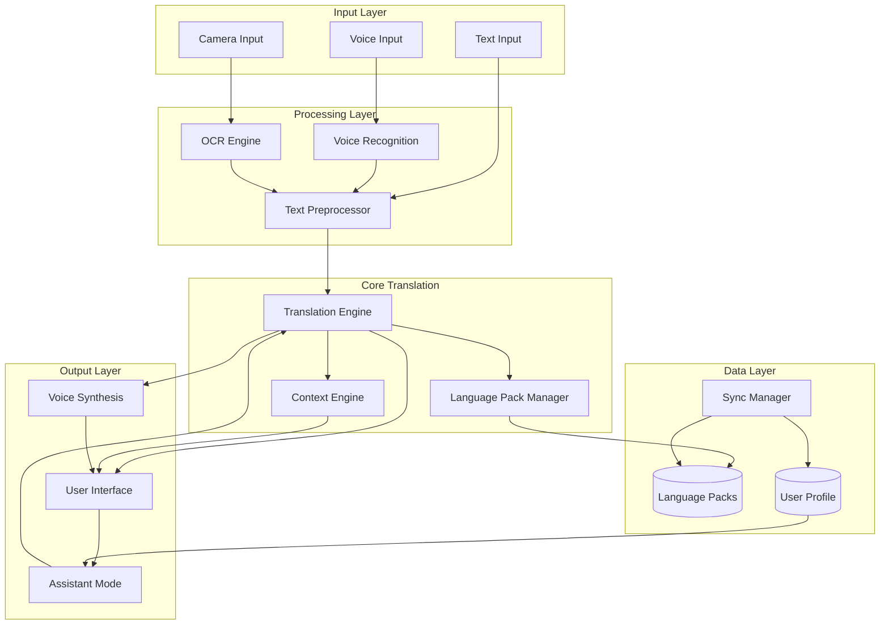
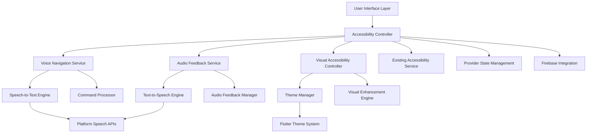

# Design Document: BhashaLens Multimodal Translation

## Overview

BhashaLens is a mobile-first multimodal translation application that provides text, voice, and camera-based translation with offline capabilities and context-aware explanations. The system is designed for accessibility, supporting users with varying levels of digital literacy across India's multilingual landscape.

The architecture follows a modular design with clear separation between input processing (text, voice, camera), translation engine, context enrichment, and offline data management. The system prioritizes offline-first operation with cloud synchronization for updates and user data.

### Key Design Principles

1. **Offline-First Architecture**: Core functionality works without internet connectivity using downloaded language packs
2. **Modular Input Processing**: Separate pipelines for text, voice, and camera inputs that converge at the translation engine
3. **Lightweight Models**: Optimized ML models for mobile devices with limited resources
4. **Accessibility by Design**: Simple UI with visual, audio, and haptic feedback
5. **Privacy-Preserving**: Local processing for sensitive data with optional cloud sync

## Architecture

### High-Level Architecture



### Component Architecture

The system consists of the following major components:

1. **Input Processing Pipeline**
   - Text Input Handler: Direct text entry with validation
   - Voice Recognition Module: Speech-to-text conversion with noise filtering
   - OCR Module: Image text extraction with layout preservation

2. **Translation Core**
   - Translation Engine: Neural machine translation models
   - Language Pack Manager: Offline model loading and caching
   - Context Engine: Cultural context, pronunciation, and usage examples

3. **Output and Interaction**
   - Voice Synthesis Module: Text-to-speech with speed control
   - User Interface: Accessible, multi-modal interface
   - Assistant Mode: Interactive learning with feedback

4. **Data Management**
   - Sync Manager: Cloud synchronization and conflict resolution
   - Storage Manager: Local data persistence and caching
   - Privacy Manager: Data encryption and access control

## Components and Interfaces

### Translation Engine

**Responsibility**: Core translation between language pairs using neural machine translation models.

**Interface**:
```typescript
interface TranslationEngine {
  translate(text: string, sourceLang: Language, targetLang: Language): Promise<TranslationResult>
  isLanguagePairAvailable(source: Language, target: Language, offline: boolean): boolean
  getTranslationQuality(text: string, translation: string): QualityScore
}

interface TranslationResult {
  translatedText: string
  confidence: number
  alternatives: string[]
  processingTime: number
}
```

**Implementation Approach**:
- Use transformer-based neural MT models (e.g., MarianMT, mBART)
- Quantize models for mobile deployment (INT8 quantization)
- Implement model caching to avoid repeated loading
- Support direct translation between regional languages without English pivot

### Voice Recognition Module

**Responsibility**: Convert spoken audio to text with noise filtering and offline support.

**Interface**:
```typescript
interface VoiceRecognitionModule {
  startRecording(): void
  stopRecording(): Promise<RecognitionResult>
  recognizeSpeech(audioData: AudioBuffer, language: Language): Promise<RecognitionResult>
  cancelRecording(): void
}

interface RecognitionResult {
  text: string
  confidence: number
  alternatives: string[]
  processingTime: number
  language: Language
}
```

**Implementation Approach**:
- Use lightweight ASR models (e.g., Whisper tiny/base, Vosk)
- Implement noise reduction using spectral subtraction
- Support streaming recognition for real-time feedback
- Cache audio buffers for retry on recognition failure

### OCR Module

**Responsibility**: Extract text from images with layout preservation and multi-language support.

**Interface**:
```typescript
interface OCRModule {
  extractText(image: ImageData, language: Language): Promise<OCRResult>
  detectLanguage(image: ImageData): Promise<Language>
  preprocessImage(image: ImageData): ImageData
}

interface OCRResult {
  text: string
  regions: TextRegion[]
  confidence: number
  processingTime: number
}

interface TextRegion {
  text: string
  boundingBox: Rectangle
  confidence: number
  readingOrder: number
}
```

**Implementation Approach**:
- Use Tesseract OCR with Indic language support
- Implement image preprocessing (contrast, rotation correction, denoising)
- Preserve spatial layout using bounding box information
- Support multiple scripts (Devanagari, Tamil, Bengali, etc.)

### Context Engine

**Responsibility**: Provide cultural context, pronunciation guides, and usage examples for translations.

**Interface**:
```typescript
interface ContextEngine {
  getCulturalContext(phrase: string, sourceLang: Language, targetLang: Language): Promise<ContextInfo>
  getPronunciation(text: string, language: Language): Promise<PronunciationGuide>
  getUsageExamples(phrase: string, language: Language): Promise<UsageExample[]>
  getRegionalVariations(phrase: string, language: Language): Promise<RegionalVariation[]>
}

interface ContextInfo {
  explanation: string
  culturalNotes: string[]
  idiomType?: string
}

interface PronunciationGuide {
  phonetic: string
  audioUrl?: string
  syllables: string[]
}

interface UsageExample {
  sentence: string
  context: string
  translation: string
}

interface RegionalVariation {
  region: string
  variation: string
  notes: string
}
```

**Implementation Approach**:
- Store context data in structured JSON format within language packs
- Use rule-based system to detect idioms and culturally specific phrases
- Generate phonetic transcriptions using IPA (International Phonetic Alphabet)
- Provide pre-recorded audio samples for common phrases

### Language Pack Manager

**Responsibility**: Manage offline language model downloads, updates, and loading.

**Interface**:
```typescript
interface LanguagePack {
  id: string
  sourceLang: Language
  targetLang: Language
  version: string
  size: number
  models: ModelFiles
  contextData: ContextData
}

interface LanguagePackManager {
  downloadPack(packId: string, onProgress: ProgressCallback): Promise<void>
  deletePack(packId: string): Promise<void>
  getInstalledPacks(): LanguagePack[]
  checkForUpdates(): Promise<PackUpdate[]>
  loadPack(packId: string): Promise<LoadedPack>
}

interface LoadedPack {
  translationModel: Model
  contextData: ContextData
  voiceModel?: Model
  ocrModel?: Model
}
```

**Implementation Approach**:
- Store language packs in compressed format (gzip/brotli)
- Implement incremental updates using binary diffs
- Use lazy loading to load models only when needed
- Implement LRU cache for frequently used models

### Assistant Mode

**Responsibility**: Provide interactive conversation practice with real-time feedback.

**Interface**:
```typescript
interface AssistantMode {
  startSession(scenario: Scenario, targetLang: Language): Session
  processUserInput(sessionId: string, input: UserInput): Promise<Feedback>
  endSession(sessionId: string): Promise<SessionSummary>
  getRecommendedScenarios(userId: string): Promise<Scenario[]>
}

interface Scenario {
  id: string
  name: string
  description: string
  difficulty: DifficultyLevel
  conversationSteps: ConversationStep[]
}

interface Feedback {
  grammarCorrections: Correction[]
  pronunciationScore: number
  suggestions: string[]
  nextPrompt: string
}

interface SessionSummary {
  duration: number
  accuracy: number
  areasForImprovement: string[]
  progress: ProgressMetrics
}
```

**Implementation Approach**:
- Use predefined conversation templates for scenarios
- Implement grammar checking using rule-based and ML approaches
- Compare user pronunciation with reference audio using DTW (Dynamic Time Warping)
- Track user progress in local database with cloud sync

### Sync Manager

**Responsibility**: Synchronize user data and language pack updates between device and cloud.

**Interface**:
```typescript
interface SyncManager {
  syncUserProfile(userId: string): Promise<SyncResult>
  syncLanguagePacks(): Promise<PackUpdate[]>
  queueChange(change: DataChange): void
  resolveConflict(conflict: SyncConflict): Promise<Resolution>
}

interface SyncResult {
  success: boolean
  conflicts: SyncConflict[]
  lastSyncTime: Date
}

interface SyncConflict {
  field: string
  localValue: any
  remoteValue: any
  localTimestamp: Date
  remoteTimestamp: Date
}
```

**Implementation Approach**:
- Use last-write-wins strategy with timestamp comparison
- Implement exponential backoff for retry on failure
- Queue changes locally when offline
- Use delta sync to minimize data transfer

## Data Models

### Translation Request

```typescript
interface TranslationRequest {
  id: string
  inputType: 'text' | 'voice' | 'camera'
  sourceText: string
  sourceLang: Language
  targetLang: Language
  timestamp: Date
  userId?: string
}
```

### Translation Response

```typescript
interface TranslationResponse {
  requestId: string
  translatedText: string
  confidence: number
  alternatives: string[]
  contextInfo?: ContextInfo
  pronunciationGuide?: PronunciationGuide
  usageExamples: UsageExample[]
  processingTime: number
}
```

### User Profile

```typescript
interface UserProfile {
  userId: string
  preferredLanguages: Language[]
  interfaceLanguage: Language
  accessibilitySettings: AccessibilitySettings
  learningProgress: LearningProgress
  installedPacks: string[]
  lastSyncTime: Date
}

interface AccessibilitySettings {
  fontSize: number
  voiceGuidance: boolean
  highContrast: boolean
  hapticFeedback: boolean
}

interface LearningProgress {
  completedScenarios: string[]
  practiceTime: number
  accuracyByLanguage: Map<Language, number>
  weakAreas: string[]
}
```

### Language Pack Metadata

```typescript
interface LanguagePackMetadata {
  id: string
  name: string
  sourceLang: Language
  targetLang: Language
  version: string
  size: number
  downloadUrl: string
  checksum: string
  releaseDate: Date
  features: PackFeature[]
}

enum PackFeature {
  Translation = 'translation',
  VoiceRecognition = 'voice_recognition',
  VoiceSynthesis = 'voice_synthesis',
  OCR = 'ocr',
  Context = 'context'
}
```


## Correctness Properties

A property is a characteristic or behavior that should hold true across all valid executions of a system—essentially, a formal statement about what the system should do. Properties serve as the bridge between human-readable specifications and machine-verifiable correctness guarantees.

### Property 1: Language Selection Persistence

*For any* sequence of translation requests with the same user session, once source and target languages are set, they should remain unchanged until explicitly modified by the user.

**Validates: Requirements 1.2**

### Property 2: Offline Operation with Language Packs

*For any* translation, voice recognition, OCR, or voice synthesis operation, if the required language pack is installed, the operation should complete successfully without network connectivity.

**Validates: Requirements 1.4, 2.4, 3.4, 11.3**

### Property 3: Long Text Segmentation

*For any* text input exceeding 500 characters, the translation engine should process it successfully and return a complete translation without data loss.

**Validates: Requirements 1.5**

### Property 4: Input Pipeline Integration

*For any* recognized voice input or extracted OCR text, the translation engine should be invoked automatically with the recognized text as input.

**Validates: Requirements 2.2, 3.2**

### Property 5: Low Confidence Error Handling

*For any* voice recognition or OCR operation that produces a confidence score below the threshold, the system should prompt the user for retry or provide error feedback.

**Validates: Requirements 2.5, 3.5**

### Property 6: Spatial Layout Preservation

*For any* image containing multiple text regions, the OCR module should extract text in correct reading order based on spatial layout (top-to-bottom, left-to-right for LTR scripts).

**Validates: Requirements 3.3**

### Property 7: Direct Regional Language Translation

*For any* translation between two regional Indian languages, the translation path should not route through English as an intermediary language.

**Validates: Requirements 4.4**

### Property 8: Language Availability Display

*For any* language pair selection, the system should display whether the pair is available for offline mode, online mode, or both.

**Validates: Requirements 4.3**

### Property 9: Context Engine Completeness

*For any* translation request, the context engine should provide pronunciation guidance, at least 2 usage examples, regional variations (if applicable), and cultural context (for idioms), all in the user's preferred interface language.

**Validates: Requirements 5.1, 5.2, 5.3, 5.4, 5.5**

### Property 10: Language Pack Download Management

*For any* language pair without an installed pack, the system should offer download with size information displayed before download begins, and show progress during download.

**Validates: Requirements 6.1, 6.2, 6.5**

### Property 11: Update Check on Reconnection

*For any* network reconnection event, the sync manager should check for language pack updates and notify the user if updates are available.

**Validates: Requirements 6.4**

### Property 12: Assistant Mode Feedback Loop

*For any* user input during an assistant mode practice session, the system should provide feedback on grammar and pronunciation.

**Validates: Requirements 7.2**

### Property 13: Progress Tracking Persistence

*For any* completed assistant mode session, the user profile should be updated with new progress metrics including accuracy, duration, and identified weak areas.

**Validates: Requirements 7.3**

### Property 14: Personalized Recommendations

*For any* recommendation request in assistant mode, suggested scenarios should be based on the user's profile history and identified weak areas.

**Validates: Requirements 7.4**

### Property 15: Pronunciation Error Correction

*For any* pronunciation attempt with a score below the acceptable threshold, the system should provide corrective audio examples and phonetic guidance.

**Validates: Requirements 7.5**

### Property 16: Accessibility Font Scaling

*For any* font size setting between 100% and 200%, the user interface should render all text correctly without truncation or overflow.

**Validates: Requirements 8.2**

### Property 17: Accessibility Voice Guidance

*For any* navigation action when accessibility mode is enabled, voice guidance should be provided describing the action and destination.

**Validates: Requirements 8.3**

### Property 18: User Action Feedback

*For any* user action (button press, gesture, input submission), the system should provide visual and/or audio feedback confirming the action was received.

**Validates: Requirements 8.4**

### Property 19: Profile Sync on Launch

*For any* app launch with internet connectivity, the sync manager should download the latest user profile from cloud storage before displaying the main interface.

**Validates: Requirements 10.2**

### Property 20: Timestamp-Based Conflict Resolution

*For any* sync conflict between local and remote data, the system should resolve the conflict by selecting the value with the most recent timestamp for each conflicting field.

**Validates: Requirements 10.3**

### Property 21: Non-Blocking Background Updates

*For any* language pack update download, the download should occur in the background without blocking user interactions with the app.

**Validates: Requirements 10.4**

### Property 22: Sync Retry Queue

*For any* sync operation that fails due to network issues, the changes should be queued locally and automatically retried when network connectivity is restored.

**Validates: Requirements 10.5**

### Property 23: Audio Playback Availability

*For any* translation result displayed to the user, an audio playback option should be available for the translated text.

**Validates: Requirements 11.1**

### Property 24: Offline Voice Synthesis

*For any* voice synthesis request with an installed language pack, speech generation should work without network connectivity.

**Validates: Requirements 11.3**

### Property 25: Playback Speed Control

*For any* playback speed setting between 0.5x and 1.5x, the voice synthesis module should generate audio at the specified speed without distortion.

**Validates: Requirements 11.4**

### Property 26: Sequential Audio Queue

*For any* queue of multiple translations, the voice synthesis module should play them sequentially in order with a 1-second pause between each item.

**Validates: Requirements 11.5**

### Property 27: Password Hashing

*For any* user password during account creation or password change, the authentication system should hash the password using bcrypt, Argon2, or equivalent before storage.

**Validates: Requirements 12.1**

### Property 28: Local Processing in Offline Mode

*For any* voice or camera data processing when offline mode is active, no network requests should be made and all processing should occur locally.

**Validates: Requirements 12.2**

### Property 29: Encrypted Data Transmission

*For any* data transmission to remote servers, the connection should use TLS 1.3 or higher encryption.

**Validates: Requirements 12.3**

### Property 30: Consent-Based Data Collection

*For any* data collection or transmission operation, the system should verify that user consent has been granted during onboarding before proceeding.

**Validates: Requirements 12.5**

## Error Handling

### Error Categories

1. **Network Errors**
   - Connection timeout
   - Server unavailable
   - Sync failures
   - Download interruptions

2. **Input Errors**
   - Invalid language selection
   - Unsupported file format
   - Audio recording failure
   - Camera access denied

3. **Processing Errors**
   - Translation failure
   - OCR extraction failure
   - Voice recognition failure
   - Model loading failure

4. **Storage Errors**
   - Insufficient storage space
   - Corrupted language pack
   - Profile save failure
   - Cache write failure

### Error Handling Strategies

**Network Errors**:
- Implement exponential backoff for retries (1s, 2s, 4s, 8s, max 30s)
- Queue operations for later execution when offline
- Display clear offline mode indicator
- Gracefully degrade to offline functionality

**Input Errors**:
- Validate inputs before processing
- Provide clear error messages with suggested actions
- Offer alternative input methods when one fails
- Request permissions with clear explanations

**Processing Errors**:
- Log errors with context for debugging
- Provide fallback mechanisms (e.g., simpler models)
- Display user-friendly error messages
- Offer retry options with different parameters

**Storage Errors**:
- Check available storage before downloads
- Implement cleanup of old cached data
- Provide storage management UI
- Validate data integrity on load

### Error Recovery

```typescript
interface ErrorHandler {
  handleError(error: AppError): ErrorResolution
  retryOperation(operation: Operation, maxRetries: number): Promise<Result>
  logError(error: AppError, context: ErrorContext): void
}

interface ErrorResolution {
  userMessage: string
  suggestedAction: string
  canRetry: boolean
  fallbackAvailable: boolean
}
```

## Testing Strategy

### Dual Testing Approach

The testing strategy employs both unit tests and property-based tests as complementary approaches:

- **Unit tests**: Verify specific examples, edge cases, integration points, and error conditions
- **Property tests**: Verify universal properties across all inputs through randomization

Together, these approaches provide comprehensive coverage where unit tests catch concrete bugs and property tests verify general correctness.

### Property-Based Testing

**Library Selection**:
- **TypeScript/JavaScript**: fast-check
- **Python**: Hypothesis
- **Java**: jqwik
- **Swift**: SwiftCheck

**Configuration**:
- Minimum 100 iterations per property test
- Each test must reference its design document property
- Tag format: `Feature: bhashalens-multimodal-translation, Property {number}: {property_text}`

**Example Property Test Structure**:

```typescript
import fc from 'fast-check';

describe('Property 2: Offline Operation with Language Packs', () => {
  // Feature: bhashalens-multimodal-translation, Property 2
  it('should complete operations offline when language pack is installed', () => {
    fc.assert(
      fc.property(
        fc.record({
          text: fc.string({ minLength: 1, maxLength: 500 }),
          sourceLang: fc.constantFrom('en', 'hi', 'ta', 'te'),
          targetLang: fc.constantFrom('en', 'hi', 'ta', 'te'),
        }),
        async ({ text, sourceLang, targetLang }) => {
          // Arrange: Install language pack and disable network
          await languagePackManager.installPack(sourceLang, targetLang);
          networkManager.setOffline(true);
          
          // Act: Perform translation
          const result = await translationEngine.translate(text, sourceLang, targetLang);
          
          // Assert: Translation succeeds without network
          expect(result.translatedText).toBeDefined();
          expect(networkManager.getRequestCount()).toBe(0);
        }
      ),
      { numRuns: 100 }
    );
  });
});
```

### Unit Testing Strategy

**Focus Areas**:
1. **Specific Examples**: Test concrete scenarios from requirements
2. **Edge Cases**: Empty inputs, maximum lengths, boundary values
3. **Error Conditions**: Invalid inputs, missing dependencies, network failures
4. **Integration Points**: Component interactions, data flow between modules

**Example Unit Test Structure**:

```typescript
describe('Translation Engine', () => {
  describe('Language Support', () => {
    // Requirements 4.1, 4.2
    it('should support English to Hindi translation', async () => {
      const result = await translationEngine.translate('Hello', 'en', 'hi');
      expect(result.translatedText).toBe('नमस्ते');
    });
    
    it('should support regional languages', () => {
      const supportedLanguages = translationEngine.getSupportedLanguages();
      expect(supportedLanguages).toContain('ta'); // Tamil
      expect(supportedLanguages).toContain('te'); // Telugu
      expect(supportedLanguages).toContain('bn'); // Bengali
      expect(supportedLanguages).toContain('mr'); // Marathi
      expect(supportedLanguages).toContain('gu'); // Gujarati
    });
  });
  
  describe('Error Handling', () => {
    it('should handle empty text input', async () => {
      await expect(
        translationEngine.translate('', 'en', 'hi')
      ).rejects.toThrow('Input text cannot be empty');
    });
    
    it('should handle unsupported language pair', async () => {
      await expect(
        translationEngine.translate('Hello', 'en', 'xyz')
      ).rejects.toThrow('Unsupported language: xyz');
    });
  });
});
```

### Integration Testing

**Test Scenarios**:
1. End-to-end translation flow (input → processing → output)
2. Offline mode with language pack installation
3. Voice input → translation → voice output pipeline
4. Camera capture → OCR → translation flow
5. Assistant mode session lifecycle
6. Sync manager conflict resolution

### Performance Testing

**Benchmarks** (not automated, manual validation):
- Text translation: < 2 seconds for 500 characters
- Voice recognition: < 5 seconds for 30-second audio
- OCR extraction: < 5 seconds for standard images
- App launch: < 3 seconds on minimum spec devices
- Mode switching: < 1 second

### Accessibility Testing

**Validation Points**:
- Screen reader compatibility
- Font scaling (100% - 200%)
- Voice guidance functionality
- High contrast mode
- Touch target sizes (minimum 44x44 points)
- Keyboard navigation

### Security Testing

**Validation Points**:
- Password hashing verification
- TLS connection validation
- Local data encryption
- Permission handling
- Data deletion verification
- Consent flow validation

## Architecture

### High-Level Architecture



### Service Integration Pattern

The accessibility enhancement follows a layered service pattern that integrates with existing app infrastructure:

1. **Accessibility Controller**: Central coordinator that manages all accessibility features
2. **Feature Services**: Specialized services for voice navigation, audio feedback, and visual accessibility
3. **Platform Integration**: Leverages Flutter's accessibility framework and platform-specific APIs
4. **State Management**: Integrates with existing Provider pattern for consistent state handling

## Components and Interfaces

### 1. Enhanced Accessibility Service

```dart
abstract class AccessibilityService {
  // Core accessibility state management
  bool get isVoiceNavigationEnabled;
  bool get isAudioFeedbackEnabled;
  bool get isVisualAccessibilityEnabled;
  
  // Feature toggles
  Future<void> enableVoiceNavigation();
  Future<void> enableAudioFeedback();
  Future<void> enableVisualAccessibility();
  
  // Integration with existing services
  void integrateWithExistingThemes();
  void preserveUserPreferences();
}

class AccessibilityController extends ChangeNotifier implements AccessibilityService {
  final VoiceNavigationService _voiceNavigation;
  final AudioFeedbackService _audioFeedback;
  final VisualAccessibilityController _visualAccessibility;
  final SharedPreferences _preferences;
  
  // Implementation coordinates between all accessibility features
}
```

### 2. Voice Navigation Service

```dart
abstract class VoiceNavigationService {
  // Voice command processing
  Stream<VoiceCommand> get commandStream;
  Future<void> startListening();
  Future<void> stopListening();
  
  // Navigation commands
  Future<void> executeNavigationCommand(VoiceCommand command);
  Future<void> executePageSpecificCommand(VoiceCommand command, String currentPage);
  
  // Command feedback
  Future<void> provideCommandFeedback(String message);
  Future<void> listAvailableCommands(String context);
}

class VoiceNavigationController implements VoiceNavigationService {
  final SpeechToText _speechToText;
  final CommandProcessor _commandProcessor;
  final NavigationService _navigationService;
  final AudioFeedbackService _audioFeedback;
  
  // Maps voice commands to navigation actions
  final Map<String, NavigationAction> _commandMap = {
    'go to camera': NavigationAction.cameraTranslation,
    'go to voice translation': NavigationAction.voiceTranslation,
    'go to text translation': NavigationAction.textTranslation,
    'go to settings': NavigationAction.settings,
    'go back': NavigationAction.back,
    'go home': NavigationAction.home,
    'start translation': NavigationAction.startTranslation,
    'help': NavigationAction.showHelp,
    'repeat': NavigationAction.repeat,
  };
}
```

### 3. Audio Feedback Service

```dart
abstract class AudioFeedbackService {
  // Text-to-speech functionality
  Future<void> speak(String text, {String? language});
  Future<void> announcePageChange(String pageName, String description);
  Future<void> announceButtonAction(String buttonName, String action);
  Future<void> announceError(String errorMessage);
  Future<void> announceSuccess(String successMessage);
  
  // Speech control
  Future<void> pauseSpeech();
  Future<void> resumeSpeech();
  Future<void> stopSpeech();
  
  // Settings
  Future<void> setSpeechRate(double rate);
  Future<void> setSpeechPitch(double pitch);
  Future<void> setVoice(String voiceId);
  List<Voice> getAvailableVoices();
}

class AudioFeedbackController implements AudioFeedbackService {
  final FlutterTts _tts;
  final AudioFeedbackManager _feedbackManager;
  
  // Manages different types of audio feedback
  final Map<FeedbackType, AudioCue> _audioCues = {
    FeedbackType.navigation: AudioCue.navigationSound,
    FeedbackType.success: AudioCue.successChime,
    FeedbackType.error: AudioCue.errorBeep,
    FeedbackType.buttonPress: AudioCue.clickSound,
  };
}
```

### 4. Visual Accessibility Controller

```dart
abstract class VisualAccessibilityController {
  // High contrast themes
  Future<void> enableHighContrastMode();
  Future<void> disableHighContrastMode();
  ThemeData getHighContrastTheme();
  
  // Text and sizing
  Future<void> setTextScale(double scale);
  Future<void> enableBoldText();
  Future<void> setTouchTargetSize(double minSize);
  
  // Visual enhancements
  Future<void> enableSimplifiedUI();
  Future<void> enableFocusIndicators();
  Future<void> enableColorBlindSupport();
  Future<void> reduceMotion();
}

class VisualAccessibilityManager implements VisualAccessibilityController {
  final ThemeManager _themeManager;
  final VisualEnhancementEngine _visualEngine;
  
  // High contrast color schemes
  final ColorScheme _highContrastLight = ColorScheme.fromSeed(
    seedColor: Colors.blue,
    brightness: Brightness.light,
    // Ensures 7:1 contrast ratio
    primary: Color(0xFF000080),
    onPrimary: Color(0xFFFFFFFF),
    surface: Color(0xFFFFFFFF),
    onSurface: Color(0xFF000000),
  );
  
  final ColorScheme _highContrastDark = ColorScheme.fromSeed(
    seedColor: Colors.blue,
    brightness: Brightness.dark,
    // Ensures 7:1 contrast ratio
    primary: Color(0xFF4080FF),
    onPrimary: Color(0xFF000000),
    surface: Color(0xFF000000),
    onSurface: Color(0xFFFFFFFF),
  );
}
```

### 5. Command Processor

```dart
class CommandProcessor {
  final Map<String, List<String>> _commandVariations = {
    'navigate_camera': ['go to camera', 'camera translation', 'open camera'],
    'navigate_voice': ['go to voice', 'voice translation', 'speak to translate'],
    'navigate_text': ['go to text', 'text translation', 'type to translate'],
    'navigate_settings': ['go to settings', 'open settings', 'preferences'],
    'navigate_back': ['go back', 'previous', 'return', 'back'],
    'navigate_home': ['go home', 'main menu', 'home screen'],
    'start_translation': ['translate this', 'start translation', 'translate'],
    'show_help': ['help', 'what can I say', 'voice commands', 'commands'],
    'repeat_last': ['repeat', 'say that again', 'repeat last'],
  };
  
  VoiceCommand? processSpokenText(String spokenText) {
    // Fuzzy matching and command recognition logic
    // Returns structured command with confidence score
  }
  
  List<String> getContextualCommands(String currentPage) {
    // Returns available commands for current page context
  }
}
```

## Data Models

### Voice Command Model

```dart
class VoiceCommand {
  final String originalText;
  final CommandType type;
  final Map<String, dynamic> parameters;
  final double confidence;
  final DateTime timestamp;
  
  VoiceCommand({
    required this.originalText,
    required this.type,
    required this.parameters,
    required this.confidence,
    required this.timestamp,
  });
}

enum CommandType {
  navigation,
  translation,
  settings,
  help,
  control,
}
```

### Accessibility Settings Model

```dart
class AccessibilitySettings {
  // Voice navigation settings
  final bool voiceNavigationEnabled;
  final String voiceNavigationLanguage;
  final double voiceCommandTimeout;
  
  // Audio feedback settings
  final bool audioFeedbackEnabled;
  final double speechRate;
  final double speechPitch;
  final String preferredVoice;
  final bool autoReadTranslations;
  final bool autoReadErrors;
  
  // Visual accessibility settings
  final bool highContrastEnabled;
  final double textScale;
  final bool boldTextEnabled;
  final bool simplifiedUIEnabled;
  final bool focusIndicatorsEnabled;
  final bool colorBlindSupportEnabled;
  final bool reducedMotionEnabled;
  final double touchTargetSize;
  
  // Sync and conflict resolution
  final DateTime lastUpdated;
  final String deviceId;
  
  AccessibilitySettings({
    this.voiceNavigationEnabled = false,
    this.voiceNavigationLanguage = 'en-US',
    this.voiceCommandTimeout = 3.0,
    this.audioFeedbackEnabled = false,
    this.speechRate = 1.0,
    this.speechPitch = 1.0,
    this.preferredVoice = 'default',
    this.autoReadTranslations = true,
    this.autoReadErrors = true,
    this.highContrastEnabled = false,
    this.textScale = 1.0,
    this.boldTextEnabled = false,
    this.simplifiedUIEnabled = false,
    this.focusIndicatorsEnabled = false,
    this.colorBlindSupportEnabled = false,
    this.reducedMotionEnabled = false,
    this.touchTargetSize = 48.0,
    DateTime? lastUpdated,
    String? deviceId,
  }) : lastUpdated = lastUpdated ?? DateTime.now(),
       deviceId = deviceId ?? _generateDeviceId();
  
  // Create updated copy with new timestamp
  AccessibilitySettings copyWith({
    bool? voiceNavigationEnabled,
    String? voiceNavigationLanguage,
    double? voiceCommandTimeout,
    bool? audioFeedbackEnabled,
    double? speechRate,
    double? speechPitch,
    String? preferredVoice,
    bool? autoReadTranslations,
    bool? autoReadErrors,
    bool? highContrastEnabled,
    double? textScale,
    bool? boldTextEnabled,
    bool? simplifiedUIEnabled,
    bool? focusIndicatorsEnabled,
    bool? colorBlindSupportEnabled,
    bool? reducedMotionEnabled,
    double? touchTargetSize,
    DateTime? lastUpdated,
    String? deviceId,
  }) {
    return AccessibilitySettings(
      voiceNavigationEnabled: voiceNavigationEnabled ?? this.voiceNavigationEnabled,
      voiceNavigationLanguage: voiceNavigationLanguage ?? this.voiceNavigationLanguage,
      voiceCommandTimeout: voiceCommandTimeout ?? this.voiceCommandTimeout,
      audioFeedbackEnabled: audioFeedbackEnabled ?? this.audioFeedbackEnabled,
      speechRate: speechRate ?? this.speechRate,
      speechPitch: speechPitch ?? this.speechPitch,
      preferredVoice: preferredVoice ?? this.preferredVoice,
      autoReadTranslations: autoReadTranslations ?? this.autoReadTranslations,
      autoReadErrors: autoReadErrors ?? this.autoReadErrors,
      highContrastEnabled: highContrastEnabled ?? this.highContrastEnabled,
      textScale: textScale ?? this.textScale,
      boldTextEnabled: boldTextEnabled ?? this.boldTextEnabled,
      simplifiedUIEnabled: simplifiedUIEnabled ?? this.simplifiedUIEnabled,
      focusIndicatorsEnabled: focusIndicatorsEnabled ?? this.focusIndicatorsEnabled,
      colorBlindSupportEnabled: colorBlindSupportEnabled ?? this.colorBlindSupportEnabled,
      reducedMotionEnabled: reducedMotionEnabled ?? this.reducedMotionEnabled,
      touchTargetSize: touchTargetSize ?? this.touchTargetSize,
      lastUpdated: lastUpdated ?? DateTime.now(),
      deviceId: deviceId ?? this.deviceId,
    );
  }
  
  // Serialization methods for persistence
  Map<String, dynamic> toJson() {
    return {
      'voiceNavigationEnabled': voiceNavigationEnabled,
      'voiceNavigationLanguage': voiceNavigationLanguage,
      'voiceCommandTimeout': voiceCommandTimeout,
      'audioFeedbackEnabled': audioFeedbackEnabled,
      'speechRate': speechRate,
      'speechPitch': speechPitch,
      'preferredVoice': preferredVoice,
      'autoReadTranslations': autoReadTranslations,
      'autoReadErrors': autoReadErrors,
      'highContrastEnabled': highContrastEnabled,
      'textScale': textScale,
      'boldTextEnabled': boldTextEnabled,
      'simplifiedUIEnabled': simplifiedUIEnabled,
      'focusIndicatorsEnabled': focusIndicatorsEnabled,
      'colorBlindSupportEnabled': colorBlindSupportEnabled,
      'reducedMotionEnabled': reducedMotionEnabled,
      'touchTargetSize': touchTargetSize,
      'lastUpdated': lastUpdated.millisecondsSinceEpoch,
      'deviceId': deviceId,
    };
  }
  
  factory AccessibilitySettings.fromJson(Map<String, dynamic> json) {
    return AccessibilitySettings(
      voiceNavigationEnabled: json['voiceNavigationEnabled'] ?? false,
      voiceNavigationLanguage: json['voiceNavigationLanguage'] ?? 'en-US',
      voiceCommandTimeout: (json['voiceCommandTimeout'] ?? 3.0).toDouble(),
      audioFeedbackEnabled: json['audioFeedbackEnabled'] ?? false,
      speechRate: (json['speechRate'] ?? 1.0).toDouble(),
      speechPitch: (json['speechPitch'] ?? 1.0).toDouble(),
      preferredVoice: json['preferredVoice'] ?? 'default',
      autoReadTranslations: json['autoReadTranslations'] ?? true,
      autoReadErrors: json['autoReadErrors'] ?? true,
      highContrastEnabled: json['highContrastEnabled'] ?? false,
      textScale: (json['textScale'] ?? 1.0).toDouble(),
      boldTextEnabled: json['boldTextEnabled'] ?? false,
      simplifiedUIEnabled: json['simplifiedUIEnabled'] ?? false,
      focusIndicatorsEnabled: json['focusIndicatorsEnabled'] ?? false,
      colorBlindSupportEnabled: json['colorBlindSupportEnabled'] ?? false,
      reducedMotionEnabled: json['reducedMotionEnabled'] ?? false,
      touchTargetSize: (json['touchTargetSize'] ?? 48.0).toDouble(),
      lastUpdated: json['lastUpdated'] != null 
          ? DateTime.fromMillisecondsSinceEpoch(json['lastUpdated'])
          : DateTime.now(),
      deviceId: json['deviceId'] ?? _generateDeviceId(),
    );
  }
  
  static String _generateDeviceId() {
    // Generate a unique device identifier
    return DateTime.now().millisecondsSinceEpoch.toString();
  }
}
```

### Audio Feedback Configuration

```dart
class AudioFeedbackConfig {
  final Map<String, String> pageAnnouncements;
  final Map<String, String> buttonDescriptions;
  final Map<String, String> errorMessages;
  final Map<String, String> successMessages;
  
  AudioFeedbackConfig({
    required this.pageAnnouncements,
    required this.buttonDescriptions,
    required this.errorMessages,
    required this.successMessages,
  });
  
  static AudioFeedbackConfig get defaultConfig => AudioFeedbackConfig(
    pageAnnouncements: {
      '/': 'Home page. Choose translation method: camera, voice, or text.',
      '/camera': 'Camera translation page. Point camera at text to translate.',
      '/voice': 'Voice translation page. Speak to translate your words.',
      '/text': 'Text translation page. Type text to translate.',
      '/settings': 'Settings page. Adjust app preferences and accessibility options.',
    },
    buttonDescriptions: {
      'camera_capture': 'Take photo for translation',
      'voice_record': 'Start voice recording for translation',
      'text_translate': 'Translate entered text',
      'settings_accessibility': 'Open accessibility settings',
      'back_button': 'Go to previous page',
    },
    errorMessages: {
      'no_internet': 'No internet connection. Please check your network and try again.',
      'translation_failed': 'Translation failed. Please try again.',
      'voice_recognition_failed': 'Could not understand speech. Please try speaking again.',
      'camera_permission_denied': 'Camera permission required for photo translation.',
    },
    successMessages: {
      'translation_complete': 'Translation completed successfully.',
      'settings_saved': 'Settings saved successfully.',
      'voice_command_executed': 'Voice command executed.',
    },
  );
}
```

## Integration Points

### 1. Existing Accessibility Service Integration

```dart
class AccessibilityServiceIntegration {
  final AccessibilityService _existingService;
  final AccessibilityController _newController;
  
  Future<void> migrateExistingSettings() {
    // Preserve existing theme preferences
    // Migrate text size settings
    // Maintain user preferences
  }
  
  void setupBidirectionalSync() {
    // Ensure changes in new system update existing system
    // Maintain compatibility with existing features
  }
}
```

### 2. Provider State Management Integration

```dart
class AccessibilityProvider extends ChangeNotifier {
  final AccessibilityController _controller;
  
  AccessibilitySettings get settings => _controller.settings;
  
  Future<void> updateVoiceNavigationEnabled(bool enabled) async {
    await _controller.setVoiceNavigationEnabled(enabled);
    notifyListeners();
  }
  
  Future<void> updateAudioFeedbackEnabled(bool enabled) async {
    await _controller.setAudioFeedbackEnabled(enabled);
    notifyListeners();
  }
  
  Future<void> updateVisualAccessibilityEnabled(bool enabled) async {
    await _controller.setVisualAccessibilityEnabled(enabled);
    notifyListeners();
  }
}
```

### 3. Firebase Integration

```dart
enum SyncStatus {
  synced,
  syncing,
  failed,
  offline,
}

class AccessibilityFirebaseIntegration {
  final FirebaseFirestore _firestore;
  final FirebaseAuth _auth;
  final SharedPreferences _prefs;
  
  static const String _cacheKey = 'accessibility_settings_cache';
  static const String _lastSyncKey = 'accessibility_last_sync';
  static const int _maxRetries = 3;
  static const Duration _baseRetryDelay = Duration(seconds: 2);
  
  final StreamController<SyncStatus> _syncStatusController = StreamController<SyncStatus>.broadcast();
  Stream<SyncStatus> get syncStatus => _syncStatusController.stream;
  
  SyncStatus _currentStatus = SyncStatus.synced;
  
  AccessibilityFirebaseIntegration({
    required FirebaseFirestore firestore,
    required FirebaseAuth auth,
    required SharedPreferences prefs,
  }) : _firestore = firestore,
       _auth = auth,
       _prefs = prefs;
  
  /// Sync settings to Firestore with offline support and conflict resolution
  Future<void> syncAccessibilitySettings(AccessibilitySettings settings) async {
    // Always save to local cache first for immediate UX
    await _saveToCache(settings);
    
    if (_auth.currentUser == null) {
      _updateSyncStatus(SyncStatus.offline);
      return;
    }
    
    _updateSyncStatus(SyncStatus.syncing);
    
    try {
      // Check for remote conflicts before syncing
      final remoteSettings = await _loadFromFirestore();
      final resolvedSettings = _resolveConflicts(settings, remoteSettings);
      
      await _syncToFirestoreWithRetry(resolvedSettings);
      await _prefs.setInt(_lastSyncKey, DateTime.now().millisecondsSinceEpoch);
      _updateSyncStatus(SyncStatus.synced);
      
    } catch (e) {
      debugPrint('Failed to sync accessibility settings: $e');
      _updateSyncStatus(SyncStatus.failed);
      
      // Schedule background retry
      _scheduleRetry(() => syncAccessibilitySettings(settings));
    }
  }
  
  /// Load settings with offline-first approach and conflict resolution
  Future<AccessibilitySettings?> loadAccessibilitySettings() async {
    // Always load from cache first for immediate UX
    final cachedSettings = await _loadFromCache();
    
    if (_auth.currentUser == null) {
      _updateSyncStatus(SyncStatus.offline);
      return cachedSettings;
    }
    
    try {
      _updateSyncStatus(SyncStatus.syncing);
      
      // Try to load from Firestore
      final remoteSettings = await _loadFromFirestore();
      
      if (remoteSettings != null && cachedSettings != null) {
        // Resolve conflicts between cached and remote
        final resolvedSettings = _resolveConflicts(cachedSettings, remoteSettings);
        
        // Update cache with resolved settings
        await _saveToCache(resolvedSettings);
        _updateSyncStatus(SyncStatus.synced);
        return resolvedSettings;
        
      } else if (remoteSettings != null) {
        // No local cache, use remote
        await _saveToCache(remoteSettings);
        _updateSyncStatus(SyncStatus.synced);
        return remoteSettings;
        
      } else {
        // No remote data, use cached
        _updateSyncStatus(cachedSettings != null ? SyncStatus.synced : SyncStatus.offline);
        return cachedSettings;
      }
      
    } catch (e) {
      debugPrint('Failed to load remote accessibility settings: $e');
      _updateSyncStatus(SyncStatus.failed);
      
      // Fall back to cached settings
      return cachedSettings;
    }
  }
  
  /// Sync to Firestore with exponential backoff retry
  Future<void> _syncToFirestoreWithRetry(AccessibilitySettings settings, [int retryCount = 0]) async {
    try {
      await _firestore
          .collection('users')
          .doc(_auth.currentUser!.uid)
          .collection('accessibility')
          .doc('settings')
          .set(settings.toJson());
          
    } catch (e) {
      if (retryCount < _maxRetries) {
        final delay = _baseRetryDelay * (1 << retryCount); // Exponential backoff
        debugPrint('Firestore sync failed, retrying in ${delay.inSeconds}s (attempt ${retryCount + 1}/$_maxRetries): $e');
        
        await Future.delayed(delay);
        return _syncToFirestoreWithRetry(settings, retryCount + 1);
      } else {
        throw Exception('Failed to sync after $_maxRetries attempts: $e');
      }
    }
  }
  
  /// Load settings from Firestore
  Future<AccessibilitySettings?> _loadFromFirestore() async {
    final doc = await _firestore
        .collection('users')
        .doc(_auth.currentUser!.uid)
        .collection('accessibility')
        .doc('settings')
        .get();
    
    if (doc.exists && doc.data() != null) {
      return AccessibilitySettings.fromJson(doc.data()!);
    }
    return null;
  }
  
  /// Save settings to local cache
  Future<void> _saveToCache(AccessibilitySettings settings) async {
    final json = jsonEncode(settings.toJson());
    await _prefs.setString(_cacheKey, json);
  }
  
  /// Load settings from local cache
  Future<AccessibilitySettings?> _loadFromCache() async {
    final json = _prefs.getString(_cacheKey);
    if (json != null) {
      try {
        final data = jsonDecode(json) as Map<String, dynamic>;
        return AccessibilitySettings.fromJson(data);
      } catch (e) {
        debugPrint('Failed to parse cached accessibility settings: $e');
        // Clear corrupted cache
        await _prefs.remove(_cacheKey);
      }
    }
    return null;
  }
  
  /// Resolve conflicts between local and remote settings using last-write-wins
  AccessibilitySettings _resolveConflicts(
    AccessibilitySettings local, 
    AccessibilitySettings? remote
  ) {
    if (remote == null) return local;
    
    // Last-write-wins based on timestamp
    if (local.lastUpdated.isAfter(remote.lastUpdated)) {
      debugPrint('Local settings are newer, keeping local changes');
      return local;
    } else if (remote.lastUpdated.isAfter(local.lastUpdated)) {
      debugPrint('Remote settings are newer, using remote changes');
      return remote;
    } else {
      // Same timestamp, prefer local device's changes
      debugPrint('Same timestamp, preferring local changes');
      return local;
    }
  }
  
  /// Update sync status and notify listeners
  void _updateSyncStatus(SyncStatus status) {
    _currentStatus = status;
    _syncStatusController.add(status);
  }
  
  /// Schedule a retry operation with exponential backoff
  void _scheduleRetry(VoidCallback operation) {
    Timer(const Duration(minutes: 1), () {
      if (_currentStatus == SyncStatus.failed) {
        operation();
      }
    });
  }
  
  /// Get current sync status
  SyncStatus get currentSyncStatus => _currentStatus;
  
  /// Force a full sync (useful for manual refresh)
  Future<void> forcSync() async {
    final settings = await _loadFromCache();
    if (settings != null) {
      await syncAccessibilitySettings(settings);
    }
  }
  
  /// Clear local cache (useful for logout)
  Future<void> clearCache() async {
    await _prefs.remove(_cacheKey);
    await _prefs.remove(_lastSyncKey);
    _updateSyncStatus(SyncStatus.offline);
  }
  
  void dispose() {
    _syncStatusController.close();
  }
}
```

## Correctness Properties

*A property is a characteristic or behavior that should hold true across all valid executions of a system—essentially, a formal statement about what the system should do. Properties serve as the bridge between human-readable specifications and machine-verifiable correctness guarantees.*

### Property 1: Voice Navigation Activation and Deactivation
*For any* voice navigation activation method (voice command or button tap), the Voice_Navigation_System should activate successfully and provide audio confirmation, and for any deactivation command, it should deactivate successfully
**Validates: Requirements 1.1, 1.8**

### Property 2: Voice Command Recognition and Execution
*For any* valid voice command from the supported command set, the Voice_Navigation_System should recognize the command and execute the appropriate action within the expected timeframe
**Validates: Requirements 1.2, 1.3, 1.4, 1.5, 6.2**

### Property 3: Context-Aware Voice Commands
*For any* page context and its associated page-specific commands, the Voice_Navigation_System should support and execute those commands correctly while providing appropriate help information
**Validates: Requirements 1.6, 1.11**

### Property 4: Voice Command Error Handling
*For any* invalid, unclear, or unrecognized voice command, the Voice_Navigation_System should provide helpful error feedback with suggestions for valid alternatives
**Validates: Requirements 1.9**

### Property 5: Voice Command Feedback and Repetition
*For any* successfully executed voice command, the system should provide clear audio confirmation, and for any repeat request, it should replay the last audio message
**Validates: Requirements 1.7, 1.10**

### Property 6: Multi-language Voice Support
*For any* supported language in the app's translation capabilities, the Voice_Navigation_System should recognize and process voice commands in that language
**Validates: Requirements 1.12**

### Property 7: Automatic TTS for UI Elements and Translations
*For any* UI element that receives focus or any completed translation, the TTS_Engine should automatically provide appropriate audio announcements
**Validates: Requirements 2.1, 2.2, 2.4**

### Property 8: Interactive Element Audio Descriptions
*For any* button or interactive element that is tapped, the TTS_Engine should announce a clear description of what the element does
**Validates: Requirements 2.3**

### Property 9: System Message Audio Announcements
*For any* error message, success message, or system notification that appears, the TTS_Engine should immediately read the message aloud
**Validates: Requirements 2.5**

### Property 10: TTS Settings and Controls
*For any* valid speech rate, pitch, or voice selection within the supported ranges, the TTS_Engine should apply the settings correctly and allow speech control (pause, resume, stop)
**Validates: Requirements 2.6, 2.7, 2.8, 2.9**

### Property 11: Language-Aware TTS
*For any* content in different languages, the TTS_Engine should automatically detect the language and use the appropriate language-specific voice for reading
**Validates: Requirements 2.10**

### Property 12: Background TTS and Audio Cues
*For any* translation completion while the app is in background, the TTS_Engine should still provide notifications, and for any type of user action, the Audio_Feedback_System should provide distinct audio cues
**Validates: Requirements 2.11, 2.12**

### Property 13: High Contrast Visual Standards
*For any* UI element when high contrast mode is enabled, the Visual_Accessibility_Controller should ensure color contrast ratios meet or exceed 7:1 and provide distinct colors for different UI states
**Validates: Requirements 3.1, 3.5, 3.10**

### Property 14: Touch Target and Text Enhancement
*For any* interactive element when visual accessibility is active, the Visual_Accessibility_Controller should ensure minimum 48dp touch targets, and for any text when large text mode is enabled, it should be bold and appropriately scaled
**Validates: Requirements 3.2, 3.3, 3.4**

### Property 15: Visual Accessibility Features
*For any* UI layout when simplified mode is enabled, decorative elements should be hidden, and when focus indicators are enabled, clear visual focus should be displayed
**Validates: Requirements 3.6, 3.7, 3.11**

### Property 16: Color-Blind and Motion Accessibility
*For any* information display when color accessibility is enabled, non-color indicators should be used, and when motion sensitivity is enabled, animations should be reduced or removed
**Validates: Requirements 3.8, 3.12**

### Property 17: Immediate Visual Settings Application
*For any* visual accessibility setting change, the Visual_Accessibility_Controller should apply the changes immediately without requiring app restart
**Validates: Requirements 3.9**

### Property 18: Settings Preview and Reset Functionality
*For any* accessibility setting being tested, the Accessibility_Service should provide preview functionality, and for any settings configuration, it should allow reset to defaults
**Validates: Requirements 4.3, 4.6**

### Property 19: Help System Accessibility
*For any* help request or accessibility guidance need, the Accessibility_Service should provide easily accessible help content and tutorials
**Validates: Requirements 4.5**

### Property 20: Settings Import/Export
*For any* accessibility settings configuration, the Accessibility_Service should allow exporting the configuration and importing it correctly on other devices
**Validates: Requirements 4.8**

### Property 21: Multi-Feature Coordination
*For any* combination of multiple accessibility features enabled simultaneously, the Accessibility_Service should ensure they work together without conflicts while maintaining good performance
**Validates: Requirements 4.7, 5.8, 6.7**

### Property 22: Existing Feature Integration
*For any* existing app functionality (translation, Firebase, themes, navigation, state management) when accessibility features are enabled, all existing functionality should continue to work correctly
**Validates: Requirements 5.1, 5.2, 5.3, 5.4, 5.5, 5.6, 5.7**

### Property 23: Performance Impact When Disabled
*For any* performance metric (speed, battery, memory) when accessibility features are disabled, there should be no measurable impact on app performance
**Validates: Requirements 6.1**

### Property 24: TTS Non-Interference
*For any* concurrent app function (camera, voice recording) while TTS is active, the TTS_Engine should not interfere with the other functionality
**Validates: Requirements 6.3**

### Property 25: Performance Maintenance with Visual Accessibility
*For any* animation or UI interaction when visual accessibility mode is enabled, the Visual_Accessibility_Controller should maintain smooth performance and quick response times
**Validates: Requirements 6.4**

### Property 26: Error Resilience and Priority Management
*For any* error condition in accessibility features, the Accessibility_Service should handle errors gracefully while maintaining core translation functionality, and under heavy load, should prioritize translation features appropriately
**Validates: Requirements 6.5, 6.8**

### Property 27: Adaptive Learning
*For any* user interaction pattern over time, the Voice_Command_Processor should gradually improve recognition accuracy based on usage patterns
**Validates: Requirements 6.6**

### Property 28: Screen Reader and Assistive Technology Compatibility
*For any* UI element when screen readers or external assistive technologies are active, the Accessibility_Service should provide proper labels, descriptions, and expose necessary accessibility information
**Validates: Requirements 7.1, 7.2**

### Property 29: Keyboard Navigation Support
*For any* app feature when keyboard navigation is used, the Accessibility_Service should support full navigation using tab and arrow keys
**Validates: Requirements 7.3**

### Property 30: Platform Accessibility Compliance
*For any* platform accessibility guideline or automated accessibility test, the Accessibility_Service should meet Android and iOS standards and pass compliance checks
**Validates: Requirements 7.4, 7.8**

### Property 31: Focus Management and Announcements
*For any* focus movement through the app, the Accessibility_Service should maintain logical focus order, and for any app state change, it should properly notify assistive technologies using appropriate announcement types
**Validates: Requirements 7.5, 7.6, 7.7**

## Error Handling

### Voice Navigation Error Handling

1. **Speech Recognition Failures**
   - Timeout handling for voice commands (3-second default)
   - Background noise filtering and confidence thresholds
   - Graceful degradation when speech recognition is unavailable
   - Clear user feedback for recognition failures

2. **Command Processing Errors**
   - Fuzzy matching for similar commands
   - Context-aware error suggestions
   - Fallback to manual navigation when voice fails
   - Command history for debugging and improvement

3. **Navigation Errors**
   - Validation of navigation targets before execution
   - Rollback mechanisms for failed navigation
   - Integration with existing error handling systems

### Audio Feedback Error Handling

1. **TTS Engine Failures**
   - Fallback to system TTS when primary engine fails
   - Silent degradation with visual indicators
   - Queue management for multiple TTS requests
   - Language fallback for unsupported languages

2. **Audio Hardware Issues**
   - Detection of audio output availability
   - Graceful handling of headphone disconnection
   - Volume level validation and adjustment
   - Background audio conflict resolution

### Visual Accessibility Error Handling

1. **Theme Application Failures**
   - Rollback to previous working theme
   - Validation of contrast ratios before application
   - Safe mode with guaranteed accessible colors
   - Progressive enhancement approach

2. **Performance Degradation**
   - Automatic feature reduction under resource constraints
   - User notification of performance impacts
   - Selective feature disabling to maintain core functionality

## Testing Strategy

## Testing Strategy

### Dual Testing Approach

The accessibility enhancement features require both unit testing and property-based testing to ensure comprehensive coverage:

**Unit Tests**: Focus on specific examples, edge cases, and integration points
- Test specific voice commands with known inputs and expected outputs
- Test TTS with specific text samples and language combinations
- Test visual accessibility with specific UI configurations
- Test error conditions with controlled failure scenarios
- Test integration points between accessibility features and existing services

**Property-Based Tests**: Verify universal properties across all inputs using the `glados` library
- Generate random voice commands and verify recognition patterns
- Generate random UI elements and verify accessibility compliance
- Generate random settings combinations and verify compatibility
- Generate random error conditions and verify graceful handling
- Each property test runs minimum 100 iterations for thorough coverage

### Property-Based Testing Configuration

**Library**: `glados` - A property-based testing library for Dart inspired by QuickCheck
**Configuration**: Minimum 100 iterations per property test
**Tagging**: Each property test references its design document property

Example property test structure for Dart/Flutter:
```dart
import 'package:glados/glados.dart';

// Feature: accessibility-enhancement, Property 2: Voice Command Recognition and Execution
testAll('voice command recognition handles all valid camera commands', 
  () {
    // Generator for camera navigation commands
    final cameraCommandGen = any.of([
      'go to camera',
      'camera translation', 
      'open camera',
      'navigate to camera',
      'switch to camera',
      'camera mode'
    ]);
    
    return cameraCommandGen;
  },
  (String command) {
    final result = voiceNavigationService.processCommand(command);
    
    expect(result.action, equals(NavigationAction.cameraTranslation));
    expect(result.executionTime, lessThan(Duration(milliseconds: 2000)));
  },
  maxExamples: 100,
);

// Alternative using custom generator for more complex scenarios
testAll('voice commands work across different contexts',
  () {
    final contextGen = any.of(['/camera', '/voice', '/text', '/settings']);
    final commandGen = any.of([
      'go back', 'help', 'settings', 'home'
    ]);
    
    return any.tuple2(contextGen, commandGen);
  },
  ((String, String) data) {
    final (context, command) = data;
    voiceNavigationService.setCurrentPage(context);
    final result = voiceNavigationService.processCommand(command);
    
    expect(result, isNotNull);
    expect(result.executionTime, lessThan(Duration(milliseconds: 2000)));
  },
  maxExamples: 100,
);
```

**Installation**: Add `glados: ^0.4.0` to `dev_dependencies` in `pubspec.yaml`

### Accessibility-Specific Testing

**Screen Reader Testing**: Use platform accessibility testing tools
- iOS: Xcode Accessibility Inspector with VoiceOver
- Android: Accessibility Scanner and TalkBack testing
- Automated semantic tree validation

**Contrast Ratio Testing**: Automated validation of color contrast
- WCAG 2.1 AA compliance verification (7:1 ratio for high contrast)
- Programmatic contrast calculation and validation
- Visual regression testing for theme changes

**Performance Testing**: Measure impact of accessibility features
- Memory usage monitoring with accessibility features enabled/disabled
- Battery usage testing during extended voice navigation sessions
- Response time measurement for voice commands and TTS

**Integration Testing**: Verify compatibility with existing features
- Translation accuracy with accessibility features enabled
- Firebase synchronization with accessibility settings
- Provider state management consistency
- Navigation flow preservation

### Testing Tools and Frameworks

1. **Flutter Testing Framework**: For unit and widget tests
2. **fast-check**: For property-based testing of business logic
3. **Accessibility Testing Tools**: Platform-specific accessibility validators
4. **Performance Monitoring**: Flutter performance profiling tools
5. **Integration Testing**: Flutter integration test framework

The testing strategy ensures that accessibility features enhance the app experience without compromising existing functionality, performance, or reliability.