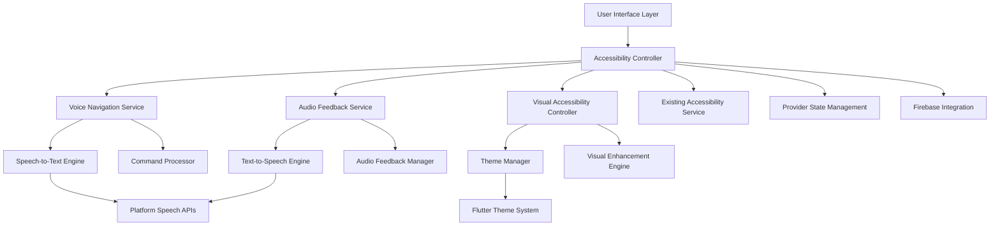

# Design Document: Accessibility Enhancement

## Overview

This design document outlines the implementation of three comprehensive accessibility features for the BhashaLens Flutter translation app: Voice Navigation System, Smart Audio Feedback System, and Enhanced Visual Accessibility. The design builds upon the existing accessibility infrastructure while adding powerful new capabilities that make the app fully accessible to users with diverse needs.

The implementation leverages Flutter's built-in accessibility framework, integrates with platform-specific accessibility services, and uses established packages like `speech_to_text` and `flutter_tts` for voice functionality. The design ensures seamless integration with existing features while maintaining high performance and reliability.

## Architecture

### High-Level Architecture



### Service Integration Pattern

The accessibility enhancement follows a layered service pattern that integrates with existing app infrastructure:

1. **Accessibility Controller**: Central coordinator that manages all accessibility features
2. **Feature Services**: Specialized services for voice navigation, audio feedback, and visual accessibility
3. **Platform Integration**: Leverages Flutter's accessibility framework and platform-specific APIs
4. **State Management**: Integrates with existing Provider pattern for consistent state handling

## Components and Interfaces

### 1. Enhanced Accessibility Service

```dart
abstract class AccessibilityService {
  // Core accessibility state management
  bool get isVoiceNavigationEnabled;
  bool get isAudioFeedbackEnabled;
  bool get isVisualAccessibilityEnabled;
  
  // Feature toggles
  Future<void> enableVoiceNavigation();
  Future<void> enableAudioFeedback();
  Future<void> enableVisualAccessibility();
  
  // Integration with existing services
  void integrateWithExistingThemes();
  void preserveUserPreferences();
}

class AccessibilityController extends ChangeNotifier implements AccessibilityService {
  final VoiceNavigationService _voiceNavigation;
  final AudioFeedbackService _audioFeedback;
  final VisualAccessibilityController _visualAccessibility;
  final SharedPreferences _preferences;
  
  // Implementation coordinates between all accessibility features
}
```

### 2. Voice Navigation Service

```dart
abstract class VoiceNavigationService {
  // Voice command processing
  Stream<VoiceCommand> get commandStream;
  Future<void> startListening();
  Future<void> stopListening();
  
  // Navigation commands
  Future<void> executeNavigationCommand(VoiceCommand command);
  Future<void> executePageSpecificCommand(VoiceCommand command, String currentPage);
  
  // Command feedback
  Future<void> provideCommandFeedback(String message);
  Future<void> listAvailableCommands(String context);
}

class VoiceNavigationController implements VoiceNavigationService {
  final SpeechToText _speechToText;
  final CommandProcessor _commandProcessor;
  final NavigationService _navigationService;
  final AudioFeedbackService _audioFeedback;
  
  // Maps voice commands to navigation actions
  final Map<String, NavigationAction> _commandMap = {
    'go to camera': NavigationAction.cameraTranslation,
    'go to voice translation': NavigationAction.voiceTranslation,
    'go to text translation': NavigationAction.textTranslation,
    'go to settings': NavigationAction.settings,
    'go back': NavigationAction.back,
    'go home': NavigationAction.home,
    'start translation': NavigationAction.startTranslation,
    'help': NavigationAction.showHelp,
    'repeat': NavigationAction.repeat,
  };
}
```

### 3. Audio Feedback Service

```dart
abstract class AudioFeedbackService {
  // Text-to-speech functionality
  Future<void> speak(String text, {String? language});
  Future<void> announcePageChange(String pageName, String description);
  Future<void> announceButtonAction(String buttonName, String action);
  Future<void> announceError(String errorMessage);
  Future<void> announceSuccess(String successMessage);
  
  // Speech control
  Future<void> pauseSpeech();
  Future<void> resumeSpeech();
  Future<void> stopSpeech();
  
  // Settings
  Future<void> setSpeechRate(double rate);
  Future<void> setSpeechPitch(double pitch);
  Future<void> setVoice(String voiceId);
  List<Voice> getAvailableVoices();
}

class AudioFeedbackController implements AudioFeedbackService {
  final FlutterTts _tts;
  final AudioFeedbackManager _feedbackManager;
  
  // Manages different types of audio feedback
  final Map<FeedbackType, AudioCue> _audioCues = {
    FeedbackType.navigation: AudioCue.navigationSound,
    FeedbackType.success: AudioCue.successChime,
    FeedbackType.error: AudioCue.errorBeep,
    FeedbackType.buttonPress: AudioCue.clickSound,
  };
}
```

### 4. Visual Accessibility Controller

```dart
abstract class VisualAccessibilityController {
  // High contrast themes
  Future<void> enableHighContrastMode();
  Future<void> disableHighContrastMode();
  ThemeData getHighContrastTheme();
  
  // Text and sizing
  Future<void> setTextScale(double scale);
  Future<void> enableBoldText();
  Future<void> setTouchTargetSize(double minSize);
  
  // Visual enhancements
  Future<void> enableSimplifiedUI();
  Future<void> enableFocusIndicators();
  Future<void> enableColorBlindSupport();
  Future<void> reduceMotion();
}

class VisualAccessibilityManager implements VisualAccessibilityController {
  final ThemeManager _themeManager;
  final VisualEnhancementEngine _visualEngine;
  
  // High contrast color schemes
  final ColorScheme _highContrastLight = ColorScheme.fromSeed(
    seedColor: Colors.blue,
    brightness: Brightness.light,
    // Ensures 7:1 contrast ratio
    primary: Color(0xFF000080),
    onPrimary: Color(0xFFFFFFFF),
    surface: Color(0xFFFFFFFF),
    onSurface: Color(0xFF000000),
  );
  
  final ColorScheme _highContrastDark = ColorScheme.fromSeed(
    seedColor: Colors.blue,
    brightness: Brightness.dark,
    // Ensures 7:1 contrast ratio
    primary: Color(0xFF4080FF),
    onPrimary: Color(0xFF000000),
    surface: Color(0xFF000000),
    onSurface: Color(0xFFFFFFFF),
  );
}
```

### 5. Command Processor

```dart
class CommandProcessor {
  final Map<String, List<String>> _commandVariations = {
    'navigate_camera': ['go to camera', 'camera translation', 'open camera'],
    'navigate_voice': ['go to voice', 'voice translation', 'speak to translate'],
    'navigate_text': ['go to text', 'text translation', 'type to translate'],
    'navigate_settings': ['go to settings', 'open settings', 'preferences'],
    'navigate_back': ['go back', 'previous', 'return', 'back'],
    'navigate_home': ['go home', 'main menu', 'home screen'],
    'start_translation': ['translate this', 'start translation', 'translate'],
    'show_help': ['help', 'what can I say', 'voice commands', 'commands'],
    'repeat_last': ['repeat', 'say that again', 'repeat last'],
  };
  
  VoiceCommand? processSpokenText(String spokenText) {
    // Fuzzy matching and command recognition logic
    // Returns structured command with confidence score
  }
  
  List<String> getContextualCommands(String currentPage) {
    // Returns available commands for current page context
  }
}
```

## Data Models

### Voice Command Model

```dart
class VoiceCommand {
  final String originalText;
  final CommandType type;
  final Map<String, dynamic> parameters;
  final double confidence;
  final DateTime timestamp;
  
  VoiceCommand({
    required this.originalText,
    required this.type,
    required this.parameters,
    required this.confidence,
    required this.timestamp,
  });
}

enum CommandType {
  navigation,
  translation,
  settings,
  help,
  control,
}
```

### Accessibility Settings Model

```dart
class AccessibilitySettings {
  // Voice navigation settings
  final bool voiceNavigationEnabled;
  final String voiceNavigationLanguage;
  final double voiceCommandTimeout;
  
  // Audio feedback settings
  final bool audioFeedbackEnabled;
  final double speechRate;
  final double speechPitch;
  final String preferredVoice;
  final bool autoReadTranslations;
  final bool autoReadErrors;
  
  // Visual accessibility settings
  final bool highContrastEnabled;
  final double textScale;
  final bool boldTextEnabled;
  final bool simplifiedUIEnabled;
  final bool focusIndicatorsEnabled;
  final bool colorBlindSupportEnabled;
  final bool reducedMotionEnabled;
  final double touchTargetSize;
  
  AccessibilitySettings({
    this.voiceNavigationEnabled = false,
    this.voiceNavigationLanguage = 'en-US',
    this.voiceCommandTimeout = 3.0,
    this.audioFeedbackEnabled = false,
    this.speechRate = 1.0,
    this.speechPitch = 1.0,
    this.preferredVoice = 'default',
    this.autoReadTranslations = true,
    this.autoReadErrors = true,
    this.highContrastEnabled = false,
    this.textScale = 1.0,
    this.boldTextEnabled = false,
    this.simplifiedUIEnabled = false,
    this.focusIndicatorsEnabled = false,
    this.colorBlindSupportEnabled = false,
    this.reducedMotionEnabled = false,
    this.touchTargetSize = 48.0,
  });
  
  // Serialization methods for persistence
  Map<String, dynamic> toJson();
  factory AccessibilitySettings.fromJson(Map<String, dynamic> json);
}
```

### Audio Feedback Configuration

```dart
class AudioFeedbackConfig {
  final Map<String, String> pageAnnouncements;
  final Map<String, String> buttonDescriptions;
  final Map<String, String> errorMessages;
  final Map<String, String> successMessages;
  
  AudioFeedbackConfig({
    required this.pageAnnouncements,
    required this.buttonDescriptions,
    required this.errorMessages,
    required this.successMessages,
  });
  
  static AudioFeedbackConfig get defaultConfig => AudioFeedbackConfig(
    pageAnnouncements: {
      '/': 'Home page. Choose translation method: camera, voice, or text.',
      '/camera': 'Camera translation page. Point camera at text to translate.',
      '/voice': 'Voice translation page. Speak to translate your words.',
      '/text': 'Text translation page. Type text to translate.',
      '/settings': 'Settings page. Adjust app preferences and accessibility options.',
    },
    buttonDescriptions: {
      'camera_capture': 'Take photo for translation',
      'voice_record': 'Start voice recording for translation',
      'text_translate': 'Translate entered text',
      'settings_accessibility': 'Open accessibility settings',
      'back_button': 'Go to previous page',
    },
    errorMessages: {
      'no_internet': 'No internet connection. Please check your network and try again.',
      'translation_failed': 'Translation failed. Please try again.',
      'voice_recognition_failed': 'Could not understand speech. Please try speaking again.',
      'camera_permission_denied': 'Camera permission required for photo translation.',
    },
    successMessages: {
      'translation_complete': 'Translation completed successfully.',
      'settings_saved': 'Settings saved successfully.',
      'voice_command_executed': 'Voice command executed.',
    },
  );
}
```

## Integration Points

### 1. Existing Accessibility Service Integration

```dart
class AccessibilityServiceIntegration {
  final AccessibilityService _existingService;
  final AccessibilityController _newController;
  
  Future<void> migrateExistingSettings() {
    // Preserve existing theme preferences
    // Migrate text size settings
    // Maintain user preferences
  }
  
  void setupBidirectionalSync() {
    // Ensure changes in new system update existing system
    // Maintain compatibility with existing features
  }
}
```

### 2. Provider State Management Integration

```dart
class AccessibilityProvider extends ChangeNotifier {
  final AccessibilityController _controller;
  
  AccessibilitySettings get settings => _controller.settings;
  
  Future<void> updateVoiceNavigationEnabled(bool enabled) async {
    await _controller.setVoiceNavigationEnabled(enabled);
    notifyListeners();
  }
  
  Future<void> updateAudioFeedbackEnabled(bool enabled) async {
    await _controller.setAudioFeedbackEnabled(enabled);
    notifyListeners();
  }
  
  Future<void> updateVisualAccessibilityEnabled(bool enabled) async {
    await _controller.setVisualAccessibilityEnabled(enabled);
    notifyListeners();
  }
}
```

### 3. Firebase Integration

```dart
class AccessibilityFirebaseIntegration {
  final FirebaseFirestore _firestore;
  final FirebaseAuth _auth;
  
  Future<void> syncAccessibilitySettings(AccessibilitySettings settings) async {
    if (_auth.currentUser != null) {
      await _firestore
          .collection('users')
          .doc(_auth.currentUser!.uid)
          .collection('accessibility')
          .doc('settings')
          .set(settings.toJson());
    }
  }
  
  Future<AccessibilitySettings?> loadAccessibilitySettings() async {
    if (_auth.currentUser != null) {
      final doc = await _firestore
          .collection('users')
          .doc(_auth.currentUser!.uid)
          .collection('accessibility')
          .doc('settings')
          .get();
      
      if (doc.exists) {
        return AccessibilitySettings.fromJson(doc.data()!);
      }
    }
    return null;
  }
}
```

Now I need to use the prework tool to analyze the acceptance criteria before writing the correctness properties:

<function_calls>
<invoke name="prework">
<parameter name="featureName">accessibility-enhancement
## Correctness Properties

*A property is a characteristic or behavior that should hold true across all valid executions of a system—essentially, a formal statement about what the system should do. Properties serve as the bridge between human-readable specifications and machine-verifiable correctness guarantees.*

Based on the prework analysis, I've identified the testable acceptance criteria and consolidated redundant properties. The following properties provide comprehensive validation coverage while avoiding duplication:

### Property 1: Voice Navigation Activation and Deactivation
*For any* voice navigation activation method (voice command or button tap), the Voice_Navigation_System should activate successfully and provide audio confirmation, and for any deactivation command, it should deactivate successfully
**Validates: Requirements 1.1, 1.8**

### Property 2: Voice Command Recognition and Execution
*For any* valid voice command from the supported command set, the Voice_Navigation_System should recognize the command and execute the appropriate action within the expected timeframe
**Validates: Requirements 1.2, 1.3, 1.4, 1.5, 6.2**

### Property 3: Context-Aware Voice Commands
*For any* page context and its associated page-specific commands, the Voice_Navigation_System should support and execute those commands correctly while providing appropriate help information
**Validates: Requirements 1.6, 1.11**

### Property 4: Voice Command Error Handling
*For any* invalid, unclear, or unrecognized voice command, the Voice_Navigation_System should provide helpful error feedback with suggestions for valid alternatives
**Validates: Requirements 1.9**

### Property 5: Voice Command Feedback and Repetition
*For any* successfully executed voice command, the system should provide clear audio confirmation, and for any repeat request, it should replay the last audio message
**Validates: Requirements 1.7, 1.10**

### Property 6: Multi-language Voice Support
*For any* supported language in the app's translation capabilities, the Voice_Navigation_System should recognize and process voice commands in that language
**Validates: Requirements 1.12**

### Property 7: Automatic TTS for UI Elements and Translations
*For any* UI element that receives focus or any completed translation, the TTS_Engine should automatically provide appropriate audio announcements
**Validates: Requirements 2.1, 2.2, 2.4**

### Property 8: Interactive Element Audio Descriptions
*For any* button or interactive element that is tapped, the TTS_Engine should announce a clear description of what the element does
**Validates: Requirements 2.3**

### Property 9: System Message Audio Announcements
*For any* error message, success message, or system notification that appears, the TTS_Engine should immediately read the message aloud
**Validates: Requirements 2.5**

### Property 10: TTS Settings and Controls
*For any* valid speech rate, pitch, or voice selection within the supported ranges, the TTS_Engine should apply the settings correctly and allow speech control (pause, resume, stop)
**Validates: Requirements 2.6, 2.7, 2.8, 2.9**

### Property 11: Language-Aware TTS
*For any* content in different languages, the TTS_Engine should automatically detect the language and use the appropriate language-specific voice for reading
**Validates: Requirements 2.10**

### Property 12: Background TTS and Audio Cues
*For any* translation completion while the app is in background, the TTS_Engine should still provide notifications, and for any type of user action, the Audio_Feedback_System should provide distinct audio cues
**Validates: Requirements 2.11, 2.12**

### Property 13: High Contrast Visual Standards
*For any* UI element when high contrast mode is enabled, the Visual_Accessibility_Controller should ensure color contrast ratios meet or exceed 7:1 and provide distinct colors for different UI states
**Validates: Requirements 3.1, 3.5, 3.10**

### Property 14: Touch Target and Text Enhancement
*For any* interactive element when visual accessibility is active, the Visual_Accessibility_Controller should ensure minimum 48dp touch targets, and for any text when large text mode is enabled, it should be bold and appropriately scaled
**Validates: Requirements 3.2, 3.3, 3.4**

### Property 15: Visual Accessibility Features
*For any* UI layout when simplified mode is enabled, decorative elements should be hidden, and when focus indicators are enabled, clear visual focus should be displayed
**Validates: Requirements 3.6, 3.7, 3.11**

### Property 16: Color-Blind and Motion Accessibility
*For any* information display when color accessibility is enabled, non-color indicators should be used, and when motion sensitivity is enabled, animations should be reduced or removed
**Validates: Requirements 3.8, 3.12**

### Property 17: Immediate Visual Settings Application
*For any* visual accessibility setting change, the Visual_Accessibility_Controller should apply the changes immediately without requiring app restart
**Validates: Requirements 3.9**

### Property 18: Settings Preview and Reset Functionality
*For any* accessibility setting being tested, the Accessibility_Service should provide preview functionality, and for any settings configuration, it should allow reset to defaults
**Validates: Requirements 4.3, 4.6**

### Property 19: Help System Accessibility
*For any* help request or accessibility guidance need, the Accessibility_Service should provide easily accessible help content and tutorials
**Validates: Requirements 4.5**

### Property 20: Settings Import/Export
*For any* accessibility settings configuration, the Accessibility_Service should allow exporting the configuration and importing it correctly on other devices
**Validates: Requirements 4.8**

### Property 21: Multi-Feature Coordination
*For any* combination of multiple accessibility features enabled simultaneously, the Accessibility_Service should ensure they work together without conflicts while maintaining good performance
**Validates: Requirements 4.7, 5.8, 6.7**

### Property 22: Existing Feature Integration
*For any* existing app functionality (translation, Firebase, themes, navigation, state management) when accessibility features are enabled, all existing functionality should continue to work correctly
**Validates: Requirements 5.1, 5.2, 5.3, 5.4, 5.5, 5.6, 5.7**

### Property 23: Performance Impact When Disabled
*For any* performance metric (speed, battery, memory) when accessibility features are disabled, there should be no measurable impact on app performance
**Validates: Requirements 6.1**

### Property 24: TTS Non-Interference
*For any* concurrent app function (camera, voice recording) while TTS is active, the TTS_Engine should not interfere with the other functionality
**Validates: Requirements 6.3**

### Property 25: Performance Maintenance with Visual Accessibility
*For any* animation or UI interaction when visual accessibility mode is enabled, the Visual_Accessibility_Controller should maintain smooth performance and quick response times
**Validates: Requirements 6.4**

### Property 26: Error Resilience and Priority Management
*For any* error condition in accessibility features, the Accessibility_Service should handle errors gracefully while maintaining core translation functionality, and under heavy load, should prioritize translation features appropriately
**Validates: Requirements 6.5, 6.8**

### Property 27: Adaptive Learning
*For any* user interaction pattern over time, the Voice_Command_Processor should gradually improve recognition accuracy based on usage patterns
**Validates: Requirements 6.6**

### Property 28: Screen Reader and Assistive Technology Compatibility
*For any* UI element when screen readers or external assistive technologies are active, the Accessibility_Service should provide proper labels, descriptions, and expose necessary accessibility information
**Validates: Requirements 7.1, 7.2**

### Property 29: Keyboard Navigation Support
*For any* app feature when keyboard navigation is used, the Accessibility_Service should support full navigation using tab and arrow keys
**Validates: Requirements 7.3**

### Property 30: Platform Accessibility Compliance
*For any* platform accessibility guideline or automated accessibility test, the Accessibility_Service should meet Android and iOS standards and pass compliance checks
**Validates: Requirements 7.4, 7.8**

### Property 31: Focus Management and Announcements
*For any* focus movement through the app, the Accessibility_Service should maintain logical focus order, and for any app state change, it should properly notify assistive technologies using appropriate announcement types
**Validates: Requirements 7.5, 7.6, 7.7**

## Error Handling

### Voice Navigation Error Handling

1. **Speech Recognition Failures**
   - Timeout handling for voice commands (3-second default)
   - Background noise filtering and confidence thresholds
   - Graceful degradation when speech recognition is unavailable
   - Clear user feedback for recognition failures

2. **Command Processing Errors**
   - Fuzzy matching for similar commands
   - Context-aware error suggestions
   - Fallback to manual navigation when voice fails
   - Command history for debugging and improvement

3. **Navigation Errors**
   - Validation of navigation targets before execution
   - Rollback mechanisms for failed navigation
   - Integration with existing error handling systems

### Audio Feedback Error Handling

1. **TTS Engine Failures**
   - Fallback to system TTS when primary engine fails
   - Silent degradation with visual indicators
   - Queue management for multiple TTS requests
   - Language fallback for unsupported languages

2. **Audio Hardware Issues**
   - Detection of audio output availability
   - Graceful handling of headphone disconnection
   - Volume level validation and adjustment
   - Background audio conflict resolution

### Visual Accessibility Error Handling

1. **Theme Application Failures**
   - Rollback to previous working theme
   - Validation of contrast ratios before application
   - Safe mode with guaranteed accessible colors
   - Progressive enhancement approach

2. **Performance Degradation**
   - Automatic feature reduction under resource constraints
   - User notification of performance impacts
   - Selective feature disabling to maintain core functionality

## Testing Strategy

### Dual Testing Approach

The accessibility enhancement features require both unit testing and property-based testing to ensure comprehensive coverage:

**Unit Tests**: Focus on specific examples, edge cases, and integration points
- Test specific voice commands with known inputs and expected outputs
- Test TTS with specific text samples and language combinations
- Test visual accessibility with specific UI configurations
- Test error conditions with controlled failure scenarios
- Test integration points between accessibility features and existing services

**Property-Based Tests**: Verify universal properties across all inputs using fast-check library
- Generate random voice commands and verify recognition patterns
- Generate random UI elements and verify accessibility compliance
- Generate random settings combinations and verify compatibility
- Generate random error conditions and verify graceful handling
- Each property test runs minimum 100 iterations for thorough coverage

### Property-Based Testing Configuration

**Library**: fast-check for TypeScript/JavaScript property-based testing
**Configuration**: Minimum 100 iterations per property test
**Tagging**: Each property test references its design document property

Example property test structure:
```typescript
// Feature: accessibility-enhancement, Property 2: Voice Command Recognition and Execution
fc.assert(fc.property(
  fc.oneof(
    fc.constant("go to camera"),
    fc.constant("camera translation"),
    fc.constant("open camera")
  ),
  (command) => {
    const result = voiceNavigationService.processCommand(command);
    expect(result.action).toBe(NavigationAction.cameraTranslation);
    expect(result.executionTime).toBeLessThan(2000);
  }
), { numRuns: 100 });
```

### Accessibility-Specific Testing

**Screen Reader Testing**: Use platform accessibility testing tools
- iOS: Xcode Accessibility Inspector with VoiceOver
- Android: Accessibility Scanner and TalkBack testing
- Automated semantic tree validation

**Contrast Ratio Testing**: Automated validation of color contrast
- WCAG 2.1 AA compliance verification (7:1 ratio for high contrast)
- Programmatic contrast calculation and validation
- Visual regression testing for theme changes

**Performance Testing**: Measure impact of accessibility features
- Memory usage monitoring with accessibility features enabled/disabled
- Battery usage testing during extended voice navigation sessions
- Response time measurement for voice commands and TTS

**Integration Testing**: Verify compatibility with existing features
- Translation accuracy with accessibility features enabled
- Firebase synchronization with accessibility settings
- Provider state management consistency
- Navigation flow preservation

### Testing Tools and Frameworks

1. **Flutter Testing Framework**: For unit and widget tests
2. **fast-check**: For property-based testing of business logic
3. **Accessibility Testing Tools**: Platform-specific accessibility validators
4. **Performance Monitoring**: Flutter performance profiling tools
5. **Integration Testing**: Flutter integration test framework

The testing strategy ensures that accessibility features enhance the app experience without compromising existing functionality, performance, or reliability.