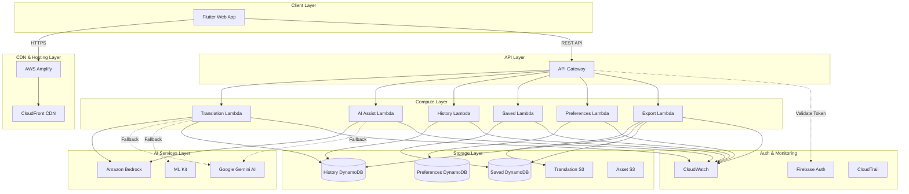
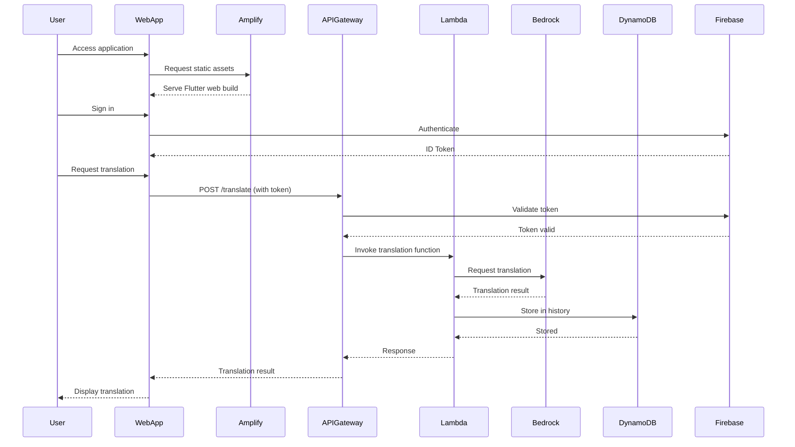
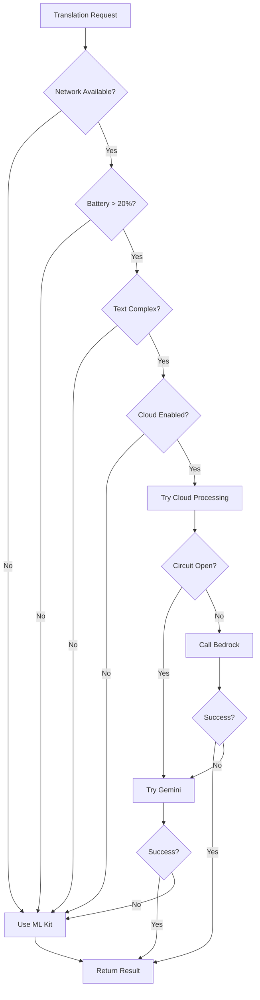
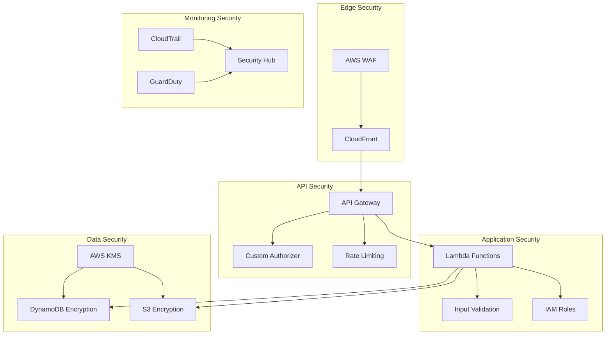

# Design Document: AWS Web Deployment for BhashaLens

## Overview

This design document specifies the technical architecture for deploying the BhashaLens Flutter web application on AWS cloud infrastructure. The system extends the existing hybrid offline-first architecture with scalable web hosting, persistent cloud storage, and serverless AI processing capabilities.

### System Context

BhashaLens currently operates as a mobile-first translation and accessibility application using:
- Firebase Authentication for user identity
- Google Gemini AI for language processing
- ML Kit for on-device translation
- Local storage for offline functionality

This AWS deployment adds:
- Web application hosting via AWS Amplify
- Cloud storage for translation history and saved translations via DynamoDB
- Enhanced AI capabilities via Amazon Bedrock
- Serverless processing via AWS Lambda
- RESTful API via API Gateway
- File storage and export via S3

### Design Goals

1. **Hybrid Architecture**: Maintain offline-first capabilities while adding cloud features
2. **Cost Efficiency**: Serverless architecture with pay-per-use pricing
3. **Scalability**: Auto-scaling from 0 to 10,000+ concurrent users
4. **Reliability**: 99.9% uptime with graceful degradation
5. **Security**: End-to-end encryption and compliance with data privacy regulations
6. **Performance**: Sub-5-second response times for 95% of requests
7. **Maintainability**: Infrastructure as code with automated deployment


## Architecture

### High-Level Architecture

The system follows a serverless microservices architecture with the following layers:




### Request Flow Architecture



### Hybrid Processing Decision Flow




### Deployment Architecture

The infrastructure is deployed using Terraform with the following resource organization:

```
AWS Account (us-east-1)
├── Networking
│   ├── VPC (optional for Lambda)
│   └── Security Groups
├── Compute
│   ├── AWS Amplify App
│   ├── Lambda Functions (6)
│   └── Lambda Layers (shared dependencies)
├── API
│   ├── API Gateway REST API
│   ├── Resources & Methods
│   ├── Authorizer (Firebase token validation)
│   └── Usage Plans & API Keys
├── Storage
│   ├── DynamoDB Tables (3)
│   ├── S3 Buckets (2)
│   └── KMS Keys (encryption)
├── AI Services
│   └── Bedrock Model Access
├── Monitoring
│   ├── CloudWatch Log Groups
│   ├── CloudWatch Dashboards
│   ├── CloudWatch Alarms
│   └── SNS Topics
└── Security
    ├── IAM Roles & Policies
    ├── CloudTrail
    └── AWS WAF (optional)
```

## Components and Interfaces

### 1. AWS Amplify Hosting Component

**Purpose**: Host and serve the Flutter web application with CDN distribution.

**Configuration**:
- Build settings: Flutter web build command
- Environment: Production
- Branch: main (auto-deploy)
- Custom domain: Optional
- Compression: Brotli/Gzip enabled
- Cache control: 1 year for static assets, no-cache for index.html

**Interface**:
```
Input: Git repository push
Output: HTTPS endpoint serving web application
```

**Performance Requirements**:
- Initial page load: < 3 seconds
- Asset delivery: < 500ms via CloudFront
- Cache hit ratio: > 90%


### 2. API Gateway Component

**Purpose**: Provide RESTful API endpoints with authentication, throttling, and request validation.

**Endpoints**:

| Method | Path | Lambda Function | Auth Required | Description |
|--------|------|----------------|---------------|-------------|
| POST | /translate | TranslateLambda | Optional | Translate text |
| POST | /assist | AssistLambda | Optional | AI language assistance |
| POST | /simplify | AssistLambda | Optional | Text simplification |
| GET | /history | HistoryLambda | Required | Get translation history |
| DELETE | /history/{id} | HistoryLambda | Required | Delete history item |
| GET | /saved | SavedLambda | Required | Get saved translations |
| POST | /saved | SavedLambda | Required | Save translation |
| DELETE | /saved/{id} | SavedLambda | Required | Unsave translation |
| GET | /preferences | PrefsLambda | Required | Get user preferences |
| PUT | /preferences | PrefsLambda | Required | Update preferences |
| POST | /export | ExportLambda | Required | Export translations |

**Request/Response Formats**:

```typescript
// POST /translate
Request: {
  sourceText: string;
  sourceLang: string;
  targetLang: string;
  userId?: string; // Optional for anonymous
}

Response: {
  status: "success" | "error";
  data?: {
    translatedText: string;
    confidence: number;
    backend: "bedrock" | "gemini" | "mlkit";
    processingTime: number;
  };
  error?: {
    code: string;
    message: string;
  };
}

// POST /assist
Request: {
  text: string;
  requestType: "grammar" | "simplify" | "qa" | "conversation";
  targetComplexity?: "simple" | "moderate" | "advanced";
  context?: string[];
  userId?: string;
}

Response: {
  status: "success" | "error";
  data?: {
    result: string;
    corrections?: Array<{
      original: string;
      corrected: string;
      explanation: string;
    }>;
    confidence: number;
    metadata: Record<string, any>;
  };
  error?: {
    code: string;
    message: string;
  };
}

// GET /history
Request: Query params {
  page?: number;
  pageSize?: 20 | 50 | 100;
  startDate?: string;
  endDate?: string;
}

Response: {
  status: "success" | "error";
  data?: {
    items: TranslationRecord[];
    total: number;
    page: number;
    pageSize: number;
    hasMore: boolean;
  };
  error?: {
    code: string;
    message: string;
  };
}

// GET /saved
Request: Query params {
  search?: string;
  tags?: string[];
  page?: number;
  pageSize?: 20 | 50 | 100;
}

Response: {
  status: "success" | "error";
  data?: {
    items: SavedTranslation[];
    total: number;
    page: number;
    pageSize: number;
  };
  error?: {
    code: string;
    message: string;
  };
}

// GET /preferences
Response: {
  status: "success" | "error";
  data?: {
    theme: "light" | "dark" | "system";
    defaultSourceLang: string;
    defaultTargetLang: string;
    dataUsagePolicy: "wifi-only" | "always" | "never";
    accessibilitySettings: {
      textScaleFactor: number;
      highContrast: boolean;
      screenReader: boolean;
    };
    version: number;
  };
  error?: {
    code: string;
    message: string;
  };
}

// POST /export
Request: {
  exportType: "history" | "saved" | "both";
  format: "json" | "csv";
  startDate?: string;
  endDate?: string;
}

Response: {
  status: "success" | "error";
  data?: {
    downloadUrl: string; // Presigned S3 URL
    expiresAt: string;
    recordCount: number;
  };
  error?: {
    code: string;
    message: string;
  };
}
```

**Configuration**:
- CORS: Allow requests from Amplify domain
- Throttling: 1000 requests/second burst, 500 requests/second steady
- Rate limiting: 100 requests/minute per user
- Request validation: JSON schema validation
- Authorization: Custom authorizer validating Firebase ID tokens


### 3. Lambda Functions Component

**Common Configuration**:
- Runtime: Python 3.11
- Memory: 512 MB
- Timeout: 30 seconds
- Environment variables: DynamoDB table names, S3 bucket names, Bedrock model IDs
- IAM role: Least privilege access to required services
- Logging: CloudWatch Logs with structured JSON format
- Error handling: Try-catch with exponential backoff retry
- Cold start optimization: Provisioned concurrency during peak hours

**3.1 Translation Lambda**

**Purpose**: Process translation requests using Bedrock with fallback to Gemini/ML Kit.

**Logic Flow**:
1. Validate input (source text, languages)
2. Check circuit breaker status
3. Invoke Bedrock Claude 3 Sonnet for translation
4. If Bedrock fails, fallback to Gemini API
5. If Gemini fails, return error (client will use ML Kit)
6. Store translation in History DynamoDB (if user authenticated)
7. Return translation with metadata

**Dependencies**:
- boto3 (AWS SDK)
- Bedrock runtime client
- DynamoDB client
- Google Generative AI SDK (for Gemini fallback)

**3.2 AI Assist Lambda**

**Purpose**: Provide grammar checking, text simplification, and language assistance.

**Logic Flow**:
1. Validate input and request type
2. Build appropriate prompt for Bedrock based on request type
3. Invoke Bedrock with context and parameters
4. Parse and structure response
5. Return formatted result with confidence scores

**Request Type Handling**:
- Grammar: Analyze text and return corrections with explanations
- Simplify: Rewrite text at target complexity level
- QA: Answer language learning questions
- Conversation: Multi-turn dialogue with context

**3.3 History Lambda**

**Purpose**: Manage translation history CRUD operations.

**Operations**:
- GET: Query history with pagination, filtering by date range
- DELETE: Remove specific history item or all history for user
- Automatic cleanup: Archive records older than 365 days

**Query Optimization**:
- Use DynamoDB Query with partition key (userId) and sort key (timestamp)
- Implement pagination using LastEvaluatedKey
- Cache frequent queries in Lambda memory

**3.4 Saved Lambda**

**Purpose**: Manage saved translations with tagging and search.

**Operations**:
- GET: Query saved translations with search and tag filtering
- POST: Save translation with tags
- PUT: Update tags or metadata
- DELETE: Remove saved translation

**Search Implementation**:
- Full-text search on source/target text using DynamoDB scan with filter
- Tag-based filtering using GSI on tags attribute
- Combine filters for complex queries

**3.5 Preferences Lambda**

**Purpose**: Synchronize user preferences across devices.

**Operations**:
- GET: Retrieve current preferences
- PUT: Update preferences with version conflict resolution

**Conflict Resolution**:
- Last-write-wins strategy using version numbers
- Increment version on each update
- Return conflict error if client version is outdated

**3.6 Export Lambda**

**Purpose**: Generate and export translation data to S3.

**Logic Flow**:
1. Query DynamoDB for requested data (history/saved)
2. Format data as JSON or CSV
3. Upload to S3 Translation Bucket with unique key
4. Generate presigned URL with 1-hour expiration
5. Return download URL to client

**Export Formats**:
- JSON: Structured data with full metadata
- CSV: Tabular format with essential fields


### 4. Amazon Bedrock Integration Component

**Purpose**: Provide high-quality AI-powered translation and language assistance.

**Models Used**:
- **Claude 3 Sonnet**: Primary model for translation and complex language tasks
- **Titan Text**: Alternative model for cost optimization on simple tasks

**Model Selection Logic**:
```python
def select_model(text_length: int, complexity: str) -> str:
    if complexity == "high" or text_length > 1000:
        return "anthropic.claude-3-sonnet-20240229-v1:0"
    else:
        return "amazon.titan-text-express-v1"
```

**Prompt Engineering**:

Translation prompt template:
```
Translate the following text from {source_lang} to {target_lang}.
Maintain the tone, style, and cultural context.
Provide only the translation without explanations.

Text: {source_text}

Translation:
```

Grammar checking prompt template:
```
Analyze the following text for grammar, spelling, and style errors.
Provide corrections with brief explanations.

Text: {text}

Format your response as JSON:
{
  "corrections": [
    {"original": "...", "corrected": "...", "explanation": "..."}
  ]
}
```

Simplification prompt template:
```
Rewrite the following text at a {complexity_level} reading level.
Maintain the core meaning while making it easier to understand.

Text: {text}

Simplified version:
```

**Error Handling**:
- Throttling: Exponential backoff with max 3 retries
- Model errors: Fallback to alternative model or Gemini
- Timeout: 25-second timeout (within Lambda 30s limit)

**Cost Optimization**:
- Cache frequent translations in DynamoDB with TTL
- Use cheaper Titan model for simple requests
- Implement request deduplication


### 5. Hybrid Router Component

**Purpose**: Intelligently route translation requests between on-device, Gemini, and Bedrock backends.

**Decision Factors**:
1. **Network Status**: Online/offline detection
2. **Battery Level**: Avoid cloud processing on low battery
3. **Text Complexity**: Simple text uses on-device, complex uses cloud
4. **User Preferences**: Respect data usage policy settings
5. **Circuit Breaker State**: Prevent requests to failing services
6. **Cost Considerations**: Prefer cheaper options when quality is sufficient

**Routing Algorithm**:
```python
class HybridRouter:
    def route_translation(self, request: TranslationRequest) -> Backend:
        # Check prerequisites
        if not self.network_available():
            return Backend.ML_KIT
        
        if self.battery_level < 0.20:
            return Backend.ML_KIT
        
        if request.user_prefs.data_usage == "never":
            return Backend.ML_KIT
        
        if request.user_prefs.data_usage == "wifi-only" and not self.is_wifi():
            return Backend.ML_KIT
        
        # Check circuit breakers
        if self.circuit_breaker.is_open("bedrock"):
            if self.circuit_breaker.is_open("gemini"):
                return Backend.ML_KIT
            return Backend.GEMINI
        
        # Assess complexity
        complexity = self.assess_complexity(request.source_text)
        
        if complexity == "low":
            return Backend.ML_KIT
        elif complexity == "medium":
            return Backend.GEMINI  # Cost-effective for medium complexity
        else:
            return Backend.BEDROCK  # Best quality for complex text
    
    def assess_complexity(self, text: str) -> str:
        # Factors: length, vocabulary, sentence structure, idioms
        if len(text) < 50 and not self.has_idioms(text):
            return "low"
        elif len(text) < 200:
            return "medium"
        else:
            return "high"
```

**Circuit Breaker Implementation**:
```python
class CircuitBreaker:
    def __init__(self, failure_threshold: int = 5, timeout: int = 30):
        self.failure_threshold = failure_threshold
        self.timeout = timeout
        self.failures = {}
        self.last_failure_time = {}
        self.state = {}  # "closed", "open", "half-open"
    
    def record_success(self, service: str):
        self.failures[service] = 0
        self.state[service] = "closed"
    
    def record_failure(self, service: str):
        self.failures[service] = self.failures.get(service, 0) + 1
        self.last_failure_time[service] = time.time()
        
        if self.failures[service] >= self.failure_threshold:
            self.state[service] = "open"
    
    def is_open(self, service: str) -> bool:
        if self.state.get(service) != "open":
            return False
        
        # Check if timeout has passed
        if time.time() - self.last_failure_time[service] > self.timeout:
            self.state[service] = "half-open"
            return False
        
        return True
```


### 6. Firebase Authentication Integration Component

**Purpose**: Validate Firebase ID tokens and extract user identity for authorization.

**Integration Points**:
1. **API Gateway Custom Authorizer**: Lambda function validating tokens
2. **Client-side**: Web app obtains token from Firebase Auth
3. **Token Validation**: Verify signature using Firebase public keys

**Custom Authorizer Implementation**:
```python
import jwt
import requests
from functools import lru_cache

class FirebaseAuthorizer:
    FIREBASE_KEYS_URL = "https://www.googleapis.com/robot/v1/metadata/x509/securetoken@system.gserviceaccount.com"
    
    @lru_cache(maxsize=1)
    def get_public_keys(self):
        response = requests.get(self.FIREBASE_KEYS_URL)
        return response.json()
    
    def validate_token(self, token: str, project_id: str) -> dict:
        try:
            # Decode header to get key ID
            header = jwt.get_unverified_header(token)
            key_id = header["kid"]
            
            # Get public key
            public_keys = self.get_public_keys()
            public_key = public_keys[key_id]
            
            # Verify token
            decoded = jwt.decode(
                token,
                public_key,
                algorithms=["RS256"],
                audience=project_id,
                issuer=f"https://securetoken.google.com/{project_id}"
            )
            
            return {
                "userId": decoded["user_id"],
                "email": decoded.get("email"),
                "emailVerified": decoded.get("email_verified", False)
            }
        except Exception as e:
            raise AuthenticationError(f"Invalid token: {str(e)}")
```

**API Gateway Authorizer Response**:
```json
{
  "principalId": "user123",
  "policyDocument": {
    "Version": "2012-10-17",
    "Statement": [
      {
        "Action": "execute-api:Invoke",
        "Effect": "Allow",
        "Resource": "arn:aws:execute-api:*:*:*"
      }
    ]
  },
  "context": {
    "userId": "user123",
    "email": "user@example.com"
  }
}
```

**Anonymous Access**:
- Translation and assist endpoints allow anonymous access
- History, saved, preferences, and export require authentication
- Anonymous requests have stricter rate limits


## Data Models

### DynamoDB Table Schemas

#### 1. Translation History Table

**Table Name**: `bhashalens-translation-history`

**Primary Key**:
- Partition Key: `userId` (String)
- Sort Key: `timestamp` (Number) - Unix timestamp in milliseconds

**Attributes**:
```typescript
interface TranslationRecord {
  userId: string;              // Partition key
  timestamp: number;           // Sort key (Unix ms)
  translationId: string;       // UUID
  sourceText: string;
  targetText: string;
  sourceLang: string;
  targetLang: string;
  backend: "bedrock" | "gemini" | "mlkit";
  confidence: number;          // 0.0 to 1.0
  processingTime: number;      // milliseconds
  createdAt: string;           // ISO 8601 timestamp
  ttl: number;                 // Unix timestamp for auto-deletion (365 days)
}
```

**Global Secondary Indexes**:

GSI 1: Language Pair Analytics
- Partition Key: `languagePair` (String) - Format: "en-es"
- Sort Key: `timestamp` (Number)
- Projection: ALL
- Purpose: Analytics on popular language pairs

**Capacity**:
- Billing Mode: On-demand
- Point-in-time recovery: Enabled (35 days)
- Encryption: AWS KMS with customer-managed key

**TTL Configuration**:
- TTL Attribute: `ttl`
- Automatic deletion after 365 days

**Access Patterns**:
1. Get user history: Query by userId, sort by timestamp DESC
2. Get user history in date range: Query by userId with timestamp BETWEEN
3. Get specific translation: Query by userId and timestamp
4. Delete translation: DeleteItem by userId and timestamp
5. Analytics by language pair: Query GSI by languagePair


#### 2. Saved Translations Table

**Table Name**: `bhashalens-saved-translations`

**Primary Key**:
- Partition Key: `userId` (String)
- Sort Key: `translationId` (String) - UUID

**Attributes**:
```typescript
interface SavedTranslation {
  userId: string;              // Partition key
  translationId: string;       // Sort key (UUID)
  sourceText: string;
  targetText: string;
  sourceLang: string;
  targetLang: string;
  tags: string[];              // User-defined tags
  notes: string;               // Optional user notes
  savedAt: string;             // ISO 8601 timestamp
  updatedAt: string;           // ISO 8601 timestamp
  usageCount: number;          // Track how often accessed
  lastAccessedAt: string;      // ISO 8601 timestamp
}
```

**Global Secondary Indexes**:

GSI 1: Tag Search
- Partition Key: `userId` (String)
- Sort Key: `tag` (String)
- Projection: ALL
- Purpose: Search saved translations by tag
- Note: Requires denormalization - create item per tag

**Capacity**:
- Billing Mode: On-demand
- Point-in-time recovery: Enabled (35 days)
- Encryption: AWS KMS with customer-managed key

**Item Limit**: 500 saved translations per user (enforced in application logic)

**Access Patterns**:
1. Get all saved translations: Query by userId
2. Get specific saved translation: Query by userId and translationId
3. Search by tag: Query GSI by userId and tag
4. Full-text search: Scan with filter expression (expensive, use sparingly)
5. Update translation: UpdateItem by userId and translationId
6. Delete translation: DeleteItem by userId and translationId


#### 3. User Preferences Table

**Table Name**: `bhashalens-user-preferences`

**Primary Key**:
- Partition Key: `userId` (String)

**Attributes**:
```typescript
interface UserPreferences {
  userId: string;                    // Partition key
  theme: "light" | "dark" | "system";
  defaultSourceLang: string;         // ISO 639-1 code
  defaultTargetLang: string;         // ISO 639-1 code
  dataUsagePolicy: "wifi-only" | "always" | "never";
  accessibilitySettings: {
    textScaleFactor: number;         // 0.8 to 2.0
    highContrast: boolean;
    screenReader: boolean;
  };
  notificationSettings: {
    translationComplete: boolean;
    dailySummary: boolean;
    weeklyReport: boolean;
  };
  version: number;                   // Incremented on each update
  createdAt: string;                 // ISO 8601 timestamp
  updatedAt: string;                 // ISO 8601 timestamp
  lastSyncedAt: string;              // ISO 8601 timestamp
}
```

**Capacity**:
- Billing Mode: On-demand
- Point-in-time recovery: Enabled (35 days)
- Encryption: AWS KMS with customer-managed key

**Conflict Resolution**:
- Strategy: Last-write-wins using version number
- Client must include current version in update request
- Server increments version and rejects if client version is outdated

**Access Patterns**:
1. Get preferences: GetItem by userId
2. Update preferences: UpdateItem by userId with version check
3. Create default preferences: PutItem on first login

**Default Preferences**:
```json
{
  "theme": "system",
  "defaultSourceLang": "en",
  "defaultTargetLang": "es",
  "dataUsagePolicy": "wifi-only",
  "accessibilitySettings": {
    "textScaleFactor": 1.0,
    "highContrast": false,
    "screenReader": false
  },
  "notificationSettings": {
    "translationComplete": true,
    "dailySummary": false,
    "weeklyReport": false
  },
  "version": 1
}
```


### S3 Bucket Schemas

#### 1. Translation Export Bucket

**Bucket Name**: `bhashalens-translation-exports-{account-id}`

**Purpose**: Store temporary export files for user download

**Structure**:
```
s3://bhashalens-translation-exports-{account-id}/
├── exports/
│   ├── {userId}/
│   │   ├── {exportId}-{timestamp}.json
│   │   ├── {exportId}-{timestamp}.csv
│   │   └── ...
```

**Object Metadata**:
```json
{
  "userId": "user123",
  "exportId": "uuid",
  "exportType": "history|saved|both",
  "format": "json|csv",
  "recordCount": 150,
  "createdAt": "2024-01-15T10:30:00Z",
  "expiresAt": "2024-01-22T10:30:00Z"
}
```

**Configuration**:
- Versioning: Enabled
- Encryption: AWS KMS (customer-managed key)
- Public access: Blocked (use presigned URLs)
- Lifecycle policy: Delete objects after 7 days
- CORS: Allow GET from Amplify domain

**Presigned URL Generation**:
```python
def generate_presigned_url(bucket: str, key: str, expiration: int = 3600) -> str:
    s3_client = boto3.client('s3')
    url = s3_client.generate_presigned_url(
        'get_object',
        Params={'Bucket': bucket, 'Key': key},
        ExpiresIn=expiration
    )
    return url
```

#### 2. Static Assets Bucket

**Bucket Name**: `bhashalens-static-assets-{account-id}`

**Purpose**: Store language packs, ML models, and other static resources

**Structure**:
```
s3://bhashalens-static-assets-{account-id}/
├── language-packs/
│   ├── en-es.json
│   ├── en-fr.json
│   └── ...
├── ml-models/
│   ├── sentiment-v1.tflite
│   └── ...
├── images/
│   ├── flags/
│   └── icons/
└── fonts/
    └── ...
```

**Configuration**:
- Versioning: Enabled
- Encryption: AWS KMS
- Public access: Allowed for read (via CloudFront)
- Lifecycle policy: Transition to Glacier after 90 days for old versions
- CloudFront distribution: Cache assets globally


## Correctness Properties

*A property is a characteristic or behavior that should hold true across all valid executions of a system—essentially, a formal statement about what the system should do. Properties serve as the bridge between human-readable specifications and machine-verifiable correctness guarantees.*

### Property Reflection

After analyzing all acceptance criteria, I identified the following testable properties. I've eliminated redundancy by combining related properties:

**Redundancy Analysis**:
- Properties 2.1 (history persistence) and 3.1 (saved persistence) both test round-trip storage → Combined into comprehensive storage properties
- Properties 4.6, 5.8, 6.8, 9.6 all test metadata/logging → Combined into single logging property
- Properties 4.5 and 5.7 both test fallback behavior → Combined into single fallback property
- Properties 8.3, 8.4, 8.5 all test token validation → Combined into comprehensive auth property
- Properties 9.3 and 9.4 both test request validation → Combined into single validation property
- Properties 10.5, 10.6, 10.7 all test error handling → Combined into comprehensive error handling property

### Property 1: Translation History Round-Trip

*For any* translation record with valid source text, target text, languages, and user ID, storing the record in History_Store and then retrieving it should return an equivalent record with all fields preserved.

**Validates: Requirements 2.1**

### Property 2: History Query Pagination Correctness

*For any* user with N translation records (where N ≤ 1000) and any valid page size (20, 50, or 100), querying history with pagination should return the correct number of pages, correct records per page, and accurate hasMore flag.

**Validates: Requirements 2.2, 2.8**

### Property 3: History Timestamp Ordering

*For any* set of translation records for a user, the returned history list should be sorted by timestamp in descending order (newest first).

**Validates: Requirements 2.4**

### Property 4: Account Deletion Removes All History

*For any* user with translation history, deleting the user account should result in zero translation records remaining for that user ID.

**Validates: Requirements 2.7**

### Property 5: Saved Translation Round-Trip

*For any* saved translation with source text, target text, languages, tags, and notes, saving it to Saved_Store and retrieving it should return an equivalent record with all fields preserved including tags.

**Validates: Requirements 3.1, 3.4**

### Property 6: Saved Translation Limit Enforcement

*For any* user with 500 saved translations, attempting to save an additional translation should be rejected with an appropriate error.

**Validates: Requirements 3.2**

### Property 7: Saved Translation Search Correctness

*For any* search query (by source text, target text, or tags), all returned saved translations should match the search criteria.

**Validates: Requirements 3.5**

### Property 8: Save and Unsave Inverse Operations

*For any* translation, saving it and then unsaving it should result in the translation not appearing in the saved translations list.

**Validates: Requirements 3.6**

### Property 9: Export Format Round-Trip

*For any* set of translations exported in JSON or CSV format, parsing the exported file should recover all translation records with data integrity preserved.

**Validates: Requirements 3.8, 6.1**

### Property 10: Hybrid Router Decision Consistency

*For any* combination of network status, battery level, text complexity, and user preferences, the Hybrid Router should return a valid backend choice (ML_Kit, Gemini, or Bedrock) that respects the input constraints.

**Validates: Requirements 4.1**

### Property 11: Model Selection Returns Valid Model ID

*For any* text length and complexity level, the model selection function should return a valid Bedrock model identifier (Claude 3 Sonnet or Titan Text).

**Validates: Requirements 4.3**

### Property 12: Fallback Chain Completeness

*For any* translation request where Bedrock fails, the system should attempt fallback to Gemini, and if Gemini fails, should either use ML_Kit or return an error (never leaving the request unhandled).

**Validates: Requirements 4.5, 5.7**

### Property 13: Response Includes Backend Identifier

*For any* successful translation response, the response object should include a valid backend identifier field indicating which service processed the request.

**Validates: Requirements 4.7**

### Property 14: Circuit Breaker State Transitions

*For any* service, after N consecutive failures (where N = 5), the circuit breaker should transition to open state and reject requests for the timeout period (30 seconds).

**Validates: Requirements 4.8**

### Property 15: Request Type Forwarding Correctness

*For any* grammar checking or text simplification request, the forwarded request to Lambda should include the correct request type and all required parameters (complexity level for simplification).

**Validates: Requirements 5.1, 5.3**

### Property 16: Conversation Context Preservation

*For any* conversation request with previous message context, the API should accept and include the context in the Bedrock invocation.

**Validates: Requirements 5.6**

### Property 17: Export File Unique Identifiers

*For any* two export requests (even from the same user), the generated file keys should be unique (no collisions).

**Validates: Requirements 6.2**

### Property 18: Export Type Filtering

*For any* export request specifying "history", "saved", or "both", the exported data should contain only records of the requested type(s).

**Validates: Requirements 6.7**

### Property 19: Export Metadata Completeness

*For any* export file, the file should contain metadata including export date, user identifier, and record count.

**Validates: Requirements 6.8**

### Property 20: User Preferences Round-Trip

*For any* valid preferences object with theme, languages, data usage policy, and accessibility settings, storing and retrieving preferences should preserve all fields.

**Validates: Requirements 7.2**

### Property 21: Preferences Version Increment

*For any* preferences update, the version number should increment by exactly 1, and concurrent updates with stale versions should be rejected.

**Validates: Requirements 7.5, 7.7**

### Property 22: Firebase Token Validation Correctness

*For any* valid Firebase ID token, validation should succeed and extract the correct user ID; for any invalid or expired token, validation should fail and return HTTP 401.

**Validates: Requirements 8.3, 8.4, 8.5**

### Property 23: Rate Limiting Enforcement

*For any* user making more than 100 requests in a 60-second window, the 101st request should be rejected with HTTP 429 status.

**Validates: Requirements 8.8, 9.8**

### Property 24: Request Payload Validation

*For any* request with invalid JSON structure or missing required fields, the API should return HTTP 400 with a descriptive error message; for any valid payload, the request should be processed.

**Validates: Requirements 9.3, 9.4**

### Property 25: Request Logging Completeness

*For any* API request, a log entry should be created containing timestamp, endpoint, user identifier (if authenticated), and response status.

**Validates: Requirements 9.6**

### Property 26: Lambda Error Handling Robustness

*For any* Bedrock service error or exception, the Lambda function should handle it gracefully, log the error with stack trace, implement retry with exponential backoff for transient failures, and return a structured error response without crashing.

**Validates: Requirements 10.5, 10.6, 10.7**

### Property 27: Lambda Response Structure Invariant

*For any* Lambda function response (success or error), the response should be valid JSON containing status field and either data field (on success) or error field (on failure).

**Validates: Requirements 10.8**

### Property 28: Input Sanitization Against Injection

*For any* user input containing SQL injection patterns, NoSQL injection patterns, or script injection patterns, the input should be rejected or sanitized before processing.

**Validates: Requirements 15.1**


## Error Handling

### Error Categories

The system handles four categories of errors:

1. **Client Errors (4xx)**: Invalid requests, authentication failures, rate limiting
2. **Server Errors (5xx)**: Internal failures, service unavailability, timeouts
3. **Service Errors**: External service failures (Bedrock, Gemini, Firebase)
4. **Data Errors**: Validation failures, constraint violations, data corruption

### Error Response Format

All API errors follow a consistent structure:

```typescript
interface ErrorResponse {
  status: "error";
  error: {
    code: string;           // Machine-readable error code
    message: string;        // Human-readable error message
    details?: any;          // Optional additional context
    requestId: string;      // For tracking and debugging
    timestamp: string;      // ISO 8601 timestamp
  };
}
```

### Error Codes

| Code | HTTP Status | Description | Recovery Action |
|------|-------------|-------------|-----------------|
| INVALID_REQUEST | 400 | Malformed request payload | Fix request format |
| MISSING_FIELD | 400 | Required field missing | Add required field |
| INVALID_TOKEN | 401 | Authentication token invalid | Re-authenticate |
| EXPIRED_TOKEN | 401 | Authentication token expired | Refresh token |
| FORBIDDEN | 403 | Insufficient permissions | Check user permissions |
| NOT_FOUND | 404 | Resource not found | Verify resource ID |
| RATE_LIMITED | 429 | Too many requests | Wait and retry |
| LIMIT_EXCEEDED | 400 | Resource limit exceeded | Delete old items |
| INTERNAL_ERROR | 500 | Unexpected server error | Retry with backoff |
| SERVICE_UNAVAILABLE | 503 | External service down | Use fallback service |
| TIMEOUT | 504 | Request timeout | Retry with shorter text |
| BEDROCK_ERROR | 502 | Bedrock service error | Fallback to Gemini |
| GEMINI_ERROR | 502 | Gemini service error | Fallback to ML Kit |
| VALIDATION_ERROR | 400 | Input validation failed | Fix input data |
| CONFLICT | 409 | Version conflict | Refresh and retry |

### Error Handling Strategies

#### 1. Retry with Exponential Backoff

For transient failures (network errors, service throttling):

```python
def retry_with_backoff(func, max_retries=3, base_delay=1):
    for attempt in range(max_retries):
        try:
            return func()
        except TransientError as e:
            if attempt == max_retries - 1:
                raise
            delay = base_delay * (2 ** attempt)
            time.sleep(delay)
```

**Applied to**:
- Bedrock API calls
- DynamoDB operations
- S3 operations

#### 2. Circuit Breaker Pattern

For preventing cascading failures:

```python
class CircuitBreaker:
    states = ["CLOSED", "OPEN", "HALF_OPEN"]
    
    def call(self, func):
        if self.state == "OPEN":
            if self.should_attempt_reset():
                self.state = "HALF_OPEN"
            else:
                raise CircuitOpenError()
        
        try:
            result = func()
            self.on_success()
            return result
        except Exception as e:
            self.on_failure()
            raise
```

**Applied to**:
- Bedrock service calls
- Gemini API calls
- External service integrations

#### 3. Graceful Degradation

For maintaining functionality when services fail:

**Translation Service Fallback Chain**:
1. Try Bedrock (best quality)
2. If Bedrock fails → Try Gemini (good quality)
3. If Gemini fails → Use ML Kit (basic quality)
4. If ML Kit fails → Return error

**Preferences Service Fallback**:
1. Try DynamoDB (cloud sync)
2. If DynamoDB fails → Use local cache
3. If no cache → Use default preferences

#### 4. Timeout Management

All operations have defined timeouts:

| Operation | Timeout | Reason |
|-----------|---------|--------|
| Bedrock API call | 25s | Within Lambda 30s limit |
| DynamoDB query | 5s | Fast data access |
| S3 upload | 10s | File size dependent |
| API Gateway request | 29s | API Gateway 30s limit |
| Lambda execution | 30s | AWS Lambda limit |

#### 5. Input Validation

Multi-layer validation prevents errors:

**Layer 1: API Gateway**
- JSON schema validation
- Required field checking
- Type validation

**Layer 2: Lambda Function**
- Business logic validation
- Range checking
- Format validation

**Layer 3: Data Layer**
- Constraint enforcement
- Uniqueness checking
- Referential integrity

### Error Logging

All errors are logged with structured data:

```json
{
  "timestamp": "2024-01-15T10:30:00Z",
  "level": "ERROR",
  "requestId": "abc-123",
  "userId": "user123",
  "endpoint": "/translate",
  "errorCode": "BEDROCK_ERROR",
  "errorMessage": "Model invocation failed",
  "stackTrace": "...",
  "context": {
    "model": "claude-3-sonnet",
    "textLength": 150,
    "attempt": 2
  }
}
```

### User-Facing Error Messages

Error messages are user-friendly and actionable:

| Internal Error | User Message |
|----------------|--------------|
| BEDROCK_ERROR | "Translation service temporarily unavailable. Using alternative service." |
| RATE_LIMITED | "Too many requests. Please wait a moment and try again." |
| INVALID_TOKEN | "Your session has expired. Please sign in again." |
| LIMIT_EXCEEDED | "You've reached the maximum number of saved translations (500). Please delete some to save more." |
| TIMEOUT | "Request took too long. Try translating shorter text." |
| INTERNAL_ERROR | "Something went wrong. Please try again." |


## Testing Strategy

### Dual Testing Approach

The system requires both unit tests and property-based tests for comprehensive coverage:

**Unit Tests**: Verify specific examples, edge cases, and integration points
**Property Tests**: Verify universal properties across all inputs

Together, these approaches provide comprehensive coverage where unit tests catch concrete bugs and property tests verify general correctness.

### Property-Based Testing Configuration

**Library Selection**:
- **Python Lambda Functions**: Hypothesis (https://hypothesis.readthedocs.io/)
- **Flutter/Dart Web App**: test package with custom property testing utilities

**Configuration**:
- Minimum 100 iterations per property test (due to randomization)
- Each property test must reference its design document property
- Tag format: `# Feature: aws-web-deployment, Property {number}: {property_text}`

**Example Property Test Structure**:

```python
from hypothesis import given, strategies as st
import pytest

# Feature: aws-web-deployment, Property 1: Translation History Round-Trip
@given(
    source_text=st.text(min_size=1, max_size=1000),
    target_text=st.text(min_size=1, max_size=1000),
    source_lang=st.sampled_from(['en', 'es', 'fr', 'de', 'hi']),
    target_lang=st.sampled_from(['en', 'es', 'fr', 'de', 'hi']),
    user_id=st.uuids().map(str)
)
@pytest.mark.property_test
def test_translation_history_round_trip(source_text, target_text, source_lang, target_lang, user_id):
    """Property 1: For any translation record, storing and retrieving should preserve all fields."""
    # Arrange
    record = create_translation_record(
        source_text=source_text,
        target_text=target_text,
        source_lang=source_lang,
        target_lang=target_lang,
        user_id=user_id
    )
    
    # Act
    store_translation(record)
    retrieved = get_translation(user_id, record['timestamp'])
    
    # Assert
    assert retrieved['sourceText'] == source_text
    assert retrieved['targetText'] == target_text
    assert retrieved['sourceLang'] == source_lang
    assert retrieved['targetLang'] == target_lang
    assert retrieved['userId'] == user_id
```

### Unit Testing Strategy

Unit tests focus on:
1. **Specific Examples**: Known input-output pairs
2. **Edge Cases**: Empty strings, maximum lengths, special characters
3. **Error Conditions**: Invalid inputs, service failures
4. **Integration Points**: Service boundaries, API contracts

**Example Unit Test**:

```python
def test_empty_translation_history():
    """Test that new users have empty translation history."""
    user_id = "new_user_123"
    history = get_translation_history(user_id)
    assert history['items'] == []
    assert history['total'] == 0

def test_saved_translation_limit():
    """Test that 501st saved translation is rejected."""
    user_id = "user_with_500_saved"
    # Assume user already has 500 saved translations
    result = save_translation(user_id, create_test_translation())
    assert result['status'] == 'error'
    assert result['error']['code'] == 'LIMIT_EXCEEDED'

def test_invalid_firebase_token():
    """Test that invalid tokens return 401."""
    response = call_api_with_token("invalid_token")
    assert response.status_code == 401
    assert response.json()['error']['code'] == 'INVALID_TOKEN'
```

### Test Coverage Requirements

**Lambda Functions**:
- Line coverage: > 80%
- Branch coverage: > 75%
- Property tests: All 28 properties implemented
- Unit tests: All error paths covered

**API Gateway**:
- All endpoints tested
- All error codes tested
- Request validation tested
- Authentication tested

**DynamoDB Operations**:
- CRUD operations tested
- Query patterns tested
- GSI queries tested
- Pagination tested

**Integration Tests**:
- End-to-end translation flow
- Authentication flow
- Export flow
- Fallback scenarios

### Test Data Generation

**Hypothesis Strategies**:

```python
# Translation text strategy
translation_text = st.text(
    alphabet=st.characters(blacklist_categories=['Cs']),  # Exclude surrogates
    min_size=1,
    max_size=5000
)

# Language code strategy
language_code = st.sampled_from([
    'en', 'es', 'fr', 'de', 'hi', 'zh', 'ja', 'ar', 'ru', 'pt'
])

# User ID strategy
user_id = st.uuids().map(str)

# Timestamp strategy
timestamp = st.integers(min_value=1000000000000, max_value=9999999999999)

# Tags strategy
tags = st.lists(
    st.text(alphabet=st.characters(whitelist_categories=['L', 'N']), min_size=1, max_size=20),
    min_size=0,
    max_size=10
)

# Preferences strategy
preferences = st.fixed_dictionaries({
    'theme': st.sampled_from(['light', 'dark', 'system']),
    'defaultSourceLang': language_code,
    'defaultTargetLang': language_code,
    'dataUsagePolicy': st.sampled_from(['wifi-only', 'always', 'never']),
    'accessibilitySettings': st.fixed_dictionaries({
        'textScaleFactor': st.floats(min_value=0.8, max_value=2.0),
        'highContrast': st.booleans(),
        'screenReader': st.booleans()
    })
})
```

### Mocking Strategy

**External Services**:
- Mock Bedrock API responses
- Mock Firebase token validation
- Mock Gemini API responses
- Mock DynamoDB for unit tests (use local DynamoDB for integration tests)

**Example Mock**:

```python
from unittest.mock import Mock, patch

@patch('boto3.client')
def test_bedrock_translation_success(mock_boto_client):
    """Test successful Bedrock translation."""
    mock_bedrock = Mock()
    mock_bedrock.invoke_model.return_value = {
        'body': json.dumps({'completion': 'Translated text'})
    }
    mock_boto_client.return_value = mock_bedrock
    
    result = translate_with_bedrock('Hello', 'en', 'es')
    assert result['translatedText'] == 'Translated text'
```

### Performance Testing

**Load Testing**:
- Use Locust or Artillery for API load testing
- Test with 100, 1000, 10000 concurrent users
- Measure response times at different load levels
- Verify auto-scaling behavior

**Benchmarks**:
- Translation API: < 5s for 95th percentile
- History query: < 2s for 95th percentile
- Saved query: < 2s for 95th percentile
- Export generation: < 10s for 1000 records

### Security Testing

**Vulnerability Scanning**:
- OWASP Top 10 testing
- SQL/NoSQL injection testing
- XSS testing
- CSRF testing
- Authentication bypass testing

**Penetration Testing**:
- API security testing
- Token manipulation testing
- Rate limit bypass testing
- Data access control testing

### Continuous Integration

**CI Pipeline**:
1. Lint code (pylint, flake8)
2. Run unit tests
3. Run property tests (100 iterations)
4. Check code coverage
5. Run integration tests
6. Security scanning
7. Build Lambda deployment packages
8. Deploy to staging environment
9. Run smoke tests
10. Manual approval for production

**Test Execution Time**:
- Unit tests: < 2 minutes
- Property tests: < 10 minutes
- Integration tests: < 5 minutes
- Total CI pipeline: < 20 minutes


## Security Architecture

### Security Layers



### Authentication and Authorization

#### Firebase Authentication Integration

**Token Flow**:
1. User authenticates with Firebase (web app)
2. Firebase returns ID token (JWT)
3. Web app includes token in Authorization header
4. API Gateway custom authorizer validates token
5. Lambda functions receive validated user context

**Token Validation**:
```python
def validate_firebase_token(token: str) -> dict:
    """
    Validate Firebase ID token and extract user claims.
    
    Returns:
        dict: User claims including userId, email
    Raises:
        AuthenticationError: If token is invalid
    """
    try:
        # Verify token signature using Firebase public keys
        decoded = jwt.decode(
            token,
            get_firebase_public_key(token),
            algorithms=['RS256'],
            audience=FIREBASE_PROJECT_ID,
            issuer=f'https://securetoken.google.com/{FIREBASE_PROJECT_ID}'
        )
        
        # Check expiration
        if decoded['exp'] < time.time():
            raise AuthenticationError('Token expired')
        
        return {
            'userId': decoded['user_id'],
            'email': decoded.get('email'),
            'emailVerified': decoded.get('email_verified', False)
        }
    except Exception as e:
        raise AuthenticationError(f'Invalid token: {str(e)}')
```

**Authorization Levels**:
- **Anonymous**: Translation, assist, simplify endpoints
- **Authenticated**: History, saved, preferences, export endpoints
- **Admin**: Analytics, user management (future)

#### IAM Roles and Policies

**Lambda Execution Role**:
```json
{
  "Version": "2012-10-17",
  "Statement": [
    {
      "Effect": "Allow",
      "Action": [
        "dynamodb:GetItem",
        "dynamodb:PutItem",
        "dynamodb:Query",
        "dynamodb:UpdateItem",
        "dynamodb:DeleteItem"
      ],
      "Resource": [
        "arn:aws:dynamodb:*:*:table/bhashalens-*"
      ],
      "Condition": {
        "ForAllValues:StringEquals": {
          "dynamodb:LeadingKeys": ["${aws:userid}"]
        }
      }
    },
    {
      "Effect": "Allow",
      "Action": [
        "bedrock:InvokeModel"
      ],
      "Resource": [
        "arn:aws:bedrock:*::foundation-model/anthropic.claude-3-sonnet*",
        "arn:aws:bedrock:*::foundation-model/amazon.titan-text*"
      ]
    },
    {
      "Effect": "Allow",
      "Action": [
        "s3:PutObject",
        "s3:GetObject"
      ],
      "Resource": [
        "arn:aws:s3:::bhashalens-translation-exports-*/*"
      ]
    },
    {
      "Effect": "Allow",
      "Action": [
        "kms:Decrypt",
        "kms:Encrypt",
        "kms:GenerateDataKey"
      ],
      "Resource": [
        "arn:aws:kms:*:*:key/*"
      ]
    },
    {
      "Effect": "Allow",
      "Action": [
        "logs:CreateLogGroup",
        "logs:CreateLogStream",
        "logs:PutLogEvents"
      ],
      "Resource": "arn:aws:logs:*:*:*"
    }
  ]
}
```

### Data Protection

#### Encryption at Rest

**DynamoDB Tables**:
- Encryption: AWS KMS with customer-managed keys
- Key rotation: Automatic annual rotation
- Key policy: Restrict access to Lambda execution role

**S3 Buckets**:
- Encryption: AWS KMS with customer-managed keys
- Bucket policy: Deny unencrypted uploads
- Versioning: Enabled for data recovery

**KMS Key Policy**:
```json
{
  "Version": "2012-10-17",
  "Statement": [
    {
      "Sid": "Enable IAM User Permissions",
      "Effect": "Allow",
      "Principal": {
        "AWS": "arn:aws:iam::ACCOUNT_ID:root"
      },
      "Action": "kms:*",
      "Resource": "*"
    },
    {
      "Sid": "Allow Lambda to use the key",
      "Effect": "Allow",
      "Principal": {
        "AWS": "arn:aws:iam::ACCOUNT_ID:role/lambda-execution-role"
      },
      "Action": [
        "kms:Decrypt",
        "kms:Encrypt",
        "kms:GenerateDataKey"
      ],
      "Resource": "*"
    }
  ]
}
```

#### Encryption in Transit

**TLS Configuration**:
- Minimum version: TLS 1.2
- Cipher suites: Strong ciphers only (AES-GCM)
- Certificate: AWS Certificate Manager (ACM)
- HSTS: Enabled with max-age=31536000

**API Gateway**:
- Enforce HTTPS only
- Reject HTTP requests
- Custom domain with ACM certificate

#### Data Sanitization

**Input Sanitization**:
```python
import re
import html

def sanitize_input(text: str, max_length: int = 5000) -> str:
    """
    Sanitize user input to prevent injection attacks.
    
    Args:
        text: User input text
        max_length: Maximum allowed length
    
    Returns:
        Sanitized text
    
    Raises:
        ValidationError: If input is invalid
    """
    # Check length
    if len(text) > max_length:
        raise ValidationError(f'Input exceeds maximum length of {max_length}')
    
    # Remove null bytes
    text = text.replace('\x00', '')
    
    # HTML escape
    text = html.escape(text)
    
    # Check for SQL injection patterns
    sql_patterns = [
        r"(\bUNION\b.*\bSELECT\b)",
        r"(\bDROP\b.*\bTABLE\b)",
        r"(\bINSERT\b.*\bINTO\b)",
        r"(--)",
        r"(;.*--)"
    ]
    for pattern in sql_patterns:
        if re.search(pattern, text, re.IGNORECASE):
            raise ValidationError('Input contains potentially malicious content')
    
    # Check for NoSQL injection patterns
    nosql_patterns = [
        r"(\$where)",
        r"(\$ne)",
        r"(\$gt)",
        r"(\$regex)"
    ]
    for pattern in nosql_patterns:
        if re.search(pattern, text, re.IGNORECASE):
            raise ValidationError('Input contains potentially malicious content')
    
    return text
```

### Network Security

#### VPC Configuration (Optional)

For enhanced security, Lambda functions can run in VPC:

```
VPC: bhashalens-vpc (10.0.0.0/16)
├── Private Subnet 1: 10.0.1.0/24 (us-east-1a)
├── Private Subnet 2: 10.0.2.0/24 (us-east-1b)
├── NAT Gateway (for outbound internet)
└── VPC Endpoints
    ├── DynamoDB VPC Endpoint
    ├── S3 VPC Endpoint
    └── Bedrock VPC Endpoint
```

**Security Groups**:
```
Lambda Security Group:
- Inbound: None (Lambda doesn't accept inbound)
- Outbound: HTTPS (443) to AWS services
```

#### API Gateway Security

**CORS Configuration**:
```json
{
  "allowOrigins": ["https://bhashalens.amplifyapp.com"],
  "allowMethods": ["GET", "POST", "PUT", "DELETE", "OPTIONS"],
  "allowHeaders": ["Content-Type", "Authorization", "X-Amz-Date"],
  "maxAge": 3600,
  "allowCredentials": true
}
```

**Request Validation**:
- JSON schema validation for all POST/PUT requests
- Query parameter validation for GET requests
- Header validation for authentication

**Rate Limiting**:
- Per-user: 100 requests/minute
- Per-IP: 1000 requests/minute
- Global: 10,000 requests/minute

#### AWS WAF (Optional)

**WAF Rules**:
1. **Rate-based rule**: Block IPs exceeding 2000 requests/5 minutes
2. **Geo-blocking**: Block requests from high-risk countries (optional)
3. **SQL injection rule**: Block requests with SQL injection patterns
4. **XSS rule**: Block requests with XSS patterns
5. **Known bad inputs**: Block requests with known malicious patterns

### Audit and Compliance

#### CloudTrail Logging

**Events Logged**:
- All API calls to AWS services
- IAM role assumptions
- KMS key usage
- S3 object access
- DynamoDB table access

**Log Retention**:
- CloudTrail logs: 90 days in CloudWatch
- Long-term storage: S3 with Glacier transition after 90 days

#### Compliance Requirements

**GDPR Compliance**:
- Right to access: Export endpoint provides user data
- Right to deletion: Account deletion removes all user data
- Data minimization: Only collect necessary data
- Consent: User preferences control data usage
- Data portability: Export in standard formats (JSON, CSV)

**CCPA Compliance**:
- Data disclosure: Privacy policy explains data collection
- Opt-out: Data usage policy allows "never" option
- Data deletion: Account deletion within 24 hours

**Data Retention**:
- Translation history: 365 days (automatic deletion via TTL)
- Saved translations: Until user deletes
- User preferences: Until account deletion
- Export files: 7 days (automatic deletion via lifecycle policy)
- Logs: 30 days in CloudWatch, 90 days in S3

### Security Monitoring

#### CloudWatch Alarms

**Security Alarms**:
1. **Unauthorized access attempts**: > 10 per 5 minutes
2. **Failed authentication**: > 20 per 5 minutes
3. **Rate limit exceeded**: > 100 per 5 minutes
4. **Unusual API patterns**: Anomaly detection
5. **KMS key usage spike**: > 1000 per minute

#### AWS GuardDuty

**Threat Detection**:
- Unusual API calls
- Compromised credentials
- Reconnaissance activity
- Instance compromise
- Bucket compromise

#### Security Hub

**Compliance Checks**:
- CIS AWS Foundations Benchmark
- PCI DSS
- AWS Foundational Security Best Practices

### Incident Response

**Security Incident Playbook**:

1. **Detection**: CloudWatch alarm or GuardDuty finding
2. **Assessment**: Review logs in CloudWatch and CloudTrail
3. **Containment**: 
   - Revoke compromised credentials
   - Block malicious IPs in WAF
   - Disable affected Lambda functions
4. **Eradication**: 
   - Rotate all credentials
   - Update security groups
   - Patch vulnerabilities
5. **Recovery**: 
   - Restore from backups if needed
   - Re-enable services
   - Monitor for recurrence
6. **Post-Incident**: 
   - Document incident
   - Update security policies
   - Improve detection rules


## Deployment Architecture

### Terraform Infrastructure as Code

The entire AWS infrastructure is defined using Terraform for reproducible, version-controlled deployments.

### Terraform Project Structure

```
terraform/
├── main.tf                      # Main configuration
├── variables.tf                 # Input variables
├── outputs.tf                   # Output values
├── terraform.tfvars            # Variable values (gitignored)
├── backend.tf                   # Remote state configuration
├── modules/
│   ├── amplify/
│   │   ├── main.tf
│   │   ├── variables.tf
│   │   └── outputs.tf
│   ├── api-gateway/
│   │   ├── main.tf
│   │   ├── variables.tf
│   │   └── outputs.tf
│   ├── lambda/
│   │   ├── main.tf
│   │   ├── variables.tf
│   │   └── outputs.tf
│   ├── dynamodb/
│   │   ├── main.tf
│   │   ├── variables.tf
│   │   └── outputs.tf
│   ├── s3/
│   │   ├── main.tf
│   │   ├── variables.tf
│   │   └── outputs.tf
│   ├── monitoring/
│   │   ├── main.tf
│   │   ├── variables.tf
│   │   └── outputs.tf
│   └── security/
│       ├── main.tf
│       ├── variables.tf
│       └── outputs.tf
└── environments/
    ├── dev.tfvars
    ├── staging.tfvars
    └── prod.tfvars
```

### Main Terraform Configuration

**main.tf**:
```hcl
terraform {
  required_version = ">= 1.0"
  
  required_providers {
    aws = {
      source  = "hashicorp/aws"
      version = "~> 5.0"
    }
  }
  
  backend "s3" {
    bucket         = "bhashalens-terraform-state"
    key            = "aws-web-deployment/terraform.tfstate"
    region         = "us-east-1"
    encrypt        = true
    dynamodb_table = "terraform-state-lock"
  }
}

provider "aws" {
  region = var.aws_region
  
  default_tags {
    tags = {
      Project     = "BhashaLens"
      Environment = var.environment
      ManagedBy   = "Terraform"
    }
  }
}

# Data sources
data "aws_caller_identity" "current" {}
data "aws_region" "current" {}

# Local variables
locals {
  account_id = data.aws_caller_identity.current.account_id
  region     = data.aws_region.current.name
  
  common_tags = {
    Project     = "BhashaLens"
    Environment = var.environment
    ManagedBy   = "Terraform"
  }
}

# Modules
module "security" {
  source = "./modules/security"
  
  environment = var.environment
  project_name = var.project_name
}

module "dynamodb" {
  source = "./modules/dynamodb"
  
  environment = var.environment
  kms_key_arn = module.security.kms_key_arn
}

module "s3" {
  source = "./modules/s3"
  
  environment = var.environment
  account_id  = local.account_id
  kms_key_arn = module.security.kms_key_arn
}

module "lambda" {
  source = "./modules/lambda"
  
  environment           = var.environment
  history_table_name    = module.dynamodb.history_table_name
  saved_table_name      = module.dynamodb.saved_table_name
  preferences_table_name = module.dynamodb.preferences_table_name
  export_bucket_name    = module.s3.export_bucket_name
  lambda_role_arn       = module.security.lambda_role_arn
  bedrock_model_ids     = var.bedrock_model_ids
  firebase_project_id   = var.firebase_project_id
}

module "api_gateway" {
  source = "./modules/api-gateway"
  
  environment              = var.environment
  lambda_functions         = module.lambda.function_arns
  authorizer_function_arn  = module.lambda.authorizer_function_arn
  amplify_domain          = module.amplify.default_domain
}

module "amplify" {
  source = "./modules/amplify"
  
  environment       = var.environment
  repository_url    = var.repository_url
  branch_name       = var.branch_name
  github_token      = var.github_token
  custom_domain     = var.custom_domain
}

module "monitoring" {
  source = "./modules/monitoring"
  
  environment         = var.environment
  api_gateway_id      = module.api_gateway.api_id
  lambda_function_names = module.lambda.function_names
  dynamodb_table_names  = module.dynamodb.table_names
  sns_email           = var.alert_email
}
```

### DynamoDB Module

**modules/dynamodb/main.tf**:
```hcl
resource "aws_dynamodb_table" "translation_history" {
  name           = "bhashalens-translation-history-${var.environment}"
  billing_mode   = "PAY_PER_REQUEST"
  hash_key       = "userId"
  range_key      = "timestamp"
  
  attribute {
    name = "userId"
    type = "S"
  }
  
  attribute {
    name = "timestamp"
    type = "N"
  }
  
  attribute {
    name = "languagePair"
    type = "S"
  }
  
  global_secondary_index {
    name            = "LanguagePairIndex"
    hash_key        = "languagePair"
    range_key       = "timestamp"
    projection_type = "ALL"
  }
  
  ttl {
    attribute_name = "ttl"
    enabled        = true
  }
  
  point_in_time_recovery {
    enabled = true
  }
  
  server_side_encryption {
    enabled     = true
    kms_key_arn = var.kms_key_arn
  }
  
  tags = {
    Name = "Translation History"
  }
}

resource "aws_dynamodb_table" "saved_translations" {
  name           = "bhashalens-saved-translations-${var.environment}"
  billing_mode   = "PAY_PER_REQUEST"
  hash_key       = "userId"
  range_key      = "translationId"
  
  attribute {
    name = "userId"
    type = "S"
  }
  
  attribute {
    name = "translationId"
    type = "S"
  }
  
  point_in_time_recovery {
    enabled = true
  }
  
  server_side_encryption {
    enabled     = true
    kms_key_arn = var.kms_key_arn
  }
  
  tags = {
    Name = "Saved Translations"
  }
}

resource "aws_dynamodb_table" "user_preferences" {
  name           = "bhashalens-user-preferences-${var.environment}"
  billing_mode   = "PAY_PER_REQUEST"
  hash_key       = "userId"
  
  attribute {
    name = "userId"
    type = "S"
  }
  
  point_in_time_recovery {
    enabled = true
  }
  
  server_side_encryption {
    enabled     = true
    kms_key_arn = var.kms_key_arn
  }
  
  tags = {
    Name = "User Preferences"
  }
}

output "history_table_name" {
  value = aws_dynamodb_table.translation_history.name
}

output "saved_table_name" {
  value = aws_dynamodb_table.saved_translations.name
}

output "preferences_table_name" {
  value = aws_dynamodb_table.user_preferences.name
}

output "table_names" {
  value = [
    aws_dynamodb_table.translation_history.name,
    aws_dynamodb_table.saved_translations.name,
    aws_dynamodb_table.user_preferences.name
  ]
}
```

### Lambda Module

**modules/lambda/main.tf**:
```hcl
# Lambda Layer for shared dependencies
resource "aws_lambda_layer_version" "dependencies" {
  filename            = "${path.module}/../../lambda/layers/dependencies.zip"
  layer_name          = "bhashalens-dependencies-${var.environment}"
  compatible_runtimes = ["python3.11"]
  
  source_code_hash = filebase64sha256("${path.module}/../../lambda/layers/dependencies.zip")
}

# Translation Lambda
resource "aws_lambda_function" "translation" {
  filename         = "${path.module}/../../lambda/functions/translation.zip"
  function_name    = "bhashalens-translation-${var.environment}"
  role            = var.lambda_role_arn
  handler         = "handler.lambda_handler"
  runtime         = "python3.11"
  timeout         = 30
  memory_size     = 512
  
  layers = [aws_lambda_layer_version.dependencies.arn]
  
  environment {
    variables = {
      ENVIRONMENT           = var.environment
      HISTORY_TABLE_NAME    = var.history_table_name
      BEDROCK_MODEL_CLAUDE  = var.bedrock_model_ids.claude
      BEDROCK_MODEL_TITAN   = var.bedrock_model_ids.titan
      GEMINI_API_KEY        = var.gemini_api_key
    }
  }
  
  source_code_hash = filebase64sha256("${path.module}/../../lambda/functions/translation.zip")
  
  tags = {
    Name = "Translation Function"
  }
}

# CloudWatch Log Group
resource "aws_cloudwatch_log_group" "translation" {
  name              = "/aws/lambda/${aws_lambda_function.translation.function_name}"
  retention_in_days = 30
  
  tags = {
    Name = "Translation Logs"
  }
}

# Similar resources for other Lambda functions:
# - assist
# - history
# - saved
# - preferences
# - export
# - authorizer

output "function_arns" {
  value = {
    translation  = aws_lambda_function.translation.arn
    assist       = aws_lambda_function.assist.arn
    history      = aws_lambda_function.history.arn
    saved        = aws_lambda_function.saved.arn
    preferences  = aws_lambda_function.preferences.arn
    export       = aws_lambda_function.export.arn
  }
}

output "authorizer_function_arn" {
  value = aws_lambda_function.authorizer.arn
}

output "function_names" {
  value = [
    aws_lambda_function.translation.function_name,
    aws_lambda_function.assist.function_name,
    aws_lambda_function.history.function_name,
    aws_lambda_function.saved.function_name,
    aws_lambda_function.preferences.function_name,
    aws_lambda_function.export.function_name
  ]
}
```

### API Gateway Module

**modules/api-gateway/main.tf**:
```hcl
resource "aws_api_gateway_rest_api" "main" {
  name        = "bhashalens-api-${var.environment}"
  description = "BhashaLens Translation API"
  
  endpoint_configuration {
    types = ["REGIONAL"]
  }
}

# Custom Authorizer
resource "aws_api_gateway_authorizer" "firebase" {
  name                   = "firebase-authorizer"
  rest_api_id            = aws_api_gateway_rest_api.main.id
  authorizer_uri         = "arn:aws:apigateway:${data.aws_region.current.name}:lambda:path/2015-03-31/functions/${var.authorizer_function_arn}/invocations"
  authorizer_credentials = aws_iam_role.authorizer_invocation.arn
  type                   = "TOKEN"
  identity_source        = "method.request.header.Authorization"
}

# /translate resource
resource "aws_api_gateway_resource" "translate" {
  rest_api_id = aws_api_gateway_rest_api.main.id
  parent_id   = aws_api_gateway_rest_api.main.root_resource_id
  path_part   = "translate"
}

resource "aws_api_gateway_method" "translate_post" {
  rest_api_id   = aws_api_gateway_rest_api.main.id
  resource_id   = aws_api_gateway_resource.translate.id
  http_method   = "POST"
  authorization = "NONE"  # Anonymous allowed
  
  request_validator_id = aws_api_gateway_request_validator.body.id
}

resource "aws_api_gateway_integration" "translate" {
  rest_api_id = aws_api_gateway_rest_api.main.id
  resource_id = aws_api_gateway_resource.translate.id
  http_method = aws_api_gateway_method.translate_post.http_method
  
  integration_http_method = "POST"
  type                    = "AWS_PROXY"
  uri                     = "arn:aws:apigateway:${data.aws_region.current.name}:lambda:path/2015-03-31/functions/${var.lambda_functions.translation}/invocations"
}

# CORS configuration
resource "aws_api_gateway_method" "translate_options" {
  rest_api_id   = aws_api_gateway_rest_api.main.id
  resource_id   = aws_api_gateway_resource.translate.id
  http_method   = "OPTIONS"
  authorization = "NONE"
}

resource "aws_api_gateway_integration" "translate_options" {
  rest_api_id = aws_api_gateway_rest_api.main.id
  resource_id = aws_api_gateway_resource.translate.id
  http_method = aws_api_gateway_method.translate_options.http_method
  type        = "MOCK"
  
  request_templates = {
    "application/json" = "{\"statusCode\": 200}"
  }
}

resource "aws_api_gateway_method_response" "translate_options" {
  rest_api_id = aws_api_gateway_rest_api.main.id
  resource_id = aws_api_gateway_resource.translate.id
  http_method = aws_api_gateway_method.translate_options.http_method
  status_code = "200"
  
  response_parameters = {
    "method.response.header.Access-Control-Allow-Headers" = true
    "method.response.header.Access-Control-Allow-Methods" = true
    "method.response.header.Access-Control-Allow-Origin"  = true
  }
}

resource "aws_api_gateway_integration_response" "translate_options" {
  rest_api_id = aws_api_gateway_rest_api.main.id
  resource_id = aws_api_gateway_resource.translate.id
  http_method = aws_api_gateway_method.translate_options.http_method
  status_code = aws_api_gateway_method_response.translate_options.status_code
  
  response_parameters = {
    "method.response.header.Access-Control-Allow-Headers" = "'Content-Type,Authorization,X-Amz-Date'"
    "method.response.header.Access-Control-Allow-Methods" = "'POST,OPTIONS'"
    "method.response.header.Access-Control-Allow-Origin"  = "'${var.amplify_domain}'"
  }
}

# Request validator
resource "aws_api_gateway_request_validator" "body" {
  name                        = "body-validator"
  rest_api_id                 = aws_api_gateway_rest_api.main.id
  validate_request_body       = true
  validate_request_parameters = false
}

# Usage plan for rate limiting
resource "aws_api_gateway_usage_plan" "main" {
  name = "bhashalens-usage-plan-${var.environment}"
  
  api_stages {
    api_id = aws_api_gateway_rest_api.main.id
    stage  = aws_api_gateway_stage.main.stage_name
  }
  
  throttle_settings {
    burst_limit = 1000
    rate_limit  = 500
  }
}

# Deployment
resource "aws_api_gateway_deployment" "main" {
  rest_api_id = aws_api_gateway_rest_api.main.id
  
  triggers = {
    redeployment = sha1(jsonencode([
      aws_api_gateway_resource.translate.id,
      aws_api_gateway_method.translate_post.id,
      aws_api_gateway_integration.translate.id,
      # Add other resources...
    ]))
  }
  
  lifecycle {
    create_before_destroy = true
  }
}

resource "aws_api_gateway_stage" "main" {
  deployment_id = aws_api_gateway_deployment.main.id
  rest_api_id   = aws_api_gateway_rest_api.main.id
  stage_name    = var.environment
  
  access_log_settings {
    destination_arn = aws_cloudwatch_log_group.api_gateway.arn
    format = jsonencode({
      requestId      = "$context.requestId"
      ip             = "$context.identity.sourceIp"
      caller         = "$context.identity.caller"
      user           = "$context.identity.user"
      requestTime    = "$context.requestTime"
      httpMethod     = "$context.httpMethod"
      resourcePath   = "$context.resourcePath"
      status         = "$context.status"
      protocol       = "$context.protocol"
      responseLength = "$context.responseLength"
    })
  }
}

resource "aws_cloudwatch_log_group" "api_gateway" {
  name              = "/aws/apigateway/bhashalens-${var.environment}"
  retention_in_days = 30
}

output "api_id" {
  value = aws_api_gateway_rest_api.main.id
}

output "api_endpoint" {
  value = aws_api_gateway_stage.main.invoke_url
}
```

### Deployment Process

**Step 1: Initialize Terraform**
```bash
cd terraform
terraform init
```

**Step 2: Validate Configuration**
```bash
terraform validate
terraform fmt -check
```

**Step 3: Plan Deployment**
```bash
terraform plan -var-file=environments/prod.tfvars -out=tfplan
```

**Step 4: Review Plan**
- Review resources to be created/modified/deleted
- Verify no unexpected changes
- Check cost estimates

**Step 5: Apply Changes**
```bash
terraform apply tfplan
```

**Step 6: Verify Deployment**
```bash
# Test API endpoint
curl -X POST https://api.bhashalens.com/prod/translate \
  -H "Content-Type: application/json" \
  -d '{"sourceText": "Hello", "sourceLang": "en", "targetLang": "es"}'

# Check CloudWatch logs
aws logs tail /aws/lambda/bhashalens-translation-prod --follow
```

### Environment Management

**Development Environment** (dev.tfvars):
```hcl
environment         = "dev"
aws_region          = "us-east-1"
repository_url      = "https://github.com/org/bhashalens"
branch_name         = "develop"
firebase_project_id = "bhashalens-dev"
alert_email         = "dev-alerts@bhashalens.com"
custom_domain       = null  # Use default Amplify domain
```

**Production Environment** (prod.tfvars):
```hcl
environment         = "prod"
aws_region          = "us-east-1"
repository_url      = "https://github.com/org/bhashalens"
branch_name         = "main"
firebase_project_id = "bhashalens-prod"
alert_email         = "prod-alerts@bhashalens.com"
custom_domain       = "app.bhashalens.com"
```

### Rollback Strategy

**Terraform State Rollback**:
```bash
# List state versions
terraform state list

# Pull previous state
terraform state pull > previous-state.json

# Restore previous state
terraform state push previous-state.json

# Apply previous configuration
terraform apply
```

**Lambda Function Rollback**:
```bash
# List function versions
aws lambda list-versions-by-function --function-name bhashalens-translation-prod

# Update alias to previous version
aws lambda update-alias \
  --function-name bhashalens-translation-prod \
  --name prod \
  --function-version 5
```

### Disaster Recovery

**Backup Strategy**:
1. Terraform state: Versioned in S3 with replication
2. DynamoDB tables: Point-in-time recovery enabled
3. S3 buckets: Versioning enabled
4. Lambda code: Stored in S3 and Git

**Recovery Procedures**:
1. **Data Loss**: Restore DynamoDB from point-in-time backup
2. **Infrastructure Loss**: Re-apply Terraform configuration
3. **Region Failure**: Deploy to secondary region using multi-region setup
4. **Complete Disaster**: Restore from backups in different region

### Monitoring Deployment

**Terraform Cloud Integration** (Optional):
- Remote state management
- Automated plan/apply workflows
- Cost estimation
- Policy as code (Sentinel)
- Team collaboration

**CI/CD Pipeline**:
```yaml
# .github/workflows/deploy.yml
name: Deploy Infrastructure

on:
  push:
    branches: [main]
    paths: ['terraform/**']

jobs:
  deploy:
    runs-on: ubuntu-latest
    steps:
      - uses: actions/checkout@v3
      
      - name: Setup Terraform
        uses: hashicorp/setup-terraform@v2
        with:
          terraform_version: 1.5.0
      
      - name: Terraform Init
        run: terraform init
        working-directory: ./terraform
      
      - name: Terraform Validate
        run: terraform validate
        working-directory: ./terraform
      
      - name: Terraform Plan
        run: terraform plan -var-file=environments/prod.tfvars -out=tfplan
        working-directory: ./terraform
      
      - name: Terraform Apply
        if: github.ref == 'refs/heads/main'
        run: terraform apply -auto-approve tfplan
        working-directory: ./terraform
```


## Implementation Roadmap

### Phase 1: Core Infrastructure (Week 1)

**Objectives**:
- Set up AWS account and Terraform backend
- Deploy DynamoDB tables
- Deploy S3 buckets
- Configure KMS encryption

**Deliverables**:
- Terraform modules for DynamoDB, S3, and security
- Infrastructure deployed to dev environment
- Documentation for infrastructure setup

### Phase 2: Lambda Functions (Week 2)

**Objectives**:
- Implement Lambda functions for all operations
- Set up Bedrock integration
- Implement Firebase token validation
- Configure CloudWatch logging

**Deliverables**:
- 6 Lambda functions (translation, assist, history, saved, preferences, export)
- Custom authorizer for Firebase tokens
- Unit tests for all functions
- Property tests for core logic

### Phase 3: API Gateway (Week 3)

**Objectives**:
- Configure API Gateway with all endpoints
- Set up CORS and request validation
- Implement rate limiting
- Deploy API to dev environment

**Deliverables**:
- API Gateway REST API with 7 endpoints
- Request/response validation
- API documentation (OpenAPI spec)
- Integration tests

### Phase 4: Web Application Integration (Week 4)

**Objectives**:
- Deploy Flutter web app to Amplify
- Integrate web app with API Gateway
- Implement hybrid routing logic
- Set up monitoring and alarms

**Deliverables**:
- Web app deployed to Amplify
- Client-side API integration
- CloudWatch dashboards
- End-to-end tests

### Phase 5: Testing and Optimization (Week 5)

**Objectives**:
- Run comprehensive test suite
- Performance testing and optimization
- Security testing
- Cost optimization

**Deliverables**:
- Test coverage > 80%
- Performance benchmarks met
- Security audit passed
- Cost optimization implemented

### Phase 6: Production Deployment (Week 6)

**Objectives**:
- Deploy to production environment
- Configure custom domain
- Set up monitoring and alerts
- User acceptance testing

**Deliverables**:
- Production deployment complete
- Monitoring and alerting active
- Documentation complete
- User training materials

## Success Criteria

The AWS web deployment will be considered successful when:

1. **Functionality**: All 20 requirements are implemented and tested
2. **Performance**: 95th percentile response times meet targets (< 5s for translation, < 2s for queries)
3. **Reliability**: System achieves 99.9% uptime over 30-day period
4. **Security**: Security audit passes with no critical vulnerabilities
5. **Cost**: Monthly costs remain under $300 for moderate usage (10,000 requests/month)
6. **Testing**: All 28 correctness properties pass with 100 iterations each
7. **Documentation**: Complete documentation for deployment, operation, and troubleshooting
8. **User Satisfaction**: User feedback indicates successful web app experience

## Open Questions and Decisions

### Technical Decisions

1. **VPC for Lambda**: Should Lambda functions run in VPC for enhanced security?
   - **Recommendation**: Start without VPC, add if needed for compliance
   - **Trade-off**: VPC adds complexity and cold start latency

2. **Provisioned Concurrency**: Should we use provisioned concurrency for Lambda?
   - **Recommendation**: Start with on-demand, add provisioned for peak hours if needed
   - **Trade-off**: Provisioned reduces cold starts but increases cost

3. **DynamoDB Accelerator (DAX)**: Should we use DAX for caching?
   - **Recommendation**: Start without DAX, add if query latency exceeds 100ms
   - **Trade-off**: DAX improves performance but adds cost and complexity

4. **Multi-Region**: Should we deploy multi-region from the start?
   - **Recommendation**: Start single-region, plan for multi-region in Phase 2
   - **Trade-off**: Multi-region improves availability but doubles cost

### Business Decisions

1. **Custom Domain**: Should we use custom domain for Amplify and API Gateway?
   - **Recommendation**: Yes for production, optional for dev/staging
   - **Requirement**: Purchase domain and configure DNS

2. **AWS WAF**: Should we enable AWS WAF for additional security?
   - **Recommendation**: Yes for production, optional for dev/staging
   - **Trade-off**: WAF adds cost (~$5-10/month) but improves security

3. **Support Plan**: What AWS support plan should we use?
   - **Recommendation**: Developer plan for dev, Business plan for production
   - **Cost**: Developer $29/month, Business $100/month

## Appendix

### Glossary

- **Amplify**: AWS service for hosting web applications
- **API Gateway**: AWS service for creating REST APIs
- **Bedrock**: AWS service for accessing foundation models
- **Circuit Breaker**: Pattern for preventing cascading failures
- **CloudWatch**: AWS service for monitoring and logging
- **DynamoDB**: AWS NoSQL database service
- **GSI**: Global Secondary Index in DynamoDB
- **Hybrid Router**: Component that routes requests between backends
- **KMS**: AWS Key Management Service for encryption
- **Lambda**: AWS serverless compute service
- **Property-Based Testing**: Testing approach using randomly generated inputs
- **S3**: AWS object storage service
- **Terraform**: Infrastructure as code tool
- **TTL**: Time To Live for automatic data expiration

### References

- [AWS Amplify Documentation](https://docs.aws.amazon.com/amplify/)
- [AWS API Gateway Documentation](https://docs.aws.amazon.com/apigateway/)
- [Amazon Bedrock Documentation](https://docs.aws.amazon.com/bedrock/)
- [AWS Lambda Documentation](https://docs.aws.amazon.com/lambda/)
- [Amazon DynamoDB Documentation](https://docs.aws.amazon.com/dynamodb/)
- [Terraform AWS Provider](https://registry.terraform.io/providers/hashicorp/aws/latest/docs)
- [Firebase Authentication](https://firebase.google.com/docs/auth)
- [Hypothesis Testing Library](https://hypothesis.readthedocs.io/)
- [Flutter Web Documentation](https://docs.flutter.dev/platform-integration/web)

### Contact Information

- **Project Lead**: [Name]
- **Technical Lead**: [Name]
- **DevOps Lead**: [Name]
- **Security Lead**: [Name]

---

**Document Version**: 1.0  
**Last Updated**: 2024-01-15  
**Status**: Ready for Review
