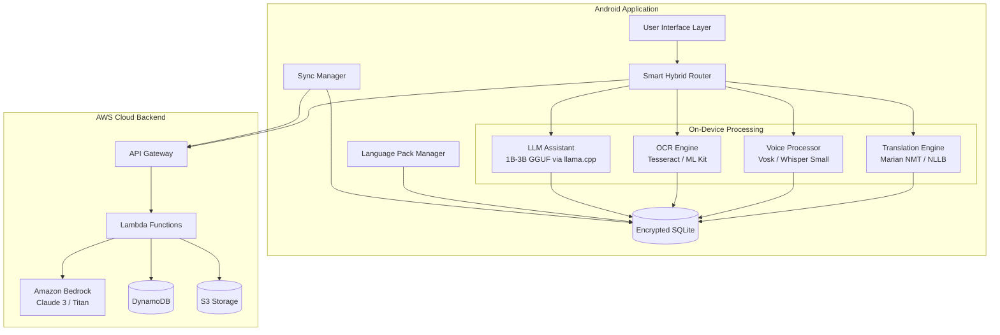

# Design Document: BhashaLens Production-Ready

## Overview

BhashaLens is a hybrid offline-first, cloud-augmented Android application that provides multilingual translation and language assistance. The architecture prioritizes on-device processing using quantized AI models while intelligently leveraging AWS cloud services when connectivity and context permit enhanced results.

The system operates in three distinct modes:
1. **Translation Mode**: Text, voice, and OCR translation between Hindi, Marathi, and English
2. **Assistance Mode**: Grammar checking, Q&A, and conversation practice using on-device LLM
3. **Simplify & Explain Mode**: Text simplification and educational explanations

The core architectural principle is "offline-first, cloud-augmented" - all features work without internet connectivity, with cloud services enhancing (never blocking) functionality when available.

## Architecture

### High-Level Architecture



### Architectural Layers

**Presentation Layer**
- Native Android UI using Jetpack Compose
- Mode selector (Translation, Assistance, Simplify)
- Real-time feedback and progress indicators
- Accessibility support (TalkBack, large text, haptic feedback)

**Business Logic Layer**
- Smart Hybrid Router: Decision engine for local vs cloud processing
- Mode Controllers: Separate controllers for each operational mode
- Language Pack Manager: Download, verify, and manage language models
- Sync Manager: Background synchronization with cloud

**Data Processing Layer**
- Translation Engine: Quantized Marian NMT or Distilled NLLB models
- Voice Processor: Vosk or Whisper Small (4-bit) for STT, native TTS for synthesis
- OCR Engine: Tesseract or ML Kit for text extraction
- LLM Assistant: 1B-3B parameter model in GGUF format via llama.cpp JNI

**Data Layer**
- Encrypted SQLite: Local storage for history, preferences, cache
- Android Keystore: Secure key management
- File System: Language pack storage

**Cloud Integration Layer**
- AWS API Gateway: Secure HTTPS endpoints
- AWS Lambda: Serverless request processing
- Amazon Bedrock: Claude 3 Sonnet, Titan Text, Titan Embeddings
- DynamoDB: User data and metadata
- S3: Language packs and model artifacts

### Technology Stack

**Android Application**
- Language: Kotlin
- UI Framework: Jetpack Compose
- Minimum SDK: Android 8.0 (API 26)
- Target SDK: Android 14 (API 34)
- Build System: Gradle with Kotlin DSL

**On-Device AI Models**
- Translation: Marian NMT (quantized INT8) or Distilled NLLB-200 (quantized)
- STT: Vosk (lightweight) or Whisper Small (4-bit quantized)
- TTS: Android native TTS engine
- OCR: Tesseract 5.x or Google ML Kit
- LLM: 1B-3B parameter model (GGUF format) via llama.cpp

**Local Storage**
- Database: SQLCipher (encrypted SQLite)
- Encryption: AES-256
- Key Management: Android Keystore System

**AWS Cloud Services**
- API Gateway: REST API with IAM authentication
- Lambda: Python 3.11 runtime
- Bedrock: Claude 3 Sonnet, Titan Text Premier, Titan Embeddings
- DynamoDB: On-demand capacity mode
- S3: Standard storage class with lifecycle policies
- CloudWatch: Logging and monitoring
- IAM: Role-based access control

**Development Tools**
- Version Control: Git
- CI/CD: GitHub Actions or AWS CodePipeline
- Testing: JUnit 5, Espresso, Robolectric
- Performance: Android Profiler, Firebase Performance Monitoring

## Components and Interfaces

### 1. Smart Hybrid Router

The Smart Hybrid Router is the decision engine that determines whether to process requests locally or route them to AWS cloud services.

**Responsibilities:**
- Evaluate request complexity, network status, battery level, and user preferences
- Route requests to appropriate processing backend
- Implement fallback logic when cloud services fail
- Track performance metrics for adaptive routing

**Interface:**
```kotlin
interface HybridRouter {
    suspend fun routeTranslation(
        request: TranslationRequest,
        context: RoutingContext
    ): ProcessingBackend
    
    suspend fun routeAssistance(
        request: AssistanceRequest,
        context: RoutingContext
    ): ProcessingBackend
    
    suspend fun routeSimplification(
        request: SimplificationRequest,
        context: RoutingContext
    ): ProcessingBackend
}

data class RoutingContext(
    val networkStatus: NetworkStatus,
    val batteryLevel: Int,
    val userPreferences: DataUsagePreference,
    val requestComplexity: ComplexityLevel
)

enum class ProcessingBackend {
    ON_DEVICE,
    AWS_CLOUD
}

enum class NetworkStatus {
    OFFLINE,
    WIFI,
    CELLULAR
}

enum class DataUsagePreference {
    OFFLINE_ONLY,
    WIFI_ONLY,
    CELLULAR_ALLOWED
}

enum class ComplexityLevel {
    SIMPLE,
    MODERATE,
    COMPLEX
}
```

**Routing Decision Logic:**
1. If network is offline → ON_DEVICE
2. If user preference is OFFLINE_ONLY → ON_DEVICE
3. If battery < 20% → ON_DEVICE
4. If user preference is WIFI_ONLY and network is CELLULAR → ON_DEVICE
5. If request complexity is SIMPLE → ON_DEVICE
6. If request complexity is COMPLEX and network available → AWS_CLOUD with fallback
7. Otherwise → ON_DEVICE

### 2. Translation Engine

The Translation Engine handles text translation using quantized neural machine translation models.

**Responsibilities:**
- Load and manage language-specific translation models
- Perform bidirectional translation between supported language pairs
- Cache translation results for repeated queries
- Report translation confidence scores

**Interface:**
```kotlin
interface TranslationEngine {
    suspend fun initialize(languagePair: LanguagePair)
    
    suspend fun translate(
        text: String,
        sourceLang: Language,
        targetLang: Language
    ): TranslationResult
    
    suspend fun isLanguagePairAvailable(pair: LanguagePair): Boolean
    
    fun release()
}

data class TranslationResult(
    val translatedText: String,
    val confidence: Float,
    val processingTimeMs: Long,
    val backend: ProcessingBackend
)

data class LanguagePair(
    val source: Language,
    val target: Language
)

enum class Language {
    HINDI,
    MARATHI,
    ENGLISH
}
```

**Model Selection:**
- **Marian NMT**: Lightweight, fast, good for common phrases (preferred for Phase 1)
- **Distilled NLLB-200**: Better quality, slightly larger, supports more language pairs

**Quantization:** INT8 quantization to reduce model size from ~300MB to ~80MB per language pair

### 3. Voice Processor

The Voice Processor handles speech-to-text (STT) and text-to-speech (TTS) operations.

**Responsibilities:**
- Convert speech to text using on-device STT models
- Synthesize natural speech from text using TTS engine
- Handle audio recording and playback
- Manage voice processing pipeline for translation mode

**Interface:**
```kotlin
interface VoiceProcessor {
    suspend fun initializeSTT(language: Language)
    
    suspend fun initializeTTS(language: Language)
    
    suspend fun speechToText(
        audioData: ByteArray,
        language: Language
    ): STTResult
    
    suspend fun textToSpeech(
        text: String,
        language: Language
    ): TTSResult
    
    suspend fun voiceTranslate(
        audioData: ByteArray,
        sourceLang: Language,
        targetLang: Language
    ): VoiceTranslationResult
    
    fun release()
}

data class STTResult(
    val text: String,
    val confidence: Float,
    val wordErrorRate: Float,
    val processingTimeMs: Long
)

data class TTSResult(
    val audioData: ByteArray,
    val durationMs: Long,
    val processingTimeMs: Long
)

data class VoiceTranslationResult(
    val originalText: String,
    val translatedText: String,
    val translatedAudio: ByteArray,
    val totalProcessingTimeMs: Long
)
```

**Model Selection:**
- **Vosk**: Lightweight, fast, good offline performance (preferred for Phase 1)
- **Whisper Small (4-bit)**: Better accuracy, slightly slower, ~150MB per language

**TTS**: Use Android native TTS engine with language-specific voices

### 4. OCR Engine

The OCR Engine extracts text from images captured by the device camera.

**Responsibilities:**
- Extract text from images in multiple scripts (Devanagari, Latin)
- Preprocess images for optimal recognition
- Provide confidence scores for extracted text
- Handle multiple text regions in a single image

**Interface:**
```kotlin
interface OCREngine {
    suspend fun initialize(languages: List<Language>)
    
    suspend fun extractText(
        image: Bitmap,
        languages: List<Language>
    ): OCRResult
    
    suspend fun extractTextRegions(
        image: Bitmap,
        languages: List<Language>
    ): List<TextRegion>
    
    fun release()
}

data class OCRResult(
    val text: String,
    val confidence: Float,
    val processingTimeMs: Long,
    val detectedLanguage: Language?
)

data class TextRegion(
    val text: String,
    val boundingBox: Rect,
    val confidence: Float,
    val language: Language?
)
```

**Model Selection:**
- **Tesseract 5.x**: Open source, supports Devanagari and Latin scripts, ~10MB per language
- **Google ML Kit**: Better accuracy, easier integration, requires Google Play Services

**Preprocessing:** Image enhancement (contrast, brightness, deskewing) for improved accuracy

### 5. LLM Assistant

The LLM Assistant provides grammar checking, Q&A, conversation practice, and text simplification using an on-device large language model.

**Responsibilities:**
- Load and manage quantized LLM in GGUF format
- Generate contextual responses for assistance queries
- Maintain conversation history for multi-turn interactions
- Provide grammar corrections with explanations
- Simplify complex text while preserving meaning

**Interface:**
```kotlin
interface LLMAssistant {
    suspend fun initialize(modelPath: String)
    
    suspend fun checkGrammar(
        text: String,
        language: Language
    ): GrammarCheckResult
    
    suspend fun answerQuestion(
        question: String,
        context: String?,
        language: Language
    ): AnswerResult
    
    suspend fun practiceConversation(
        userMessage: String,
        conversationHistory: List<Message>,
        language: Language
    ): ConversationResponse
    
    suspend fun simplifyText(
        text: String,
        targetComplexity: ComplexityLevel,
        language: Language
    ): SimplificationResult
    
    suspend fun explainText(
        text: String,
        language: Language
    ): ExplanationResult
    
    fun release()
}

data class GrammarCheckResult(
    val corrections: List<GrammarCorrection>,
    val correctedText: String,
    val processingTimeMs: Long
)

data class GrammarCorrection(
    val originalText: String,
    val correctedText: String,
    val explanation: String,
    val position: IntRange
)

data class AnswerResult(
    val answer: String,
    val confidence: Float,
    val sources: List<String>?,
    val processingTimeMs: Long
)

data class ConversationResponse(
    val response: String,
    val suggestedFollowUps: List<String>,
    val processingTimeMs: Long
)

data class SimplificationResult(
    val simplifiedText: String,
    val complexityReduction: Float,
    val processingTimeMs: Long
)

data class ExplanationResult(
    val explanation: String,
    val keyTerms: Map<String, String>,
    val processingTimeMs: Long
)

data class Message(
    val role: MessageRole,
    val content: String,
    val timestamp: Long
)

enum class MessageRole {
    USER,
    ASSISTANT
}
```

**Model Selection:**
- 1B-3B parameter model in GGUF format (e.g., Phi-2, TinyLlama, Gemma-2B)
- 4-bit or 8-bit quantization for ~500MB-1.5GB model size
- Integration via llama.cpp with JNI bindings

**Context Management:** Maintain last 10 conversation turns (~2048 tokens) for coherent multi-turn interactions

### 6. Language Pack Manager

The Language Pack Manager handles downloading, verifying, and managing language-specific model files.

**Responsibilities:**
- Download language packs from S3 or CDN
- Verify integrity using checksums
- Manage storage and deletion of language packs
- Check for and apply updates
- Provide download progress feedback

**Interface:**
```kotlin
interface LanguagePackManager {
    suspend fun downloadLanguagePack(
        languagePair: LanguagePair,
        progressCallback: (Float) -> Unit
    ): DownloadResult
    
    suspend fun deleteLanguagePack(languagePair: LanguagePair): Boolean
    
    suspend fun getInstalledPacks(): List<LanguagePackInfo>
    
    suspend fun getAvailablePacks(): List<LanguagePackInfo>
    
    suspend fun checkForUpdates(): List<LanguagePackUpdate>
    
    suspend fun updateLanguagePack(
        languagePair: LanguagePair,
        progressCallback: (Float) -> Unit
    ): UpdateResult
    
    suspend fun verifyIntegrity(languagePair: LanguagePair): Boolean
}

data class LanguagePackInfo(
    val languagePair: LanguagePair,
    val version: String,
    val sizeBytes: Long,
    val isInstalled: Boolean,
    val lastUpdated: Long
)

data class LanguagePackUpdate(
    val languagePair: LanguagePair,
    val currentVersion: String,
    val newVersion: String,
    val sizeBytes: Long,
    val releaseNotes: String
)

sealed class DownloadResult {
    data class Success(val packInfo: LanguagePackInfo) : DownloadResult()
    data class Failure(val error: DownloadError) : DownloadResult()
}

sealed class UpdateResult {
    data class Success(val packInfo: LanguagePackInfo) : UpdateResult()
    data class Failure(val error: UpdateError) : UpdateResult()
}

enum class DownloadError {
    NETWORK_ERROR,
    INSUFFICIENT_STORAGE,
    CHECKSUM_MISMATCH,
    UNKNOWN
}

enum class UpdateError {
    NETWORK_ERROR,
    INSUFFICIENT_STORAGE,
    CHECKSUM_MISMATCH,
    ROLLBACK_FAILED,
    UNKNOWN
}
```

**Storage Structure:**
```
/data/data/com.bhashalens/files/
  language_packs/
    hi-en/
      translation_model.bin
      vocab.txt
      metadata.json
      checksum.sha256
    en-hi/
      ...
    mr-en/
      ...
```

### 7. Local Storage (Encrypted SQLite)

The Local Storage component manages persistent data using encrypted SQLite.

**Responsibilities:**
- Store translation history with timestamps
- Store user preferences and settings
- Cache translation results for offline access
- Store conversation history for LLM context
- Manage encryption keys via Android Keystore

**Schema:**
```sql
-- Translation History
CREATE TABLE translation_history (
    id INTEGER PRIMARY KEY AUTOINCREMENT,
    source_text TEXT NOT NULL,
    translated_text TEXT NOT NULL,
    source_lang TEXT NOT NULL,
    target_lang TEXT NOT NULL,
    mode TEXT NOT NULL, -- 'text', 'voice', 'ocr'
    backend TEXT NOT NULL, -- 'on_device', 'aws_cloud'
    confidence REAL,
    timestamp INTEGER NOT NULL,
    is_favorite INTEGER DEFAULT 0
);

-- User Preferences
CREATE TABLE user_preferences (
    key TEXT PRIMARY KEY,
    value TEXT NOT NULL,
    updated_at INTEGER NOT NULL
);

-- Translation Cache
CREATE TABLE translation_cache (
    source_text TEXT NOT NULL,
    source_lang TEXT NOT NULL,
    target_lang TEXT NOT NULL,
    translated_text TEXT NOT NULL,
    confidence REAL,
    cached_at INTEGER NOT NULL,
    PRIMARY KEY (source_text, source_lang, target_lang)
);

-- Conversation History
CREATE TABLE conversation_history (
    id INTEGER PRIMARY KEY AUTOINCREMENT,
    session_id TEXT NOT NULL,
    role TEXT NOT NULL, -- 'user', 'assistant'
    content TEXT NOT NULL,
    language TEXT NOT NULL,
    timestamp INTEGER NOT NULL
);

-- Language Pack Metadata
CREATE TABLE language_pack_metadata (
    language_pair TEXT PRIMARY KEY,
    version TEXT NOT NULL,
    size_bytes INTEGER NOT NULL,
    installed_at INTEGER NOT NULL,
    last_used INTEGER
);
```

**Interface:**
```kotlin
interface LocalStorage {
    suspend fun saveTranslation(translation: TranslationHistoryEntry)
    
    suspend fun getTranslationHistory(
        limit: Int = 100,
        offset: Int = 0
    ): List<TranslationHistoryEntry>
    
    suspend fun searchTranslationHistory(query: String): List<TranslationHistoryEntry>
    
    suspend fun deleteTranslationHistory(beforeTimestamp: Long? = null)
    
    suspend fun savePreference(key: String, value: String)
    
    suspend fun getPreference(key: String): String?
    
    suspend fun cacheTranslation(
        sourceText: String,
        sourceLang: Language,
        targetLang: Language,
        translatedText: String,
        confidence: Float
    )
    
    suspend fun getCachedTranslation(
        sourceText: String,
        sourceLang: Language,
        targetLang: Language
    ): CachedTranslation?
    
    suspend fun saveConversationMessage(message: ConversationMessage)
    
    suspend fun getConversationHistory(
        sessionId: String,
        limit: Int = 10
    ): List<ConversationMessage>
    
    suspend fun clearAllData()
}

data class TranslationHistoryEntry(
    val id: Long?,
    val sourceText: String,
    val translatedText: String,
    val sourceLang: Language,
    val targetLang: Language,
    val mode: TranslationMode,
    val backend: ProcessingBackend,
    val confidence: Float?,
    val timestamp: Long,
    val isFavorite: Boolean
)

enum class TranslationMode {
    TEXT,
    VOICE,
    OCR
}

data class CachedTranslation(
    val translatedText: String,
    val confidence: Float,
    val cachedAt: Long
)

data class ConversationMessage(
    val id: Long?,
    val sessionId: String,
    val role: MessageRole,
    val content: String,
    val language: Language,
    val timestamp: Long
)
```

### 8. Sync Manager

The Sync Manager handles background synchronization between local storage and AWS cloud services.

**Responsibilities:**
- Sync user preferences to DynamoDB
- Upload translation history (with user consent)
- Download language pack updates
- Implement retry logic with exponential backoff
- Respect user sync preferences (timing, network type)

**Interface:**
```kotlin
interface SyncManager {
    suspend fun syncNow(): SyncResult
    
    suspend fun scheduleSyncJob(preferences: SyncPreferences)
    
    suspend fun cancelScheduledSync()
    
    fun observeSyncStatus(): Flow<SyncStatus>
}

data class SyncPreferences(
    val timing: SyncTiming,
    val networkType: NetworkType,
    val syncHistory: Boolean,
    val syncPreferences: Boolean
)

enum class SyncTiming {
    IMMEDIATE,
    WIFI_ONLY,
    MANUAL_ONLY
}

enum class NetworkType {
    ANY,
    WIFI_ONLY
}

sealed class SyncResult {
    data class Success(val itemsSynced: Int, val durationMs: Long) : SyncResult()
    data class PartialSuccess(val itemsSynced: Int, val errors: List<SyncError>) : SyncResult()
    data class Failure(val error: SyncError) : SyncResult()
}

data class SyncStatus(
    val isRunning: Boolean,
    val progress: Float,
    val lastSyncTime: Long?,
    val nextScheduledSync: Long?
)

enum class SyncError {
    NETWORK_ERROR,
    AUTHENTICATION_ERROR,
    SERVER_ERROR,
    UNKNOWN
}
```

**Sync Strategy:**
- Use WorkManager for reliable background execution
- Implement exponential backoff: 1s, 2s, 4s retry delays
- Batch operations to minimize network requests
- Use delta sync to only upload changed data

### 9. AWS Backend Services

The AWS Backend provides cloud-enhanced processing capabilities.

**API Gateway Endpoints:**
```
POST /v1/translate
POST /v1/assist
POST /v1/simplify
POST /v1/sync/preferences
POST /v1/sync/history
GET  /v1/language-packs
GET  /v1/language-packs/{pack-id}/download
```

**Lambda Function Interfaces:**

```python
# Translation Handler
def handle_translation(event, context):
    """
    Process translation request using Amazon Bedrock
    
    Input:
    {
        "source_text": str,
        "source_lang": str,
        "target_lang": str,
        "user_id": str (optional)
    }
    
    Output:
    {
        "translated_text": str,
        "confidence": float,
        "model": str,
        "processing_time_ms": int
    }
    """
    pass

# Assistance Handler
def handle_assistance(event, context):
    """
    Process assistance request using Amazon Bedrock
    
    Input:
    {
        "request_type": str,  # "grammar", "qa", "conversation"
        "text": str,
        "language": str,
        "context": str (optional),
        "conversation_history": list (optional)
    }
    
    Output:
    {
        "response": str,
        "metadata": dict,
        "processing_time_ms": int
    }
    """
    pass

# Simplification Handler
def handle_simplification(event, context):
    """
    Process simplification request using Amazon Bedrock
    
    Input:
    {
        "text": str,
        "target_complexity": str,
        "language": str,
        "explain": bool
    }
    
    Output:
    {
        "simplified_text": str,
        "explanation": str (optional),
        "complexity_reduction": float,
        "processing_time_ms": int
    }
    """
    pass
```

**DynamoDB Tables:**

```
UserPreferences:
  - user_id (PK)
  - preferences (JSON)
  - updated_at

TranslationHistory:
  - user_id (PK)
  - timestamp (SK)
  - source_text
  - translated_text
  - source_lang
  - target_lang
  - mode
  - backend

LanguagePackMetadata:
  - pack_id (PK)
  - version
  - size_bytes
  - s3_key
  - checksum
  - release_notes
  - created_at
```

**S3 Bucket Structure:**
```
bhashalens-models/
  language-packs/
    v1/
      hi-en/
        translation_model.bin
        vocab.txt
        metadata.json
        checksum.sha256
      en-hi/
        ...
  llm-models/
    v1/
      phi-2-q4.gguf
      metadata.json
```

## Data Models

### Core Domain Models

```kotlin
// Translation Domain
data class TranslationRequest(
    val text: String,
    val sourceLang: Language,
    val targetLang: Language,
    val mode: TranslationMode,
    val userId: String? = null
)

data class TranslationResponse(
    val originalText: String,
    val translatedText: String,
    val sourceLang: Language,
    val targetLang: Language,
    val confidence: Float,
    val backend: ProcessingBackend,
    val processingTimeMs: Long,
    val timestamp: Long
)

// Voice Domain
data class VoiceTranslationRequest(
    val audioData: ByteArray,
    val sourceLang: Language,
    val targetLang: Language,
    val userId: String? = null
)

data class VoiceTranslationResponse(
    val originalText: String,
    val translatedText: String,
    val translatedAudio: ByteArray,
    val sourceLang: Language,
    val targetLang: Language,
    val confidence: Float,
    val backend: ProcessingBackend,
    val processingTimeMs: Long,
    val timestamp: Long
)

// OCR Domain
data class OCRTranslationRequest(
    val image: Bitmap,
    val sourceLang: Language?,
    val targetLang: Language,
    val userId: String? = null
)

data class OCRTranslationResponse(
    val extractedText: String,
    val translatedText: String,
    val textRegions: List<TextRegion>,
    val sourceLang: Language,
    val targetLang: Language,
    val ocrConfidence: Float,
    val translationConfidence: Float,
    val backend: ProcessingBackend,
    val processingTimeMs: Long,
    val timestamp: Long
)

// Assistance Domain
data class AssistanceRequest(
    val type: AssistanceType,
    val text: String,
    val language: Language,
    val context: String? = null,
    val conversationHistory: List<Message>? = null,
    val userId: String? = null
)

enum class AssistanceType {
    GRAMMAR_CHECK,
    QUESTION_ANSWER,
    CONVERSATION_PRACTICE
}

data class AssistanceResponse(
    val type: AssistanceType,
    val result: Any, // GrammarCheckResult, AnswerResult, or ConversationResponse
    val backend: ProcessingBackend,
    val processingTimeMs: Long,
    val timestamp: Long
)

// Simplification Domain
data class SimplificationRequest(
    val text: String,
    val targetComplexity: ComplexityLevel,
    val language: Language,
    val includeExplanation: Boolean = false,
    val userId: String? = null
)

data class SimplificationResponse(
    val originalText: String,
    val simplifiedText: String,
    val explanation: String?,
    val complexityReduction: Float,
    val backend: ProcessingBackend,
    val processingTimeMs: Long,
    val timestamp: Long
)

// User Preferences
data class UserPreferences(
    val userId: String?,
    val dataUsagePreference: DataUsagePreference,
    val syncTiming: SyncTiming,
    val syncHistory: Boolean,
    val defaultSourceLang: Language,
    val defaultTargetLang: Language,
    val voiceEnabled: Boolean,
    val ocrEnabled: Boolean,
    val assistanceEnabled: Boolean,
    val theme: AppTheme,
    val textSize: TextSize
)

enum class AppTheme {
    LIGHT,
    DARK,
    SYSTEM
}

enum class TextSize {
    SMALL,
    MEDIUM,
    LARGE,
    EXTRA_LARGE
}
```

### Performance Metrics

```kotlin
data class PerformanceMetrics(
    val operationType: OperationType,
    val backend: ProcessingBackend,
    val processingTimeMs: Long,
    val modelLoadTimeMs: Long?,
    val networkLatencyMs: Long?,
    val success: Boolean,
    val errorType: String?,
    val timestamp: Long,
    val deviceInfo: DeviceInfo
)

enum class OperationType {
    TRANSLATION,
    VOICE_STT,
    VOICE_TTS,
    VOICE_TRANSLATION,
    OCR,
    GRAMMAR_CHECK,
    QA,
    CONVERSATION,
    SIMPLIFICATION,
    EXPLANATION
}

data class DeviceInfo(
    val manufacturer: String,
    val model: String,
    val androidVersion: Int,
    val availableMemoryMb: Long,
    val batteryLevel: Int
)
```

## Correctness Properties


## Correctness Properties

A property is a characteristic or behavior that should hold true across all valid executions of a system. Properties serve as the bridge between human-readable specifications and machine-verifiable correctness guarantees.

### Translation Engine Properties

**Property 1: Offline translation availability**
*For any* translation request when internet is unavailable, the Translation_Engine should complete the translation using on-device models if the language pack is installed.
**Validates: Requirements 1.1, 2.1**

**Property 2: Translation latency target**
*For any* offline text translation request under 500 characters, the Translation_Engine should complete within 1 second.
**Validates: Requirements 2.1, 13.1**

**Property 3: Language pair bidirectionality**
*For any* supported language pair (A, B), both A→B and B→A translations should be available.
**Validates: Requirements 2.4**

**Property 4: Translation result persistence**
*For any* completed translation that is saved, querying Local_Storage should return the translation with all metadata.
**Validates: Requirements 9.2**

**Property 5: Translation cache consistency**
*For any* identical translation request (same source text, source language, target language), the cached result should match the original translation.
**Validates: Requirements 9.2**

### Voice Processing Properties

**Property 6: Voice roundtrip latency**
*For any* voice translation request in offline mode, the complete pipeline (STT → Translation → TTS) should complete within 2 seconds.
**Validates: Requirements 3.3, 13.2**

**Property 7: Voice data privacy**
*For any* voice processing operation, raw audio recordings should not be permanently stored in Local_Storage.
**Validates: Requirements 3.6, 9.3**

**Property 8: STT accuracy threshold**
*For any* speech recognition operation, the word error rate should be below 15% for supported languages.
**Validates: Requirements 3.7**

### OCR Properties

**Property 9: OCR processing latency**
*For any* image OCR request, text extraction should complete within 1.5 seconds.
**Validates: Requirements 4.4**

**Property 10: OCR accuracy threshold**
*For any* clear image with text, character recognition accuracy should exceed 90%.
**Validates: Requirements 4.5**

**Property 11: Multi-script support**
*For any* image containing Hindi Devanagari, Marathi Devanagari, or English Latin text, the OCR_Engine should correctly identify and extract text in the appropriate script.
**Validates: Requirements 4.2**

### LLM Assistant Properties

**Property 12: Grammar correction completeness**
*For any* grammar check request, all grammatical errors should be identified with explanations.
**Validates: Requirements 5.1**

**Property 13: Conversation context maintenance**
*For any* conversation session, the LLM_Assistant should maintain context for up to 10 previous exchanges.
**Validates: Requirements 5.7**

**Property 14: Simplification accuracy**
*For any* text simplification request, the simplified text should preserve the original meaning while reducing complexity.
**Validates: Requirements 6.1, 6.5**

**Property 15: LLM response latency**
*For any* LLM assistant request in offline mode, the first token should be generated within 500ms.
**Validates: Requirements 5.5, 13.6**

### Smart Hybrid Router Properties

**Property 16: Offline routing guarantee**
*For any* request when network status is OFFLINE, the Smart_Hybrid_Router should route to ON_DEVICE backend.
**Validates: Requirements 7.3**

**Property 17: User preference respect**
*For any* request when user preference is OFFLINE_ONLY, the Smart_Hybrid_Router should route to ON_DEVICE backend regardless of network availability.
**Validates: Requirements 7.6**

**Property 18: Cloud fallback execution**
*For any* cloud request that exceeds 5 seconds or fails, the Smart_Hybrid_Router should fall back to on-device processing.
**Validates: Requirements 7.5, 11.7**

**Property 19: Battery-aware routing**
*For any* request when battery level is below 20%, the Smart_Hybrid_Router should prefer ON_DEVICE backend.
**Validates: Requirements 7.7**

### Language Pack Management Properties

**Property 20: Language pack size constraint**
*For any* language pack, the total size should not exceed 30MB.
**Validates: Requirements 8.2**

**Property 21: Download integrity verification**
*For any* completed language pack download, the checksum should match the expected value before marking as available.
**Validates: Requirements 8.6**

**Property 22: Storage availability check**
*For any* language pack download request, if available storage is insufficient, the download should be prevented and user notified.
**Validates: Requirements 8.7**

**Property 23: Language pack availability**
*For any* translation request for an unavailable language pair, the user should be prompted to download the required language pack.
**Validates: Requirements 8.3**

### Local Storage Properties

**Property 24: Data encryption**
*For any* data stored in Local_Storage, it should be encrypted using AES-256.
**Validates: Requirements 9.2**

**Property 25: Translation history retrieval ordering**
*For any* translation history query, results should be ordered by timestamp in descending order (newest first).
**Validates: Requirements 15.6**

**Property 26: Data deletion completeness**
*For any* user-initiated data deletion, all specified data should be permanently removed from Local_Storage.
**Validates: Requirements 9.4**

**Property 27: Encryption key security**
*For any* encryption key used by Local_Storage, it should be stored in Android Keystore, not in application storage.
**Validates: Requirements 9.6**

### Synchronization Properties

**Property 28: Automatic sync trigger**
*For any* connectivity restoration event, the Sync_Manager should automatically initiate synchronization if user preferences allow.
**Validates: Requirements 10.1**

**Property 29: Background sync non-blocking**
*For any* sync operation, user interactions should not be blocked or delayed.
**Validates: Requirements 10.3**

**Property 30: Sync retry with backoff**
*For any* failed sync operation, the Sync_Manager should retry up to 3 times with exponential backoff.
**Validates: Requirements 10.4**

**Property 31: User consent for history sync**
*For any* translation history sync operation, data should only be uploaded if user has explicitly opted in.
**Validates: Requirements 10.7**

### AWS Cloud Integration Properties

**Property 32: HTTPS enforcement**
*For any* communication with AWS_Backend, HTTPS should be enforced.
**Validates: Requirements 11.1, 12.1**

**Property 33: Cloud response latency**
*For any* cloud request, the AWS_Backend should respond within 5 seconds.
**Validates: Requirements 11.6, 13.3**

**Property 34: Cloud unavailability fallback**
*For any* request when AWS services are unavailable, the system should gracefully fall back to on-device processing.
**Validates: Requirements 11.7**

**Property 35: Data encryption at rest**
*For any* data stored in S3 or DynamoDB, it should be encrypted using AES-256.
**Validates: Requirements 11.3, 11.4**

### Security and Privacy Properties

**Property 36: Voice transmission consent**
*For any* voice data transmission to cloud, it should only occur with explicit user consent.
**Validates: Requirements 12.5**

**Property 37: Privacy control availability**
*For any* user, clear privacy controls should be available in settings for data sharing preferences.
**Validates: Requirements 12.6**

**Property 38: Opt-out enforcement**
*For any* user who opts out of cloud features, no user data should be transmitted to AWS_Backend.
**Validates: Requirements 12.7**

### Performance Properties

**Property 39: Cold start latency**
*For any* application launch, the home screen should be displayed within 3 seconds.
**Validates: Requirements 13.4**

**Property 40: UI responsiveness**
*For any* processing operation, the UI should maintain frame rates above 30 FPS.
**Validates: Requirements 13.5**

**Property 41: Performance metric logging**
*For any* operation that exceeds performance targets, metrics should be logged for analysis.
**Validates: Requirements 13.7**

## Testing Strategy

### Dual Testing Approach

The BhashaLens application requires both unit testing and property-based testing for comprehensive coverage.

**Unit Tests**: Verify specific examples, edge cases, and error conditions
**Property Tests**: Verify universal properties across all inputs

### Property-Based Testing Configuration

**Framework**: Use JUnit 5 with jqwik for property-based testing
**Configuration**: Minimum 100 iterations per property test

### Test Coverage Requirements

**Component Layer** (80% minimum coverage):
- Translation Engine, Voice Processor, OCR Engine, LLM Assistant
- Smart Hybrid Router, Language Pack Manager, Local Storage, Sync Manager

**Integration Tests**: End-to-end flows, offline-online transitions, cloud fallback scenarios

**Performance Testing**: Latency benchmarks, load testing, resource usage monitoring

**Security Testing**: Encryption verification, HTTPS enforcement, privacy controls

## Deployment and Monitoring

### Android Application Deployment
- Use ABI splits and Android App Bundle for optimized distribution
- Enable ProGuard/R8 for code shrinking
- Implement gradual rollout strategy

### AWS Infrastructure Deployment
- Infrastructure as Code using Terraform
- CI/CD pipeline with automated testing
- Multi-region deployment for high availability

### Monitoring and Observability
- CloudWatch metrics and alarms
- X-Ray tracing for distributed requests
- Application performance monitoring
- Cost tracking and optimization

### Security and Compliance
- GDPR compliance for data privacy
- OWASP Mobile Top 10 compliance
- Regular security audits and penetration testing
- Responsible disclosure program
