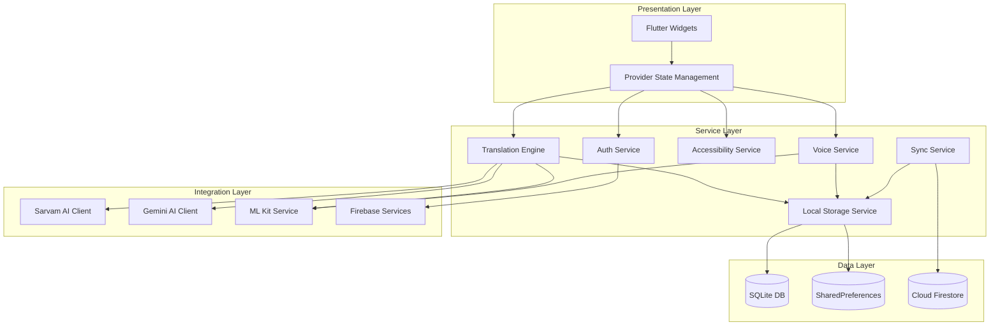
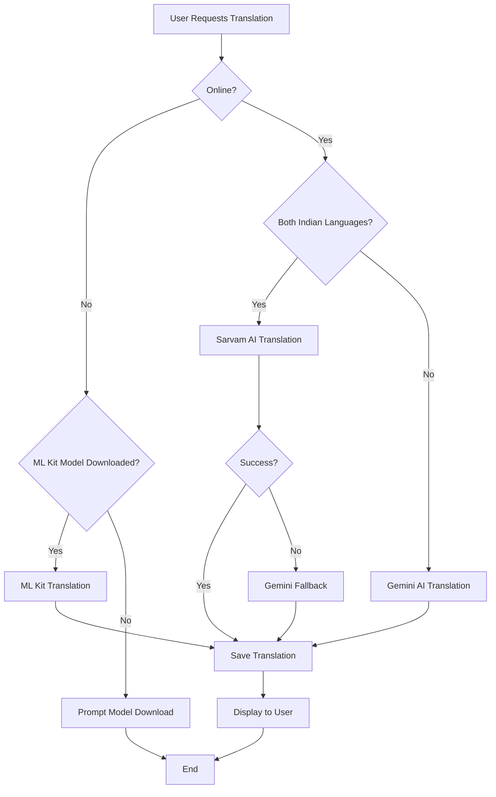

# Design Document: BhashaLens Technical Specification

## Overview

BhashaLens is a Flutter-based multilingual assistant application built on a service-oriented architecture with offline-first principles. The system integrates three AI/ML services: Sarvam AI for Indian language translation, Google Gemini AI for fallback translation and advanced explanations, and Google ML Kit for offline capabilities.

The architecture follows a layered approach:
- **Presentation Layer**: Flutter widgets with Provider state management
- **Service Layer**: Business logic services (Translation, Voice, Storage, Auth, Accessibility)
- **Data Layer**: Local persistence (SQLite, SharedPreferences) and cloud sync (Firestore)
- **Integration Layer**: External API clients (Sarvam AI, Gemini AI, Firebase, ML Kit)

Key architectural principles:
- Offline-first with intelligent fallback mechanisms
- Service-oriented design with clear separation of concerns
- Provider pattern for reactive state management
- Repository pattern for data access abstraction
- Singleton pattern for ML Kit service lifecycle management

## Architecture

### System Architecture Diagram




### Translation Flow Architecture



### Offline-First Strategy

The application implements a three-tier translation strategy:

1. **Tier 1 - Offline (ML Kit)**: Always attempted first when offline or when online services fail
2. **Tier 2 - Online Primary (Sarvam AI)**: Used for Indian language pairs when online
3. **Tier 3 - Online Fallback (Gemini AI)**: Used when Sarvam fails or for non-Indian languages

Data persistence follows a similar pattern:
- All data written to local storage immediately (SQLite + SharedPreferences)
- Cloud sync queued for background execution when online
- Conflict resolution using last-write-wins with timestamp comparison

## Components and Interfaces

### Translation Engine

The Translation Engine orchestrates translation requests across multiple services with intelligent routing and fallback logic.

**Interface:**
```dart
abstract class TranslationEngine {
  Future<TranslationResult> translate({
    required String text,
    required String sourceLanguage,
    required String targetLanguage,
    TranslationMode mode = TranslationMode.auto,
  });
  
  Future<String> detectLanguage(String text);
  
  Future<bool> isLanguagePairSupported({
    required String sourceLanguage,
    required String targetLanguage,
    required TranslationService service,
  });
}
```

**Implementation Logic:**
1. Check connectivity status
2. If offline: Route to ML Kit service
3. If online: Determine if both languages are Indian
4. If Indian pair: Route to Sarvam AI with Gemini fallback
5. If non-Indian pair: Route to Gemini AI
6. Handle errors with appropriate fallback chain
7. Save result to local storage
8. Queue cloud sync if authenticated


### Sarvam AI Service

Handles translation for 22 official Indian languages with optimized API usage.

**Interface:**
```dart
abstract class SarvamService {
  Future<TranslationResult> translate({
    required String text,
    required String sourceLanguage,
    required String targetLanguage,
  });
  
  bool isIndianLanguage(String languageCode);
  
  List<String> getSupportedLanguages();
  
  Future<int> getRemainingApiCalls();
}
```

**Supported Languages:**
Hindi, Bengali, Tamil, Telugu, Malayalam, Kannada, Gujarati, Marathi, Punjabi, Urdu, Odia, Assamese, Maithili, Santali, Kashmiri, Nepali, Sindhi, Dogri, Konkani, Manipuri, Bodo, Sanskrit

**API Integration:**
- Endpoint: Sarvam AI Translation API
- Authentication: API key stored in flutter_secure_storage
- Rate limiting: Track API calls locally, respect service limits
- Error handling: Timeout after 5 seconds, retry once, then fallback to Gemini

### Gemini AI Service

Provides fallback translation and powers Explain and Assistant modes.

**Interface:**
```dart
abstract class GeminiService {
  Future<TranslationResult> translate({
    required String text,
    required String sourceLanguage,
    required String targetLanguage,
  });
  
  Future<ExplanationResult> explainText({
    required String text,
    required String targetLanguage,
    ExplanationLevel level = ExplanationLevel.medium,
  });
  
  Future<AssistantResponse> assistantQuery({
    required String query,
    required AssistantMode mode,
    String? context,
  });
  
  Future<int> getRemainingApiCalls();
}
```

**Model Configuration:**
- Model: gemini-2.0-flash
- Temperature: 0.7 for translation, 0.9 for assistant mode
- Max tokens: 1024 for translation, 2048 for explanations
- API limit tracking: 20 calls per session (configurable)

### ML Kit Translation Service

Manages on-device translation models for offline functionality.

**Interface:**
```dart
abstract class MlKitTranslationService {
  Future<TranslationResult> translate({
    required String text,
    required String sourceLanguage,
    required String targetLanguage,
  });
  
  Future<List<LanguageModel>> getAvailableModels();
  
  Future<List<LanguageModel>> getDownloadedModels();
  
  Future<void> downloadModel({
    required String sourceLanguage,
    required String targetLanguage,
    Function(double progress)? onProgress,
  });
  
  Future<void> deleteModel({
    required String sourceLanguage,
    required String targetLanguage,
  });
  
  Future<bool> isModelDownloaded({
    required String sourceLanguage,
    required String targetLanguage,
  });
}
```

**Model Management:**
- Models stored in platform-specific cache directories
- Download progress tracked with callbacks
- Model integrity verification after download
- Automatic cleanup of unused models (configurable threshold)
- Model size information displayed before download


### Voice Translation Service

Manages speech-to-text, text-to-speech, and conversation flows.

**Interface:**
```dart
abstract class VoiceTranslationService {
  Future<void> startListening({
    required String language,
    required Function(String text) onResult,
    Function(String partial)? onPartialResult,
  });
  
  Future<void> stopListening();
  
  Future<void> speak({
    required String text,
    required String language,
    double rate = 1.0,
    double pitch = 1.0,
  });
  
  Future<void> startConversationMode({
    required String sourceLanguage,
    required String targetLanguage,
    required Function(ConversationMessage) onMessage,
  });
  
  Future<void> stopConversationMode();
  
  Future<List<ConversationMessage>> getConversationHistory();
}
```

**Conversation Mode Logic:**
1. Initialize with source and target languages
2. Start listening in source language
3. On speech detected: Convert to text, translate, speak translation
4. Switch to target language for response
5. Repeat cycle until stopped
6. Save complete conversation to local storage

**Speech Recognition:**
- Package: speech_to_text
- Real-time partial results for user feedback
- Automatic silence detection (2 seconds)
- Language-specific models when available

**Text-to-Speech:**
- Package: flutter_tts
- Configurable rate (0.5x to 2.0x)
- Configurable pitch (0.5 to 2.0)
- Gender preference when available
- Queue management for sequential speech

### Local Storage Service

Provides unified interface for local data persistence.

**Interface:**
```dart
abstract class LocalStorageService {
  // Translation storage
  Future<void> saveTranslation(SavedTranslation translation);
  Future<List<SavedTranslation>> getTranslationHistory({
    int limit = 100,
    int offset = 0,
  });
  Future<List<SavedTranslation>> getFavoriteTranslations();
  Future<void> deleteTranslation(String id);
  Future<List<SavedTranslation>> searchTranslations(String query);
  
  // Preferences
  Future<void> setPreference(String key, dynamic value);
  Future<T?> getPreference<T>(String key);
  
  // Conversation storage
  Future<void> saveConversation(List<ConversationMessage> messages);
  Future<List<ConversationMessage>> getConversationHistory(String sessionId);
  
  // Model metadata
  Future<void> saveModelMetadata(LanguageModel model);
  Future<List<LanguageModel>> getDownloadedModelsMetadata();
  
  // Cache management
  Future<void> clearCache();
  Future<int> getCacheSize();
}
```

**Storage Strategy:**
- SQLite for structured data (translations, conversations)
- SharedPreferences for simple key-value preferences
- flutter_secure_storage for sensitive data (API keys)
- Automatic database migrations for schema updates

**Database Schema (SQLite):**
```sql
CREATE TABLE translations (
  id TEXT PRIMARY KEY,
  source_text TEXT NOT NULL,
  target_text TEXT NOT NULL,
  source_language TEXT NOT NULL,
  target_language TEXT NOT NULL,
  is_favorite INTEGER DEFAULT 0,
  created_at INTEGER NOT NULL,
  synced_at INTEGER,
  user_id TEXT
);

CREATE TABLE conversations (
  id TEXT PRIMARY KEY,
  session_id TEXT NOT NULL,
  speaker_role TEXT NOT NULL,
  original_text TEXT NOT NULL,
  translated_text TEXT,
  language TEXT NOT NULL,
  created_at INTEGER NOT NULL,
  user_id TEXT
);

CREATE TABLE model_metadata (
  language_pair TEXT PRIMARY KEY,
  source_language TEXT NOT NULL,
  target_language TEXT NOT NULL,
  size_bytes INTEGER NOT NULL,
  downloaded_at INTEGER NOT NULL,
  last_used_at INTEGER
);

CREATE INDEX idx_translations_created ON translations(created_at DESC);
CREATE INDEX idx_translations_favorite ON translations(is_favorite, created_at DESC);
CREATE INDEX idx_conversations_session ON conversations(session_id, created_at);
```


### Firebase Authentication Service

Manages user authentication with multiple providers.

**Interface:**
```dart
abstract class FirebaseAuthService {
  Future<AuthResult> signInWithEmail({
    required String email,
    required String password,
  });
  
  Future<AuthResult> signUpWithEmail({
    required String email,
    required String password,
  });
  
  Future<AuthResult> signInWithGoogle();
  
  Future<AuthResult> signInAnonymously();
  
  Future<void> signOut();
  
  Future<User?> getCurrentUser();
  
  Future<void> sendPasswordResetEmail(String email);
  
  Future<void> convertAnonymousToEmail({
    required String email,
    required String password,
  });
  
  Stream<User?> authStateChanges();
}
```

**Authentication Flow:**
1. User selects authentication method
2. Service handles provider-specific flow
3. On success: Store user token, initialize sync service
4. On failure: Display error with recovery options
5. Anonymous users can convert to registered accounts with data migration

### Firestore Sync Service

Handles cloud synchronization with conflict resolution.

**Interface:**
```dart
abstract class FirestoreSyncService {
  Future<void> syncTranslations();
  Future<void> syncConversations();
  Future<void> syncPreferences();
  
  Future<void> uploadPendingChanges();
  Future<void> downloadRemoteChanges();
  
  Future<void> enableSync();
  Future<void> disableSync();
  
  Stream<SyncStatus> syncStatusStream();
}
```

**Sync Strategy:**
- Immediate upload when online and sync enabled
- Queue changes when offline for later upload
- Periodic background sync every 15 minutes when online
- Conflict resolution: Last-write-wins based on timestamp
- Batch operations for efficiency (max 500 items per batch)

**Firestore Schema:**
```
users/{userId}/
  ├── translations/{translationId}
  │   ├── sourceText: string
  │   ├── targetText: string
  │   ├── sourceLanguage: string
  │   ├── targetLanguage: string
  │   ├── isFavorite: boolean
  │   ├── createdAt: timestamp
  │   └── updatedAt: timestamp
  │
  ├── conversations/{sessionId}/messages/{messageId}
  │   ├── speakerRole: string
  │   ├── originalText: string
  │   ├── translatedText: string
  │   ├── language: string
  │   └── createdAt: timestamp
  │
  └── preferences/
      └── settings: map
```

### Accessibility Service

Manages accessibility features and audio feedback.

**Interface:**
```dart
abstract class AccessibilityService {
  Future<void> enableVoiceNavigation();
  Future<void> disableVoiceNavigation();
  
  Future<void> setTheme(AppTheme theme);
  Future<void> setTextScale(double scale);
  Future<void> setTouchTargetSize(TouchTargetSize size);
  
  Future<void> enableAudioFeedback();
  Future<void> disableAudioFeedback();
  
  Future<void> processVoiceCommand(String command);
  
  Stream<AccessibilityEvent> accessibilityEventStream();
}
```

**Voice Navigation Commands:**
- "Go to translation" → Navigate to translation screen
- "Go to history" → Navigate to history screen
- "Go to settings" → Navigate to settings screen
- "Translate [text]" → Perform translation
- "Read translation" → Speak current translation
- "Save translation" → Save current translation
- "Go back" → Navigate back

**Audio Feedback System:**
- Non-speech audio cues for UI interactions
- Success tone: 440Hz, 100ms
- Error tone: 220Hz, 200ms
- Navigation tone: 330Hz, 50ms
- Configurable volume and enable/disable per event type


### OCR Service

Handles camera integration and text recognition from images.

**Interface:**
```dart
abstract class OcrService {
  Future<void> initializeCamera();
  Future<void> disposeCamera();
  
  Future<OcrResult> recognizeTextFromImage(String imagePath);
  Future<OcrResult> recognizeTextFromCamera();
  
  Future<List<TextBlock>> detectTextBlocks(String imagePath);
  
  Stream<CameraImage> cameraImageStream();
}
```

**OCR Processing Pipeline:**
1. Capture image from camera or select from gallery
2. Preprocess image (resize if > 2MB, adjust contrast)
3. Use ML Kit Text Recognition to extract text blocks
4. Group text blocks by spatial proximity
5. Translate each text block
6. Overlay translations on original image at corresponding positions
7. Save result with image reference

**Text Block Positioning:**
- Store bounding box coordinates for each detected text block
- Calculate overlay position based on original image dimensions
- Scale coordinates for different display sizes
- Support rotation and perspective correction

## Data Models

### SavedTranslation

```dart
class SavedTranslation {
  final String id;
  final String sourceText;
  final String targetText;
  final String sourceLanguage;
  final String targetLanguage;
  final bool isFavorite;
  final DateTime createdAt;
  final DateTime? syncedAt;
  final String? userId;
  final TranslationMode mode;
  final String? imageReference;
  
  SavedTranslation({
    required this.id,
    required this.sourceText,
    required this.targetText,
    required this.sourceLanguage,
    required this.targetLanguage,
    this.isFavorite = false,
    required this.createdAt,
    this.syncedAt,
    this.userId,
    this.mode = TranslationMode.text,
    this.imageReference,
  });
  
  Map<String, dynamic> toJson();
  factory SavedTranslation.fromJson(Map<String, dynamic> json);
  Map<String, dynamic> toFirestore();
  factory SavedTranslation.fromFirestore(Map<String, dynamic> data);
}
```

### ConversationMessage

```dart
class ConversationMessage {
  final String id;
  final String sessionId;
  final SpeakerRole speakerRole;
  final String originalText;
  final String? translatedText;
  final String language;
  final DateTime createdAt;
  
  ConversationMessage({
    required this.id,
    required this.sessionId,
    required this.speakerRole,
    required this.originalText,
    this.translatedText,
    required this.language,
    required this.createdAt,
  });
  
  Map<String, dynamic> toJson();
  factory ConversationMessage.fromJson(Map<String, dynamic> json);
}

enum SpeakerRole { user, other }
```

### TranslationResult

```dart
class TranslationResult {
  final String translatedText;
  final String detectedSourceLanguage;
  final TranslationService usedService;
  final Duration latency;
  final bool fromCache;
  
  TranslationResult({
    required this.translatedText,
    required this.detectedSourceLanguage,
    required this.usedService,
    required this.latency,
    this.fromCache = false,
  });
}

enum TranslationService { sarvam, gemini, mlKit }
enum TranslationMode { text, voice, camera, auto }
```

### ExplanationResult

```dart
class ExplanationResult {
  final String simplifiedText;
  final String explanation;
  final List<String> culturalInsights;
  final List<String> examples;
  final List<String> safetyNotes;
  final List<String> followUpQuestions;
  
  ExplanationResult({
    required this.simplifiedText,
    required this.explanation,
    this.culturalInsights = const [],
    this.examples = const [],
    this.safetyNotes = const [],
    this.followUpQuestions = const [],
  });
  
  factory ExplanationResult.fromJson(Map<String, dynamic> json);
}
```


### LanguageModel

```dart
class LanguageModel {
  final String sourceLanguage;
  final String targetLanguage;
  final int sizeBytes;
  final bool isDownloaded;
  final DateTime? downloadedAt;
  final DateTime? lastUsedAt;
  
  LanguageModel({
    required this.sourceLanguage,
    required this.targetLanguage,
    required this.sizeBytes,
    this.isDownloaded = false,
    this.downloadedAt,
    this.lastUsedAt,
  });
  
  String get languagePair => '${sourceLanguage}_${targetLanguage}';
  String get displaySize => _formatBytes(sizeBytes);
  
  Map<String, dynamic> toJson();
  factory LanguageModel.fromJson(Map<String, dynamic> json);
}
```

### AccessibilitySettings

```dart
class AccessibilitySettings {
  final bool voiceNavigationEnabled;
  final bool audioFeedbackEnabled;
  final AppTheme theme;
  final double textScale;
  final TouchTargetSize touchTargetSize;
  final bool simplifiedUiMode;
  final double audioFeedbackVolume;
  
  AccessibilitySettings({
    this.voiceNavigationEnabled = false,
    this.audioFeedbackEnabled = false,
    this.theme = AppTheme.dark,
    this.textScale = 1.0,
    this.touchTargetSize = TouchTargetSize.normal,
    this.simplifiedUiMode = false,
    this.audioFeedbackVolume = 0.7,
  });
  
  Map<String, dynamic> toJson();
  factory AccessibilitySettings.fromJson(Map<String, dynamic> json);
}

enum AppTheme { light, dark, highContrast }
enum TouchTargetSize { normal, large, extraLarge }
```

### OcrResult

```dart
class OcrResult {
  final List<TextBlock> textBlocks;
  final String imagePath;
  final DateTime processedAt;
  
  OcrResult({
    required this.textBlocks,
    required this.imagePath,
    required this.processedAt,
  });
  
  String get fullText => textBlocks.map((b) => b.text).join(' ');
}

class TextBlock {
  final String text;
  final Rect boundingBox;
  final String? translatedText;
  final double confidence;
  
  TextBlock({
    required this.text,
    required this.boundingBox,
    this.translatedText,
    required this.confidence,
  });
}
```

### UserPreferences

```dart
class UserPreferences {
  final String defaultSourceLanguage;
  final String defaultTargetLanguage;
  final bool autoDetectLanguage;
  final double voiceSpeed;
  final VoiceGender voiceGender;
  final bool autoSaveTranslations;
  final bool cloudSyncEnabled;
  final int apiCallLimit;
  
  UserPreferences({
    this.defaultSourceLanguage = 'en',
    this.defaultTargetLanguage = 'hi',
    this.autoDetectLanguage = true,
    this.voiceSpeed = 1.0,
    this.voiceGender = VoiceGender.neutral,
    this.autoSaveTranslations = true,
    this.cloudSyncEnabled = true,
    this.apiCallLimit = 20,
  });
  
  Map<String, dynamic> toJson();
  factory UserPreferences.fromJson(Map<String, dynamic> json);
}

enum VoiceGender { male, female, neutral }
```


## Correctness Properties

A property is a characteristic or behavior that should hold true across all valid executions of a system—essentially, a formal statement about what the system should do. Properties serve as the bridge between human-readable specifications and machine-verifiable correctness guarantees.

### Translation Engine Properties

Property 1: Language detection accuracy
*For any* text input in a supported language, the Translation_Engine should correctly identify the source language.
**Validates: Requirements 1.1**

Property 2: Offline routing with downloaded models
*For any* translation request when offline and the required ML Kit model is downloaded, the Translation_Engine should route to ML_Kit_Service.
**Validates: Requirements 1.3, 18.8**

Property 3: Indian language pair routing
*For any* translation request when online with both source and target being Indian languages, the Translation_Engine should prioritize Sarvam_Service.
**Validates: Requirements 1.4, 18.2, 18.6**

Property 4: Fallback chain execution
*For any* translation request where Sarvam_Service fails or is unavailable, the Translation_Engine should fallback to Gemini_Service.
**Validates: Requirements 1.5, 18.3, 18.4**

Property 5: Translation persistence
*For any* completed translation that is saved, querying the Storage_Layer should return the translation with all metadata (source text, target text, languages, timestamp).
**Validates: Requirements 1.7**

Property 6: Favorite marking
*For any* saved translation, marking it as favorite should set isFavorite to true and it should appear in favorites list.
**Validates: Requirements 1.8**

Property 7: Share formatting
*For any* translation, the share function should receive properly formatted text containing both source and target text with language labels.
**Validates: Requirements 1.9**


### Voice Translation Properties

Property 8: Speech to translation pipeline
*For any* recognized speech text, the Translation_Engine should be called with the recognized text and target language.
**Validates: Requirements 2.3**

Property 9: Translation to speech pipeline
*For any* completed translation in voice mode, the Voice_Service should speak the translated text using TTS.
**Validates: Requirements 2.4**

Property 10: Conversation language alternation
*For any* conversation mode session, languages should alternate between source and target for each turn.
**Validates: Requirements 2.5**

Property 11: Conversation message persistence
*For any* conversation turn, the Storage_Layer should save the message with speaker role, text, and timestamp.
**Validates: Requirements 2.6**

Property 12: Conversation history completeness
*For any* voice translation session, stopping the session should save all conversation messages to storage.
**Validates: Requirements 2.8**

### OCR Translation Properties

Property 13: Multi-block translation
*For any* OCR result with multiple text blocks, all text blocks should be translated.
**Validates: Requirements 3.3**

Property 14: Translation overlay positioning
*For any* translated text block, the overlay data should include the bounding box coordinates from the original OCR result.
**Validates: Requirements 3.4**

Property 15: OCR translation persistence
*For any* saved OCR translation, the Storage_Layer should persist both the image reference path and translated text.
**Validates: Requirements 3.7**

Property 16: Offline OCR routing
*For any* OCR request when offline, the OCR_Service should use ML Kit on-device text recognition.
**Validates: Requirements 3.8**

### Explanation and Assistant Properties

Property 17: Explanation response structure
*For any* explanation request, the Gemini_Service response should include follow-up questions.
**Validates: Requirements 4.6**

Property 18: Follow-up question handling
*For any* selected follow-up question, the Gemini_Service should be called with the question text.
**Validates: Requirements 4.7**

Property 19: Grammar correction structure
*For any* grammar correction request, the response should include both corrections and explanations.
**Validates: Requirements 5.3**

Property 20: Pronunciation guidance structure
*For any* pronunciation request, the response should include phonetic breakdown information.
**Validates: Requirements 5.4**

Property 21: Assistant session persistence
*For any* completed assistant mode session, the Storage_Layer should save the session data.
**Validates: Requirements 5.7**

Property 22: API usage tracking
*For any* API call in assistant mode, the API usage counter should increment by one.
**Validates: Requirements 5.8, 18.7**


### Model Management Properties

Property 23: Model download progress reporting
*For any* model download in progress, progress callbacks should be invoked with increasing percentage values.
**Validates: Requirements 6.2**

Property 24: Model download completion marking
*For any* successfully downloaded model, the ML_Kit_Service should mark it as available and include it in downloaded models list.
**Validates: Requirements 6.3**

Property 25: Model deletion removal
*For any* deleted model, the ML_Kit_Service should remove it from the downloaded models list.
**Validates: Requirements 6.4**

Property 26: Download cancellation
*For any* model download in progress, cancelling should stop the download and not mark the model as available.
**Validates: Requirements 6.7**

Property 27: Connectivity-based availability
*For any* connectivity state change, the model download availability status should update accordingly.
**Validates: Requirements 6.8**

### Authentication Properties

Property 28: Authentication token provision
*For any* successful authentication, the Auth_Service should provide a user token.
**Validates: Requirements 7.4**

Property 29: Logout cleanup
*For any* logout operation, the Auth_Service should clear the authentication token and local session data.
**Validates: Requirements 7.5**

Property 30: Profile update dual persistence
*For any* profile update, the Storage_Layer should save changes to both local storage and queue for cloud sync.
**Validates: Requirements 7.6**

Property 31: Anonymous account data migration
*For any* anonymous account conversion, all anonymous user data should be accessible under the new registered account.
**Validates: Requirements 7.7**

Property 32: Authentication error messaging
*For any* authentication failure, the system should return a specific error message indicating the failure reason.
**Validates: Requirements 7.8**

### History and Storage Properties

Property 33: History timestamp ordering
*For any* translation history query, results should be ordered by timestamp in descending order (newest first).
**Validates: Requirements 8.1**

Property 34: History search filtering
*For any* search query, returned translations should match the query in source text, target text, or language pair.
**Validates: Requirements 8.2**

Property 35: Favorites filtering
*For any* favorites query, all returned translations should have isFavorite set to true.
**Validates: Requirements 8.3**

Property 36: Deletion dual removal
*For any* translation deletion, the item should be removed from both local storage and queued for cloud deletion.
**Validates: Requirements 8.4**

Property 37: History item completeness
*For any* history item display, all metadata fields (source, target, languages, timestamp) should be included.
**Validates: Requirements 8.5**

Property 38: History archival with favorites preservation
*For any* history exceeding 1000 items, oldest non-favorite items should be archived while all favorites remain accessible.
**Validates: Requirements 8.6**

Property 39: Export format validity
*For any* history export, the generated file should be valid CSV or JSON format containing all translations.
**Validates: Requirements 8.7**

Property 40: History display metadata
*For any* history list item, the rendered output should include language pair icons and timestamp.
**Validates: Requirements 8.8**


### Accessibility Properties

Property 41: Voice command audio feedback
*For any* voice command executed, the Accessibility_Service should provide audio feedback.
**Validates: Requirements 9.2**

Property 42: Text scaling application
*For any* text scale adjustment, all text elements should scale proportionally to the set value.
**Validates: Requirements 9.4**

Property 43: Audio cue triggering
*For any* UI interaction when audio feedback is enabled, an appropriate audio cue should be played.
**Validates: Requirements 9.8**

### Preferences Properties

Property 44: Source language preference persistence
*For any* default source language change, the preference should be saved and applied to subsequent translations.
**Validates: Requirements 10.1**

Property 45: Target language preference persistence
*For any* default target language change, the preference should be saved and applied to subsequent translations.
**Validates: Requirements 10.2**

Property 46: Auto-detect preference persistence
*For any* auto-detect toggle, the preference should be saved and respected in text translation.
**Validates: Requirements 10.3**

Property 47: Voice speed application
*For any* voice speed adjustment, the Voice_Service should apply the speed to all TTS output.
**Validates: Requirements 10.4**

Property 48: Voice gender preference application
*For any* voice gender selection, the Voice_Service should use the preferred gender when available.
**Validates: Requirements 10.5**

Property 49: Auto-save preference respect
*For any* translation when auto-save is disabled, the translation should not be automatically saved to storage.
**Validates: Requirements 10.6**

Property 50: Cloud sync toggle
*For any* cloud sync toggle, the Sync_Service should enable or disable Firestore synchronization accordingly.
**Validates: Requirements 10.7**

Property 51: Selective data clearing
*For any* clear app data operation, all local data should be removed except user preferences and downloaded models.
**Validates: Requirements 10.8**

### Synchronization Properties

Property 52: Initial sync download
*For any* new device login, all cloud data should be downloaded to local storage.
**Validates: Requirements 11.1**

Property 53: Online immediate upload
*For any* translation created while online with sync enabled, the translation should be uploaded to Firestore immediately.
**Validates: Requirements 11.2**

Property 54: Offline change queuing
*For any* translation created while offline, the change should be queued for upload when connectivity returns.
**Validates: Requirements 11.3**

Property 55: Reconnection sync execution
*For any* connectivity restoration, all queued changes should be synced to cloud.
**Validates: Requirements 11.4**

Property 56: Conflict resolution by timestamp
*For any* sync conflict, the item with the newer timestamp should be kept (last-write-wins).
**Validates: Requirements 11.5**

Property 57: Deletion propagation
*For any* deletion on one device, the deletion should be synced to cloud and propagated to other devices.
**Validates: Requirements 11.6**

Property 58: Sync status availability
*For any* sync operation, the sync status should be available through the status stream.
**Validates: Requirements 11.7**

Property 59: Sync retry with exponential backoff
*For any* sync failure, the Sync_Service should retry up to 5 times with exponential backoff delays.
**Validates: Requirements 11.8**


### Error Handling Properties

Property 60: Network error messaging
*For any* network request failure, the system should return a user-friendly error message with retry option.
**Validates: Requirements 12.1**

Property 61: Translation fallback execution
*For any* translation failure, the Translation_Engine should attempt the fallback method before returning an error.
**Validates: Requirements 12.6**

Property 62: Input validation error messaging
*For any* invalid input, the system should return a specific validation error message.
**Validates: Requirements 12.8**

### Security Properties

Property 63: Password hashing
*For any* stored user credential, passwords should never be stored in plain text (should be hashed).
**Validates: Requirements 14.3**

Property 64: Session timeout re-authentication
*For any* access to sensitive data after 15 minutes of inactivity, the system should require re-authentication.
**Validates: Requirements 14.5**

Property 65: Log PII exclusion
*For any* error log entry, the log should not contain personally identifiable information.
**Validates: Requirements 14.6**

Property 66: Permission request timing
*For any* device permission request, the request should occur only when the feature requiring it is accessed.
**Validates: Requirements 14.7**

Property 67: Cloud storage consent respect
*For any* translation processing, sensitive content should not be stored in cloud without user consent.
**Validates: Requirements 14.8**

### Onboarding Properties

Property 68: Onboarding completion persistence
*For any* completed onboarding, the Storage_Layer should mark onboarding as complete and not display it again on subsequent launches.
**Validates: Requirements 15.2**

### Connectivity Properties

Property 69: Offline mode switching
*For any* connectivity change from online to offline, the system should automatically switch to Offline_Mode.
**Validates: Requirements 19.2**

Property 70: Online mode resumption
*For any* connectivity change from offline to online, the system should resume online features and sync pending data.
**Validates: Requirements 19.3**

Property 71: Offline indicator display
*For any* time in Offline_Mode, the UI should display an offline indicator.
**Validates: Requirements 19.4**

Property 72: Network timeout retry
*For any* network request timeout, the system should retry with exponential backoff.
**Validates: Requirements 19.6**

### Analytics Properties

Property 73: Translation event logging
*For any* translation performed, the system should log an analytics event with language pair and mode.
**Validates: Requirements 20.1**

Property 74: Feature usage tracking
*For any* feature access, the system should track the feature usage frequency.
**Validates: Requirements 20.2**

Property 75: Error event logging
*For any* error occurrence, the system should log the error type and context.
**Validates: Requirements 20.3**

Property 76: Analytics opt-out respect
*For any* analytics event when user has opted out, no tracking data should be collected.
**Validates: Requirements 20.6**

Property 77: Offline analytics queuing
*For any* analytics event when offline, the event should be queued for later transmission.
**Validates: Requirements 20.8**


## Error Handling

### Error Classification

The system categorizes errors into four levels:

1. **Recoverable Errors**: Errors that can be automatically resolved through fallback mechanisms
   - Network timeouts → Retry with exponential backoff
   - Primary service failure → Fallback to alternative service
   - Offline state → Switch to offline-capable services

2. **User-Actionable Errors**: Errors requiring user intervention
   - Permission denied → Show rationale and settings link
   - Storage full → Suggest cleanup options
   - Model not downloaded → Prompt download

3. **Validation Errors**: Errors from invalid user input
   - Empty text input → Display validation message
   - Invalid language selection → Show supported languages
   - Malformed data → Display specific validation error

4. **Critical Errors**: Errors requiring immediate attention
   - Database corruption → Attempt recovery, fallback to fresh install
   - Authentication failure → Force logout and re-login
   - Crash → Log error, attempt state restoration

### Error Handling Strategy

**Translation Service Errors:**
```dart
try {
  // Attempt primary service (Sarvam for Indian languages)
  result = await sarvamService.translate(text, source, target);
} catch (e) {
  if (e is NetworkException) {
    // Retry once after 1 second
    await Future.delayed(Duration(seconds: 1));
    try {
      result = await sarvamService.translate(text, source, target);
    } catch (retryError) {
      // Fallback to Gemini
      result = await geminiService.translate(text, source, target);
    }
  } else if (e is ApiLimitException) {
    // Switch to alternative service
    result = await geminiService.translate(text, source, target);
  } else {
    // Fallback to offline if available
    if (await mlKitService.isModelDownloaded(source, target)) {
      result = await mlKitService.translate(text, source, target);
    } else {
      throw TranslationException('Translation failed', originalError: e);
    }
  }
}
```

**Storage Errors:**
- Database write failure → Retry up to 3 times, then queue for later
- Database read failure → Attempt recovery, fallback to empty state
- Sync conflict → Use last-write-wins with timestamp comparison
- Storage full → Notify user, suggest archival or deletion

**Permission Errors:**
- Camera permission denied → Show rationale, provide settings link, disable camera features
- Microphone permission denied → Show rationale, provide settings link, disable voice features
- Storage permission denied → Show rationale, explain impact on offline functionality

**Network Errors:**
- Connection timeout → Retry with exponential backoff (1s, 2s, 4s, 8s, 16s)
- No connectivity → Switch to offline mode automatically
- API rate limit → Switch to alternative service or offline mode
- Server error (5xx) → Retry up to 3 times, then show error

### Error Logging

All errors are logged with structured information:
```dart
class ErrorLog {
  final String errorType;
  final String errorMessage;
  final String? stackTrace;
  final Map<String, dynamic> context;
  final DateTime timestamp;
  final String? userId; // Anonymized
  
  // PII is excluded from all logs
}
```

Error logs are:
- Stored locally for debugging
- Sanitized to remove PII
- Optionally uploaded to crash reporting service (with user consent)
- Retained for 30 days locally


## Testing Strategy

### Dual Testing Approach

The BhashaLens application requires both unit testing and property-based testing for comprehensive coverage:

**Unit Tests**: Verify specific examples, edge cases, and error conditions
- Specific translation examples with known outputs
- Edge cases (empty input, very long text, special characters)
- Error conditions (network failure, permission denied, storage full)
- Integration points between services
- UI widget behavior with specific inputs

**Property Tests**: Verify universal properties across all inputs
- Translation round-trip consistency
- Data persistence and retrieval correctness
- Sync conflict resolution
- Offline-online mode transitions
- API routing logic across all language combinations

Both approaches are complementary and necessary. Unit tests catch concrete bugs with specific inputs, while property tests verify general correctness across the input space.

### Property-Based Testing Configuration

**Framework**: Use `test` package with custom property-based testing utilities (or `dart_check` if available)

**Configuration**:
- Minimum 100 iterations per property test (due to randomization)
- Each property test references its design document property
- Tag format: `@Tags(['property-test', 'feature:bhashalens-technical-spec', 'property:N'])`

**Example Property Test Structure**:
```dart
@Tags(['property-test', 'feature:bhashalens-technical-spec', 'property:33'])
test('Property 33: History timestamp ordering', () async {
  // Generate random translations with random timestamps
  final translations = List.generate(100, (i) => 
    SavedTranslation(
      id: uuid.v4(),
      sourceText: randomText(),
      targetText: randomText(),
      sourceLanguage: randomLanguage(),
      targetLanguage: randomLanguage(),
      createdAt: randomDateTime(),
    )
  );
  
  // Save all translations
  for (final translation in translations) {
    await storageService.saveTranslation(translation);
  }
  
  // Retrieve history
  final history = await storageService.getTranslationHistory();
  
  // Verify ordering: each item should have timestamp >= next item
  for (int i = 0; i < history.length - 1; i++) {
    expect(
      history[i].createdAt.isAfter(history[i + 1].createdAt) ||
      history[i].createdAt.isAtSameMomentAs(history[i + 1].createdAt),
      isTrue,
      reason: 'History should be ordered by timestamp descending'
    );
  }
});
```

### Test Coverage Requirements

**Service Layer** (80% minimum coverage):
- Translation Engine: All routing logic, fallback chains
- Voice Service: Speech recognition, TTS, conversation management
- Storage Service: CRUD operations, search, archival
- Auth Service: All authentication flows
- Sync Service: Upload, download, conflict resolution
- Accessibility Service: Voice commands, audio feedback

**Data Layer** (90% minimum coverage):
- Model serialization/deserialization
- Database migrations
- Query correctness
- Index usage

**Integration Tests**:
- End-to-end translation flows (text, voice, camera)
- Authentication and sync flows
- Offline-online transitions
- Model download and management

**UI Tests**:
- Widget rendering with various states
- User interaction flows
- Accessibility features
- Responsive layouts

### Test Data Generation

**Random Generators**:
```dart
// Language generator
String randomLanguage() => 
  ['en', 'hi', 'ta', 'te', 'bn', 'mr', 'gu', 'kn', 'ml', 'pa'].random();

// Indian language generator
String randomIndianLanguage() =>
  ['hi', 'ta', 'te', 'bn', 'mr', 'gu', 'kn', 'ml', 'pa', 'ur'].random();

// Text generator (various lengths)
String randomText({int minLength = 1, int maxLength = 500}) =>
  faker.lorem.words(Random().nextInt(maxLength - minLength) + minLength).join(' ');

// Translation generator
SavedTranslation randomTranslation() => SavedTranslation(
  id: uuid.v4(),
  sourceText: randomText(),
  targetText: randomText(),
  sourceLanguage: randomLanguage(),
  targetLanguage: randomLanguage(),
  createdAt: randomDateTime(),
  isFavorite: Random().nextBool(),
);

// DateTime generator
DateTime randomDateTime() => DateTime.now().subtract(
  Duration(days: Random().nextInt(365))
);
```

### Continuous Integration

**CI Pipeline**:
1. Lint and format check
2. Unit tests (all platforms)
3. Property tests (100 iterations minimum)
4. Integration tests
5. Widget tests
6. Build verification (Android, iOS, Web)
7. Code coverage report (minimum 80%)

**Pre-commit Hooks**:
- Format check
- Lint check
- Quick unit tests (< 30 seconds)

**Pre-release Checks**:
- Full test suite
- Performance benchmarks
- Accessibility audit
- Security scan
- Build size analysis

### Performance Testing

**Benchmarks**:
- App launch time: < 2 seconds on mid-range devices
- Text translation latency: < 3 seconds for 500 characters
- Voice recognition latency: < 500ms for real-time feedback
- OCR processing time: < 5 seconds for standard images
- Database query time: < 100ms for history retrieval
- Memory usage: < 150MB during normal operation

**Load Testing**:
- 1000+ translations in history
- 100+ downloaded models
- Large conversation sessions (50+ messages)
- Concurrent operations (translation + sync + voice)

### Accessibility Testing

**Automated Tests**:
- Semantic labels present on all interactive elements
- Touch target sizes meet minimum requirements
- Color contrast ratios (WCAG AA)
- Text scaling up to 200%

**Manual Tests**:
- Screen reader navigation (TalkBack, VoiceOver)
- Voice command functionality
- High contrast mode usability
- Keyboard navigation (web)

