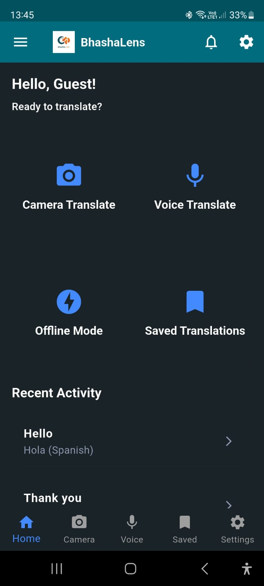
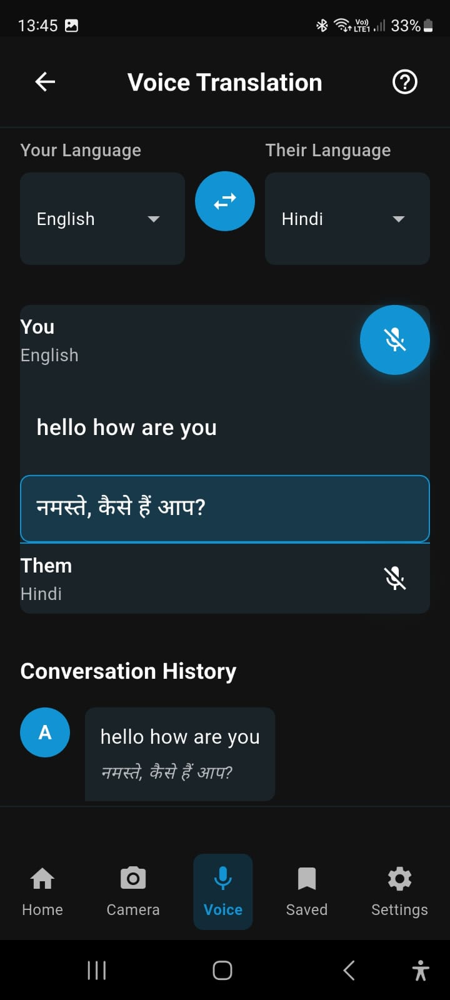
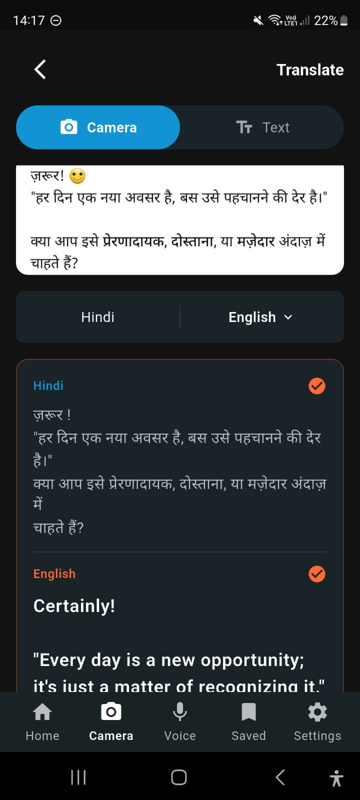

# BhashaLens 🔍🗣️

BhashaLens is a cutting-edge accessibility and translation application designed to break down language barriers and assist users in understanding the world around them. Powered by Google's Gemini AI and on-device ML Kit, BhashaLens offers real-time translation, text recognition, and intelligent assistance features wrapped in a user-friendly, accessible interface.

## 🚀 Features

### 🏠 Home & Dashboard
- **Personalized Greeting:** Welcomes users by name for a personal touch.
- **Recent Activity:** Quickly access your history of translations and scanned documents.
- **Quick Access Grid:** One-tap access to essential tools:
  - **SOS:** Emergency assistance shortcut.
  - **Offline Pack:** Manage offline translation models.
  - **Saved Items:** Access bookmarked translations.
  - **History:** View past translation records.

### 📸 Camera Translate & Explain
- **Instant OCR & Translation:** Point your camera at any text (menus, signs, documents) to instantly translate it into your preferred language.
- **Explain Mode:** Go beyond simple translation. Use Gemini AI to get detailed, context-aware explanations of complex text, documents, or objects in your native language. Service simplifies technical jargon or legal terms.
- **Gallery Import:** Import existing images from your device gallery for analysis and translation.
- **Live Preview:** See translations overlaid on the camera feed in real-time.

### 🎙️ Voice & Conversation
- **Real-time Voice Translation:** Speak in your native language and have it translated and spoken back in another language instantly.
- **Conversation Mode:** Facilitate seamless two-way conversations between speakers of different languages. The app listens to both languages and translates back and forth.
- **Text-to-Speech (TTS):** Hear the translated text spoken out loud for better understanding and pronunciation.

### 📝 Text Tools
- **Text Translation:** Type or paste text manually for quick and accurate translations.
- **Language Detection:** Automatically identifies the source language of the input text.
- **Copy & Share:** Easily copy translated text or share it with other apps.

### 🤖 Smart Assistant
- **Assistant Mode:** An AI-powered chat assistant ready to answer your questions, draft messages, or help with language learning in your preferred language.
- **Contextual Help:** Ask the assistant for help with specific phrases or cultural nuances.

### ⚙️ Settings & Customization
- **Profile Management:** Edit your user profile and details.
- **Language Preferences:**
  - **App Language:** Change the interface language of the application.
  - **Default Language:** Set your preferred target language for translations.
- **Offline Models:** Download language packs to use translation features without an internet connection.
- **Accessibility:**
  - **Text Size:** Adjust the font size across the app for better readability.
  - **Themes:** Toggle between Light and Dark modes to reduce eye strain.
- **Notifications:**
  - **Push Notifications:** Enable/disable alerts for app updates and tips.
  - **Email Notifications:** Manage email communication preferences.
- **Privacy & Security:**
  - **Privacy Policy:** Access the app's privacy policy.
  - **Security Settings:** Manage account security options.
- **Support:**
  - **Help Center:** Access FAQs and tutorials.
  - **Contact Us:** Reach out to support for assistance.
  - **Feedback:** Send feedback to the development team.
- **Account Management:**
  - **Log Out:** Securely sign out of your account.
  - **Delete Account:** Option to permanently remove your account and data.

### 🌐 Connectivity & Storage
- **Offline Support:** Core translation features work without data once models are downloaded.
- **Saved Translations:** Bookmark important translations for quick access later.
- **Secure Storage:** API keys and sensitive data are stored securely using `flutter_secure_storage`.

### 📸 Screenshots

| Home Dashboard | Voice Translation | Camera Translation |
|:---:|:---:|:---:|
|  |  |  |
| *Personalized Greeting & Quick Access* | *Real-time Bi-directional Translation* | *Instant OCR & Explain Mode* |

### 🌐 Supported Languages
- **Primary:** English, Spanish, French, German, Italian, Portuguese, Russian, Japanese, Korean, Chinese, Arabic.
- **Indian Regional:** Hindi, Bengali, Tamil, Telugu, Malayalam, Kannada, Gujarati, Marathi, Punjabi.

## 🛠️ Tech Stack

- **Framework:** [Flutter](https://flutter.dev/)
- **Language:** Dart
- **AI & ML:**
  - [Google Gemini AI](https://deepmind.google/technologies/gemini/) (Generative AI for explanations and advanced translation)
  - [Google ML Kit](https://developers.google.com/ml-kit) (On-device Text Recognition & Translation)
  - [Speech-to-Text](https://pub.dev/packages/speech_to_text) (Real-time speech recognition)
  - [Flutter TTS](https://pub.dev/packages/flutter_tts) (Text-to-speech synthesis)
- **Backend & Auth:**
  - [Firebase Auth](https://firebase.google.com/docs/auth) (Email/Password & Google Sign-In)
- **State Management:** [Provider](https://pub.dev/packages/provider)
- **Local Storage:** [SQLite](https://pub.dev/packages/sqflite) (Mobile) & [Flutter Secure Storage](https://pub.dev/packages/flutter_secure_storage)

## 📂 Project Structure

```
lib/
├── models/          # Data models (SavedTranslation, etc.)
├── pages/           # UI Screens (Home, Camera, Voice, Settings)
│   ├── auth/        # Login, Signup, Forgot Password
│   ├── home/        # Home screen widgets
│   └── ...
├── services/        # Business Logic & External APIs
│   ├── accessibility_service.dart
│   ├── firestore_service.dart
│   ├── gemini_service.dart
│   ├── local_storage_service.dart
│   ├── voice_translation_service.dart
│   └── ...
├── theme/           # App styling and themes
└── main.dart        # Entry point and initialization
```

## 🏁 Getting Started

### Prerequisites
- [Flutter SDK](https://docs.flutter.dev/get-started/install) (latest stable version recommended)
- [Dart SDK](https://dart.dev/get-dart)
- A Firebase project with Authentication enabled.
- A Google Cloud project with Gemini API access.

### Installation

1.  **Clone the repository:**
    ```bash
    git clone https://github.com/your-actual-username/bhashalens.git
    cd bhashalens    ```

2.  **Install dependencies:**
    ```bash
    flutter pub get
    ```

3.  **Environment Setup:**
    Create a `.env` file in the root directory and add your Gemini API Key:
    ```env
    GEMINI_API_KEY=your_gemini_api_key_here
    # Optional: OPENAI_API_KEY=your_openai_api_key_here
    ```

4.  **Firebase Setup:**
    - **Android:** Place your `google-services.json` file in `android/app/`.
    - **iOS:** Place your `GoogleService-Info.plist` file in `ios/Runner/`.

5.  **Run the app:**
    ```bash
    flutter run
    ```

## 🔐 Credentials & Security

- **API Keys:** The Gemini API key is securely managed using `flutter_dotenv`. Ensure you do not commit your `.env` file to version control.
- **Authentication:** User authentication is handled via Firebase, ensuring secure login and data protection.

## 📱 Platforms

- **Android:** Fully supported.
- **iOS:** Fully supported (requires valid code signing).
- **Web:** Beta Support.
  - *Note:* Ensure your `.env` file contains `FIREBASE_WEB_...` keys.
  - *Note:* SQLite is not supported on Web; the app uses a fallback (no-op) implementation for `LocalStorageService` to prevent crashes.

## 🐛 Troubleshooting

### Common Issues

1. **App Stuck on Splash Screen (Android)**
   - Check if you have blocking `await` calls in `main()`. Initialization should be in `initState`.

2. **White Screen on Web**
   - Verify `.env` configuration.
   - Check for incompatible packages like `tflite_flutter` or `sqflite` in the web build.

3. **"Service Not Ready" / Translation Not Working**
   - Check if your API Key is correctly set in `.env` and loaded in Settings.
   - Verify internet connection.
   - Ensure the API key has quota available.

4. **Speech Recognition Fails**
   - Ensure microphone permissions are granted.
   - Try speaking more clearly or closer to the microphone.

5. **"No Text Detected" in Camera Mode**
   - Ensure good lighting and clear text.
   - Try re-orienting the camera.

### Debugging
- Check the debug console for logs. We use `debugPrint` for essential logs regarding API responses and initialization errors.

## 📄 Documentation

For more specific details on the Gemini Integration, please refer to [GEMINI_INTEGRATION_README.md](GEMINI_INTEGRATION_README.md).

## 🤝 Contributing

Contributions are welcome! Please feel free to submit a Pull Request.

1.  Fork the project
2.  Create your feature branch (`git checkout -b feature/AmazingFeature`)
3.  Commit your changes (`git commit -m 'Add some AmazingFeature'`)
4.  Push to the branch (`git push origin feature/AmazingFeature`)
5.  Open a Pull Request

---

Built with ❤️ using Flutter & AI.
