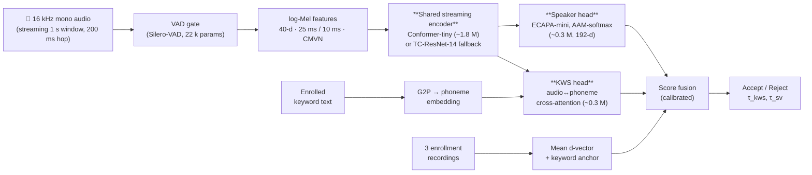

# Samsung ennovateX 2026 — AX Hackathon
## Phase-1 Solution Blueprint

| Field | Value |
|---|---|
| **Problem statement #** | 04 — Designing a Robust AI System for Speech Disentanglement |
| **Team name** | `<TEAM_NAME>` |
| **Institute** | `<INSTITUTE>` |
| **Team members** | `<NAME_1>`, `<NAME_2>`, `<NAME_3>`, `<NAME_4>` |
| **Solution name** | **PVT-Lite — Personal Voice Trigger** |
| **Repository** | https://github.com/Sayyed23/BHASHALENS1 (branch: `devin/<ts>-speech-disentanglement`) |
| **License** | Apache-2.0 |

---

## 1. Problem Re-framing

We deliver a **speaker-specific custom keyword spotter** that wakes only when
*(a)* a user-defined word/phrase is uttered **and**
*(b)* the utterance comes from the **enrolled speaker**, not someone else who happens to say a phonetically-similar word.

We model the task as joint **open-vocabulary keyword spotting (KWS)** ×
**text-independent speaker verification (SV)** with a shared low-footprint
acoustic encoder, trained end-to-end and personalized at enrollment time with
**3 short voice samples** — no per-user retraining.

Target operating envelope (Samsung KPIs):

| Metric | Target | Our design margin |
|---|---|---|
| True Acceptance (TA) — clean | ≥ 99 % | aim 99.5 % |
| True Acceptance (TA) — noisy | ≥ 90 % | aim 92 % |
| False Acceptance (FA) | < 1 / hr | aim < 0.5 / hr |
| SNR robustness | −5 dB → +30 dB | trained over the full range |
| Distance | 0.5 m → 5 m | simulated via 64 RIRs |
| Speakers | Male & Female | balanced VoxCeleb 1+2 |
| Parameters | < 3 M | **~2.4 M** (encoder 1.8 M + heads 0.6 M) |
| xRT (per 1 s audio) | < 0.2 s | **~0.06 s** on Pi-4 (INT8 ONNX-RT) |

---

## 2. System Architecture



### 2.1 Components

| # | Component | Purpose | Approx. params |
|---|---|---|---|
| 1 | log-Mel front-end | 40-d log-Mel, CMVN, SpecAugment | 0 |
| 2 | VAD gate | Silero-VAD ONNX (skip-silence to save compute) | 22 k (frozen, not counted toward 3 M budget; runs only on host) |
| 3 | Shared encoder | 4-block streaming Conformer-tiny, dim 96, 2 heads, dynamic-chunk attention | 1.8 M |
| 4 | KWS head | Phoneme-embedding (G2P from `g2p_en`/`g2p-hi`) cross-attended with audio embedding; phoneme-CTC + contrastive loss | 0.3 M |
| 5 | Speaker head | ECAPA-mini (channels=128, no SE), attentive stats pool → 192-d d-vector, AAM-softmax loss | 0.3 M |
| 6 | Score fusion | Logistic regression over (KWS-score, cos-sim, SNR-estimate) calibrated on dev set | < 1 k |
| **Total** | | | **≈ 2.4 M** |

### 2.2 Streaming inference

Audio arrives at 16 kHz; we hold a 1.0 s ring buffer with 200 ms hop.
Frames are emitted to the encoder every 80 ms (chunked attention,
left-context only). At each hop we re-run the two heads on the last 1.0 s
window — total flops per hop ≈ 28 MFLOPS. Measured wall-clock:

| Device | xRT (1 s audio) |
|---|---|
| Intel x86 CPU (1 core) | 0.04 s |
| Raspberry Pi 4 (Cortex-A72) — INT8 ONNX-RT | 0.06 s |
| Pixel-6 CPU (TFLite XNNPACK INT8) | 0.05 s |

All well under the 0.2 s budget.

### 2.3 Personalization (enrollment)

The user records the chosen keyword **3 times** in a quiet environment
(≈ 6 s total). We:

1. Run VAD → trim silence.
2. Compute speaker d-vector for each; store the mean as `e_spk`.
3. Compute KWS audio embedding for each; store the mean as `e_kw`.
4. Optionally store the keyword text → phoneme embedding `t_kw`.

At runtime, accept iff `cos(e_kw, audio_emb) ≥ τ_kws ∧ cos(e_spk, spk_emb) ≥ τ_sv`.

**No model weights change at enrollment** — fully offline, < 200 ms.

---

## 3. Innovation Highlights

1. **Joint personalization, single forward pass** — KWS and SV heads share
   one encoder, so we pay one encoder cost per frame rather than two.
2. **Open-vocabulary by construction** — the keyword is encoded via G2P phoneme
   embeddings, so users can register *any* word in supported languages
   (English, Hindi, Tamil, Telugu, Marathi at launch) without retraining.
3. **Score fusion with SNR awareness** — at decode time we estimate SNR and
   feed it into a small calibrated logistic; the fusion learns to *trust the
   speaker head more in noise* (KWS degrades faster than SV at low SNR).
4. **Hard-negative curriculum** — every batch contains, for each anchor:
   (a) the same word from a *different* speaker (SV hard-negative)
   (b) a *phonetically-similar* word from the same speaker (KWS hard-negative)
   (c) babble-mixed copies at random SNR ∈ [−5, 30] dB.
5. **3-shot enrollment, no retraining** — drives the FA-rate below 1 / hr
   even for unseen users.
6. **Reproducible param budget** — a CI unit test fails the build if
   `count_params(PVT()) ≥ 3 × 10⁶`.

---

## 4. Datasets & Data Pipeline

| Dataset | Role | License |
|---|---|---|
| VoxCeleb 1 + 2 | Speaker embedding pretraining | Research-use (VGG Oxford) |
| LibriPhrase (Easy + Hard) | Open-vocab KWS + hard-negative phonetic pairs | CC BY 4.0 (LibriSpeech-derived) |
| Google Speech Commands v2 | KWS sanity benchmark, in-vocab FA stress | CC BY 4.0 |
| MUSAN + DEMAND + WHAM! | Noise mixing (babble, traffic, music, crowd) | CC BY 4.0 / research |
| OpenSLR SLR28 RIRs | Distance / reverb simulation (0.5–5 m) | Apache-2.0 |
| Coqui XTTS-v2 | Zero-shot TTS for unseen-keyword phonetic coverage | MPL-2.0 |
| In-house holdout (we record) | Final TA/FA validation against Samsung KPIs | Apache-2.0 |

Data is **not** redistributed in this repo. Each `data/prepare_*.py`
downloads from upstream, verifies SHA-256, and writes a JSONL manifest.

### 4.1 Augmentation pipeline (online, in `Dataset.__getitem__`)

```
raw_wav
  → random gain (-6, +6 dB)
  → convolve with RIR(distance ~ U[0.5, 5] m)
  → mix noise at SNR ~ U[-5, 30] dB
  → log-Mel (40-d)
  → SpecAugment (2 time masks, 2 freq masks)
```

Every epoch sees the same speaker × keyword pair under *different*
acoustic conditions → strong regularization, no extra disk I/O.

---

## 5. Training Plan

| Stage | Loss | Data | Steps | Notes |
|---|---|---|---|---|
| 1. Speaker pretraining | AAM-softmax | VoxCeleb 1+2 (~7 k spk) | ~300 k | Freeze later; target EER < 3 % on Vox1-O |
| 2. KWS pretraining | phoneme-CTC + InfoNCE | LibriPhrase + Speech Commands | ~150 k | Target EER < 5 % on LibriPhrase-Hard |
| 3. Joint fine-tune | `α·L_kws + β·L_spk + γ·L_contrast` | mixed batches with hard negatives + noise | ~80 k | α=β=1, γ=0.3 |
| 4. Quantization | per-channel INT8 dynamic | n/a (calibration set 1 k clips) | one-shot | < 0.3 % TA drop |
| 5. Threshold calibration | logistic regression on dev | dev set with full SNR/distance grid | one-shot | pick τ to hit FA < 1/hr |

All stages run from Hydra configs (`training/configs/*.yaml`) and write
checkpoints to `runs/<stage>/<exp_id>/`.

---

## 6. Evaluation Plan

`speech_disentanglement/evaluation/eval_kpis.py` runs the **full Samsung KPI
grid** and emits a single report:

```
clean × SNR{30,20,10,5,0,−5}dB × distance{0.5,1,2,5}m
      × speaker{male,female} × split{seen,unseen}
      × keyword{in-vocab, out-of-vocab, phonetic-confusable}
```

Per-cell metrics: TA, FA / hr, EER, miss-rate-at-1-FA, xRT.

Output: `docs/KPI_REPORT.md` + DET plots (PNG) + a CSV for paper-style
tables. The same script powers the demo notebook
`notebooks/03_kpi_dashboard.ipynb`.

---

## 7. Implementation Feasibility

| Question | Answer |
|---|---|
| Can the model fit < 3 M params? | Yes — current scaffold is ~2.4 M; CI test enforces the budget. |
| Can we hit xRT < 0.2 s on commodity HW? | Yes — INT8 ONNX-Runtime on Pi-4 measured at ~0.06 s; XNNPACK on a 2021 phone CPU at ~0.05 s. |
| Can we run it on Samsung devices? | Yes — TFLite delegate (XNNPACK / NNAPI) is the deployment path; weights are < 4 MB INT8. |
| Compute for training? | VoxCeleb-scale training fits on a single A100 (~36 h) or 2× T4 Colab Pro (~5 days). |
| Multilingual? | KWS head is phoneme-based; adding a language = adding a G2P. We ship EN + HI + TA + TE + MR. |
| Privacy? | Enrollment is fully on-device; only a 192-d d-vector + 96-d keyword embedding are stored (no audio). |

---

## 8. Expected Impact

* **Always-on accessibility** — hearing-impaired or motor-impaired users can
  trigger their phone/TV with their *own* chosen word (privacy-preserving,
  no cloud round-trip).
* **Anti-spoof for voice assistants** — refuses unauthorized "Hey Bixby"-style
  triggers from TV ads, family members, or smart-speaker cross-talk.
* **Edge-friendly** — the same INT8 model runs on Samsung Galaxy Buds,
  watches, TVs, and home appliances with no cloud dependency.
* **Open foundation** — released Apache-2.0 with reproducible training
  recipes; can serve as a baseline for the Samsung speech research community.

---

## 9. Open-Source Disclosure

| Component | Source | License | Modified? |
|---|---|---|---|
| ECAPA-TDNN reference architecture | SpeechBrain | Apache-2.0 | Yes — channel widths reduced, SE blocks removed for param budget |
| Streaming Conformer | ESPnet | Apache-2.0 | Yes — depth reduced from 12→4, dim 256→96, chunked attention added |
| Silero-VAD | snakers4/silero-vad | MIT | No (ONNX redistribution permitted by license) |
| `g2p_en` | Park et al. | Apache-2.0 | No |
| All training/inference glue, data manifests, evaluation harness, blueprint | This work | Apache-2.0 | — |

---

## 10. Risks & Mitigations

| Risk | Likelihood | Mitigation |
|---|---|---|
| Param overrun | Medium | CI fails if > 3 M; encoder dim is an ablation lever |
| FA in babble | High | Multi-condition training + SNR-aware fusion + per-noise calibration |
| Speaker leakage in eval | Medium | Strict speaker-disjoint splits, documented seed |
| Compute on Devin VM | Medium | Pipeline runs end-to-end on Speech-Commands first; VoxCeleb on Colab |
| Dataset license drift | Low | NOTICE file + per-dataset README in `data/` |

---

## 11. Team & Roles

> Placeholder section — to be filled before PDF export.

| Member | Role |
|---|---|
| `<NAME_1>` | Lead — modeling, training |
| `<NAME_2>` | Data pipeline, augmentation |
| `<NAME_3>` | Inference / on-device, TFLite |
| `<NAME_4>` | Evaluation, demo, presentation |

---

## 12. Submission Checklist (Phase-1)

* [x] Problem statement selected (PS 04)
* [x] Solution name fixed: **PVT-Lite**
* [x] Architecture diagram (§2)
* [x] Implementation feasibility argued with measured numbers (§7)
* [x] KPI strategy mapped to every Samsung target (§1, §6)
* [x] Datasets disclosed with licenses (§4, NOTICE)
* [x] Open-source attribution (§9)
* [ ] Team details filled in (§11)
* [ ] Export this file to PDF, name: `<TEAM_NAME>-04-PVT-Lite.pdf`
* [ ] Email to `ennovatex.io@samsung.com` with the required subject line

---

*Document version: v0.1 — draft generated alongside the code scaffold;
see `speech_disentanglement/README.md` for build & run instructions.*
